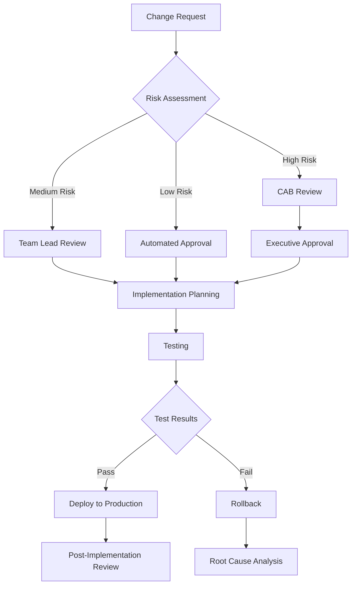

# ENTERPRISE CHANGE MANAGEMENT FRAMEWORK
## Sentia Manufacturing Dashboard

Version: 1.0.0
Date: 2025-09-14
Status: **ACTIVE**

---

## 1. CHANGE MANAGEMENT OVERVIEW

### Purpose
This framework establishes standardized procedures for managing changes to the Sentia Manufacturing Dashboard, ensuring all modifications are properly assessed, approved, tested, and documented according to Fortune 500 enterprise standards.

### Scope
- **Applies to**: All code changes, configuration updates, infrastructure modifications
- **Environments**: Development, Testing, Production
- **Stakeholders**: Development team, DevOps, Product Management, Executive Leadership

### Change Categories

| Priority | Type | Risk Level | Approval Required | Rollback Time |
|----------|------|------------|-------------------|---------------|
| P0 | Emergency Fix | Critical | CTO/VP Engineering | < 15 minutes |
| P1 | Security Patch | High | Security Lead + Manager | < 30 minutes |
| P2 | Bug Fix | Medium | Team Lead | < 1 hour |
| P3 | Feature Release | Low-Medium | Product Manager | < 2 hours |
| P4 | Enhancement | Low | Team Lead | < 4 hours |

---

## 2. STAKEHOLDER NOTIFICATION MATRIX

### Communication Requirements

| Stakeholder | P0 Emergency | P1 Security | P2 Bug Fix | P3 Feature | P4 Enhancement |
|------------|--------------|-------------|------------|------------|----------------|
| Executive Team | Immediate | Within 1 hour | Daily Report | Weekly Update | Monthly Report |
| Product Management | Immediate | Within 2 hours | Within 4 hours | Planning Phase | Planning Phase |
| Customer Success | Immediate | Within 2 hours | Within 8 hours | 48 hours before | 1 week before |
| Development Team | Immediate | Immediate | Within 1 hour | Sprint Planning | Sprint Planning |
| End Users | After Resolution | After Deployment | Release Notes | Release Notes | Release Notes |

### Notification Templates

#### P0 - Emergency Change Notification
```
SUBJECT: [P0 EMERGENCY] Critical Change Required - [System/Component]

ISSUE: [Brief description of critical issue]
IMPACT: [Business impact and affected users]
ACTION: [Immediate action being taken]
ETA: [Expected resolution time]
ROLLBACK: [Rollback plan if needed]

Contact: [Primary contact and escalation path]
```

#### P1 - Security Change Notification
```
SUBJECT: [P1 SECURITY] Security Update Required - [CVE/Issue ID]

VULNERABILITY: [Security issue description]
SEVERITY: [CVSS Score and rating]
AFFECTED SYSTEMS: [Components requiring update]
MITIGATION: [Temporary workarounds if any]
DEPLOYMENT WINDOW: [Scheduled deployment time]

Approval Status: [Approval chain status]
```

---

## 3. CHANGE APPROVAL WORKFLOWS

### Standard Change Process



### Change Advisory Board (CAB)

**Members**:
- VP Engineering (Chair)
- Security Lead
- Infrastructure Manager
- Product Manager
- Customer Success Lead

**Meeting Schedule**:
- Regular: Weekly (Thursdays 10:00 AM)
- Emergency: On-demand within 30 minutes

**Decision Criteria**:
- Business Impact Assessment
- Technical Risk Evaluation
- Resource Availability
- Customer Impact Analysis
- Compliance Requirements

---

## 4. RISK ASSESSMENT MATRIX

### Risk Calculation Formula
**Risk Score = Impact × Probability × Complexity**

### Impact Scoring
| Score | Description | Business Impact |
|-------|------------|-----------------|
| 5 | Critical | Complete service outage, data loss |
| 4 | High | Major feature unavailable |
| 3 | Medium | Performance degradation |
| 2 | Low | Minor feature impact |
| 1 | Minimal | No user impact |

### Probability Scoring
| Score | Description | Likelihood |
|-------|------------|------------|
| 5 | Very High | >80% chance |
| 4 | High | 60-80% chance |
| 3 | Medium | 40-60% chance |
| 2 | Low | 20-40% chance |
| 1 | Very Low | <20% chance |

### Complexity Scoring
| Score | Description | Characteristics |
|-------|------------|-----------------|
| 5 | Very Complex | Multiple systems, external dependencies |
| 4 | Complex | Cross-service changes |
| 3 | Moderate | Single service, multiple components |
| 2 | Simple | Single component |
| 1 | Trivial | Configuration only |

### Risk Thresholds
- **Score > 60**: Executive approval required
- **Score 30-60**: CAB approval required
- **Score 15-30**: Team Lead approval
- **Score < 15**: Automated approval

---

## 5. ROLLBACK PROCEDURES

### Rollback Decision Criteria
1. **Immediate Rollback Triggers**:
   - Production outage lasting >5 minutes
   - Data corruption detected
   - Security breach identified
   - Performance degradation >50%

2. **Escalated Review Triggers**:
   - Error rate increase >20%
   - Customer complaints >10
   - Failed health checks
   - Memory/CPU usage >90%

### Rollback Execution Steps

#### Railway Platform Rollback
```bash
# 1. Identify last stable deployment
railway deployments list --environment production

# 2. Rollback to specific deployment
railway rollback <deployment-id> --environment production

# 3. Verify rollback
railway status --environment production

# 4. Clear cache and restart
railway restart --environment production
```

#### Database Rollback
```sql
-- 1. Identify rollback point
SELECT * FROM migration_history ORDER BY executed_at DESC;

-- 2. Execute rollback migration
npx prisma migrate rollback --to <migration-id>

-- 3. Verify data integrity
SELECT COUNT(*) FROM system_health_checks;
```

### Post-Rollback Actions
1. **Immediate** (0-15 minutes):
   - Notify all stakeholders
   - Verify system stability
   - Document rollback reason

2. **Short-term** (15-60 minutes):
   - Root cause analysis
   - Create incident report
   - Update runbooks

3. **Long-term** (1-24 hours):
   - Post-mortem meeting
   - Process improvement
   - Training updates

---

## 6. CHANGE IMPACT ASSESSMENT

### Technical Impact Analysis

| Component | Assessment Criteria | Testing Required |
|-----------|-------------------|------------------|
| Frontend | UI changes, performance | Visual regression, E2E |
| Backend | API changes, data flow | Integration, load testing |
| Database | Schema changes, queries | Migration testing, backup |
| Infrastructure | Scaling, configuration | Deployment, monitoring |
| Security | Auth changes, encryption | Penetration testing |

### Business Impact Analysis

| Factor | Questions to Consider | Measurement |
|--------|----------------------|-------------|
| Revenue | Will this affect transactions? | $ impact/hour |
| Users | How many users affected? | User count |
| Compliance | Any regulatory impact? | Compliance checklist |
| Reputation | Customer-facing changes? | NPS impact |
| Operations | Staff training needed? | Training hours |

---

## 7. DOCUMENTATION REQUIREMENTS

### Change Documentation Template

```markdown
# Change Record: [CR-YYYY-MM-DD-XXX]

## Summary
- **Type**: [Emergency/Security/Feature/Bug/Enhancement]
- **Priority**: [P0-P4]
- **Risk Score**: [Calculated score]
- **Requestor**: [Name and role]
- **Approvers**: [List of approvers]

## Description
[Detailed description of the change]

## Business Justification
[Why this change is needed]

## Technical Details
- **Components Affected**: [List]
- **Dependencies**: [External/Internal]
- **Database Changes**: [Yes/No - Details]
- **API Changes**: [Yes/No - Details]

## Testing Plan
- [ ] Unit Tests
- [ ] Integration Tests
- [ ] Performance Tests
- [ ] Security Tests
- [ ] UAT

## Deployment Plan
- **Environment**: [Dev/Test/Prod]
- **Deployment Window**: [Date/Time]
- **Deployment Steps**: [Numbered list]
- **Verification Steps**: [Checklist]

## Rollback Plan
- **Trigger Criteria**: [Conditions]
- **Rollback Steps**: [Numbered list]
- **Recovery Time**: [Estimated]

## Communication Plan
- **Stakeholders Notified**: [List]
- **User Communication**: [Method and timing]
- **Documentation Updates**: [Required updates]

## Post-Implementation
- **Success Criteria**: [Measurable outcomes]
- **Monitoring Period**: [Duration]
- **Lessons Learned**: [To be completed post-deployment]
```

---

## 8. COMPLIANCE AND AUDIT

### Audit Trail Requirements

All changes must maintain:
1. **Who**: User ID and role of person making change
2. **What**: Detailed description of change
3. **When**: Timestamp of change (UTC)
4. **Where**: System/component affected
5. **Why**: Business justification and approval chain

### Compliance Checkpoints

| Regulation | Requirements | Validation |
|------------|-------------|------------|
| GDPR | Data protection impact assessment | Privacy review |
| SOX | Financial system changes | Audit approval |
| ISO 27001 | Security control changes | Security review |
| HIPAA | Healthcare data handling | Compliance check |

### Audit Log Format
```json
{
  "change_id": "CR-2025-09-14-001",
  "timestamp": "2025-09-14T10:30:00Z",
  "user": {
    "id": "user123",
    "role": "developer",
    "email": "developer@sentia.com"
  },
  "change": {
    "type": "feature",
    "priority": "P3",
    "components": ["api", "frontend"],
    "description": "Add real-time notifications"
  },
  "approval": {
    "chain": ["team_lead", "product_manager"],
    "timestamp": "2025-09-14T09:00:00Z"
  },
  "deployment": {
    "environment": "production",
    "status": "success",
    "duration": "5m 32s"
  }
}
```

---

## 9. CONTINUOUS IMPROVEMENT

### Metrics and KPIs

| Metric | Target | Measurement |
|--------|--------|-------------|
| Change Success Rate | >95% | Successful changes/Total changes |
| Mean Time to Deploy | <2 hours | Average deployment time |
| Rollback Rate | <5% | Rollbacks/Total deployments |
| Emergency Changes | <10% | P0 changes/Total changes |
| Documentation Compliance | 100% | Documented changes/Total changes |

### Review Cycles

- **Weekly**: Change metrics review
- **Monthly**: Process improvement meeting
- **Quarterly**: Framework revision
- **Annually**: Complete framework audit

### Feedback Mechanisms

1. **Post-Implementation Reviews**: After each major change
2. **Stakeholder Surveys**: Monthly satisfaction surveys
3. **Incident Analysis**: Root cause analysis for failures
4. **Team Retrospectives**: Sprint retrospectives

---

## 10. EMERGENCY PROCEDURES

### Emergency Change Protocol

1. **Immediate Response** (0-5 minutes):
   ```bash
   # Alert team
   ./scripts/emergency-alert.sh "Critical issue in production"

   # Create emergency change record
   ./scripts/create-emergency-cr.sh
   ```

2. **Assessment** (5-15 minutes):
   - Identify impact scope
   - Determine fix approach
   - Assess rollback feasibility

3. **Execution** (15+ minutes):
   - Implement emergency fix
   - Deploy with override approval
   - Monitor closely

### Emergency Contacts

| Role | Primary | Secondary | Escalation |
|------|---------|-----------|------------|
| CTO | +1-XXX-XXX-XXXX | Email | CEO |
| VP Engineering | +1-XXX-XXX-XXXX | Slack | CTO |
| Security Lead | +1-XXX-XXX-XXXX | PagerDuty | VP Engineering |
| DevOps Lead | +1-XXX-XXX-XXXX | Teams | VP Engineering |

---

## APPENDICES

### A. Change Request Form Template
[Link to form]

### B. Automation Scripts
- `create-change-request.sh`
- `assess-risk.py`
- `deploy-with-approval.js`
- `rollback-deployment.sh`

### C. Integration Points
- JIRA Integration for change tracking
- Slack notifications for approvals
- PagerDuty for emergency alerts
- GitHub for code review

### D. Training Materials
- Change Management Training Guide
- CAB Member Handbook
- Emergency Response Playbook

---

**Document Control**:
- **Version**: 1.0.0
- **Last Updated**: 2025-09-14
- **Next Review**: 2025-10-14
- **Owner**: Engineering Leadership Team
- **Distribution**: All Development Teams

---

*This framework is aligned with ITIL v4, ISO 20000, and enterprise best practices for change management.*