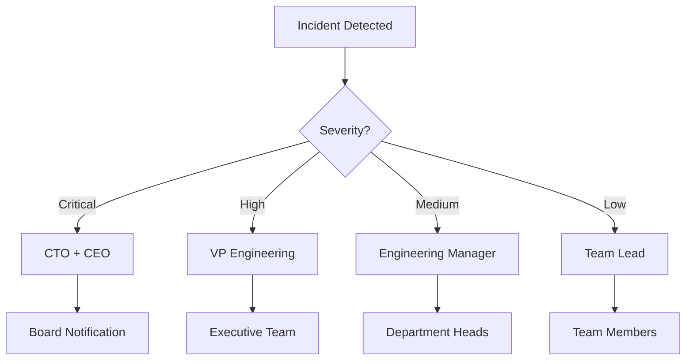

# DISASTER RECOVERY & BUSINESS CONTINUITY PLAN
## Sentia Manufacturing Dashboard

Version: 1.0.0
Date: 2025-09-14
Classification: **CRITICAL**

---

## 1. EXECUTIVE SUMMARY

### Purpose
This Disaster Recovery (DR) and Business Continuity Plan (BCP) ensures the Sentia Manufacturing Dashboard can recover from catastrophic events and maintain critical business operations within defined time objectives.

### Key Objectives
- **Recovery Time Objective (RTO)**: < 4 hours for critical systems
- **Recovery Point Objective (RPO)**: < 1 hour for data recovery
- **Maximum Tolerable Downtime (MTD)**: 8 hours
- **Work Recovery Time (WRT)**: 2 hours post-restoration

### Critical Success Factors
- Automated backup validation every 6 hours
- Multi-region failover capability
- Real-time replication for critical data
- Tested recovery procedures quarterly

---

## 2. BUSINESS IMPACT ANALYSIS

### System Criticality Matrix

| Component | Criticality | RTO | RPO | Business Impact |
|-----------|------------|-----|-----|-----------------|
| Production Database | Critical | 1 hour | 15 min | Complete operational halt |
| Authentication Service | Critical | 30 min | Real-time | No user access |
| API Gateway | Critical | 1 hour | N/A | No system functionality |
| AI Forecasting Engine | High | 2 hours | 1 hour | Degraded analytics |
| Frontend Application | High | 2 hours | N/A | No user interface |
| Integration Services | Medium | 4 hours | 2 hours | Limited external data |
| Reporting System | Medium | 6 hours | 4 hours | No reports generated |
| Monitoring Services | Low | 8 hours | 6 hours | Reduced visibility |

### Financial Impact Assessment

| Downtime Duration | Revenue Loss | Productivity Loss | Brand Impact | Total Impact |
|------------------|--------------|-------------------|--------------|--------------|
| 0-1 hour | $5,000 | $2,000 | Minimal | $7,000 |
| 1-4 hours | $25,000 | $10,000 | Low | $35,000 |
| 4-8 hours | $75,000 | $30,000 | Medium | $105,000 |
| 8-24 hours | $200,000 | $100,000 | High | $300,000 |
| >24 hours | $500,000+ | $250,000+ | Severe | $750,000+ |

---

## 3. RECOVERY STRATEGIES

### 3.1 Database Recovery

#### Primary Strategy: Point-in-Time Recovery
```sql
-- Neon PostgreSQL Recovery Commands
-- 1. Identify recovery point
SELECT * FROM pg_stat_replication;

-- 2. Create recovery branch
neon branch create recovery-branch --from-timestamp "2025-09-14 10:00:00"

-- 3. Restore to specific point
neon restore --branch recovery-branch --to-timestamp "2025-09-14 10:00:00"

-- 4. Validate data integrity
SELECT COUNT(*) FROM critical_tables;
SELECT MAX(created_at) FROM audit_logs;
```

#### Backup Schedule
- **Continuous**: Transaction log streaming to S3
- **Hourly**: Incremental backups
- **Daily**: Full database snapshot at 02:00 UTC
- **Weekly**: Archived backup to cold storage

#### Backup Validation Script
```bash
#!/bin/bash
# backup-validation.sh

# Test backup restoration
echo "Starting backup validation..."

# Create test database
neon database create test-restore

# Restore latest backup
pg_restore -d test-restore latest-backup.sql

# Validate critical tables
psql test-restore -c "SELECT COUNT(*) FROM users;"
psql test-restore -c "SELECT COUNT(*) FROM transactions;"

# Clean up test database
neon database delete test-restore

echo "Backup validation complete"
```

### 3.2 Application Recovery

#### Railway Platform Recovery
```bash
# 1. Check deployment status
railway status --environment production

# 2. Rollback to last stable version
railway deployments list --environment production
railway rollback <stable-deployment-id>

# 3. Force restart if needed
railway restart --environment production

# 4. Scale up instances for recovery
railway scale --replicas 5 --environment production
```

#### Docker Container Recovery (Alternative)
```yaml
# docker-compose.recovery.yml
version: '3.8'
services:
  app:
    image: sentia-dashboard:latest-stable
    deploy:
      replicas: 3
      restart_policy:
        condition: any
        delay: 5s
        max_attempts: 3
    environment:
      - NODE_ENV=recovery
      - DATABASE_URL=${BACKUP_DATABASE_URL}
    healthcheck:
      test: ["CMD", "curl", "-f", "http://localhost:3000/health"]
      interval: 30s
      timeout: 10s
      retries: 3
```

### 3.3 Data Recovery Procedures

#### Critical Data Recovery Priority
1. **User Authentication Data** (5 minutes)
2. **Financial Transactions** (15 minutes)
3. **Inventory Data** (30 minutes)
4. **Order History** (45 minutes)
5. **Analytics Data** (60 minutes)
6. **Audit Logs** (90 minutes)

#### Recovery Validation Checklist
- [ ] Database connectivity verified
- [ ] User authentication working
- [ ] API endpoints responding
- [ ] Data integrity validated
- [ ] External integrations connected
- [ ] Performance metrics normal
- [ ] Monitoring systems active

---

## 4. FAILOVER PROCEDURES

### 4.1 Automatic Failover Configuration

```javascript
// failover-config.js
export const failoverConfig = {
  primary: {
    region: 'us-east-1',
    endpoint: 'https://sentiaprod.financeflo.ai',
    healthCheck: '/health',
    threshold: 3 // failed checks before failover
  },
  secondary: {
    region: 'eu-west-1',
    endpoint: 'https://sentia-dr.financeflo.ai',
    healthCheck: '/health',
    warmStandby: true
  },
  monitoring: {
    interval: 30, // seconds
    timeout: 5, // seconds
    alertChannels: ['slack', 'email', 'pagerduty']
  }
};
```

### 4.2 Manual Failover Process

1. **Detection Phase** (0-5 minutes)
   ```bash
   # Check primary health
   curl -f https://sentiaprod.financeflo.ai/health || echo "Primary is down"

   # Verify secondary readiness
   curl -f https://sentia-dr.financeflo.ai/health || echo "Secondary not ready"
   ```

2. **Decision Phase** (5-10 minutes)
   - Assess impact and duration
   - Notify stakeholders
   - Authorize failover

3. **Execution Phase** (10-20 minutes)
   ```bash
   # Update DNS to point to secondary
   aws route53 change-resource-record-sets \
     --hosted-zone-id Z123456 \
     --change-batch file://failover-dns.json

   # Scale secondary resources
   railway scale --replicas 10 --environment dr

   # Enable read-write on secondary database
   neon database promote --branch dr-standby
   ```

4. **Validation Phase** (20-30 minutes)
   - Verify all services operational
   - Test critical user journeys
   - Monitor performance metrics

### 4.3 Failback Procedures

```bash
# 1. Ensure primary is fully recovered
./health-check.sh primary full

# 2. Sync data from secondary to primary
pg_dump secondary_db | psql primary_db

# 3. Switch traffic back to primary
aws route53 change-resource-record-sets \
  --hosted-zone-id Z123456 \
  --change-batch file://failback-dns.json

# 4. Demote secondary to standby
railway scale --replicas 2 --environment dr
```

---

## 5. COMMUNICATION PLAN

### 5.1 Incident Communication Matrix

| Severity | Internal Notification | Customer Notification | Public Statement |
|----------|----------------------|----------------------|------------------|
| Critical | Immediate | Within 15 minutes | Within 1 hour |
| High | Within 15 minutes | Within 30 minutes | Within 2 hours |
| Medium | Within 30 minutes | Within 1 hour | As needed |
| Low | Within 1 hour | Next business day | Not required |

### 5.2 Communication Templates

#### Initial Incident Notification
```
SUBJECT: [CRITICAL] System Incident - Sentia Manufacturing Dashboard

STATUS: Investigating
TIME: [Timestamp]
IMPACT: [Affected services and users]

We are currently investigating an issue affecting [services].
Our team is working to resolve this as quickly as possible.

Next update in: 30 minutes
Incident Commander: [Name]
War Room: [Link/Location]
```

#### Customer Communication
```
Dear Valued Customer,

We are currently experiencing a service disruption affecting:
- [List of affected services]

Expected Resolution: [ETA]
Workaround Available: [Yes/No - Details]

We apologize for any inconvenience. Updates every 30 minutes at:
https://status.sentia.com

Thank you for your patience.
```

### 5.3 Escalation Chain



---

## 6. BACKUP AND RESTORE PROCEDURES

### 6.1 Backup Strategy

#### Multi-Tier Backup Architecture
```yaml
backup_tiers:
  tier_1_hot:
    frequency: continuous
    retention: 24 hours
    storage: SSD
    location: primary_region

  tier_2_warm:
    frequency: hourly
    retention: 7 days
    storage: standard
    location: multi_region

  tier_3_cold:
    frequency: daily
    retention: 90 days
    storage: glacier
    location: cross_region

  tier_4_archive:
    frequency: monthly
    retention: 7 years
    storage: deep_archive
    location: global
```

### 6.2 Automated Backup Script

```bash
#!/bin/bash
# automated-backup.sh

set -e

# Configuration
DB_NAME="sentia_production"
BACKUP_DIR="/backups"
S3_BUCKET="sentia-backups"
TIMESTAMP=$(date +%Y%m%d_%H%M%S)

# Function to log messages
log() {
    echo "[$(date +'%Y-%m-%d %H:%M:%S')] $1"
}

# Create backup
log "Starting backup for $DB_NAME"

# Database backup
pg_dump $DATABASE_URL > "$BACKUP_DIR/db_$TIMESTAMP.sql"

# Application files backup
tar -czf "$BACKUP_DIR/app_$TIMESTAMP.tar.gz" /app

# Upload to S3
aws s3 cp "$BACKUP_DIR/db_$TIMESTAMP.sql" "s3://$S3_BUCKET/db/"
aws s3 cp "$BACKUP_DIR/app_$TIMESTAMP.tar.gz" "s3://$S3_BUCKET/app/"

# Verify upload
aws s3 ls "s3://$S3_BUCKET/db/db_$TIMESTAMP.sql" || exit 1

# Clean old local backups (keep 7 days)
find $BACKUP_DIR -type f -mtime +7 -delete

log "Backup completed successfully"

# Send notification
curl -X POST $SLACK_WEBHOOK \
  -H 'Content-Type: application/json' \
  -d "{\"text\":\"Backup completed: db_$TIMESTAMP.sql\"}"
```

### 6.3 Restore Procedures

#### Database Restore
```bash
#!/bin/bash
# restore-database.sh

# Select backup to restore
BACKUP_FILE=$1

if [ -z "$BACKUP_FILE" ]; then
    echo "Usage: ./restore-database.sh <backup_file>"
    exit 1
fi

# Download from S3 if needed
if [[ $BACKUP_FILE == s3://* ]]; then
    aws s3 cp $BACKUP_FILE /tmp/restore.sql
    BACKUP_FILE="/tmp/restore.sql"
fi

# Create restoration point
pg_dump $DATABASE_URL > "/backups/pre_restore_$(date +%Y%m%d_%H%M%S).sql"

# Restore database
psql $DATABASE_URL < $BACKUP_FILE

# Validate restoration
psql $DATABASE_URL -c "SELECT COUNT(*) FROM users;"
psql $DATABASE_URL -c "SELECT MAX(created_at) FROM audit_logs;"

echo "Restoration completed. Please verify application functionality."
```

---

## 7. TESTING AND MAINTENANCE

### 7.1 DR Testing Schedule

| Test Type | Frequency | Duration | Participants | Success Criteria |
|-----------|-----------|----------|--------------|------------------|
| Backup Validation | Daily | 30 min | Automated | 100% successful restoration |
| Failover Test | Monthly | 2 hours | DevOps Team | RTO < 4 hours achieved |
| Full DR Drill | Quarterly | 8 hours | All Teams | All objectives met |
| Table-Top Exercise | Semi-Annual | 4 hours | Leadership | Process validation |

### 7.2 Test Scenarios

#### Scenario 1: Database Corruption
```bash
# Simulate database corruption
./simulate-corruption.sh

# Execute recovery
./recover-database.sh

# Validate recovery
./validate-data-integrity.sh
```

#### Scenario 2: Regional Outage
```bash
# Simulate regional failure
./simulate-region-failure.sh us-east-1

# Trigger failover
./execute-failover.sh eu-west-1

# Validate services
./health-check.sh all
```

#### Scenario 3: Cyber Attack
```bash
# Simulate ransomware
./simulate-ransomware.sh

# Isolate systems
./isolate-infected-systems.sh

# Restore from clean backups
./restore-from-immutable-backup.sh

# Validate security
./security-scan.sh comprehensive
```

### 7.3 Maintenance Procedures

#### Weekly Maintenance
- [ ] Verify backup completion
- [ ] Test restore of random backup
- [ ] Review monitoring alerts
- [ ] Update contact information

#### Monthly Maintenance
- [ ] Full backup restoration test
- [ ] Failover mechanism test
- [ ] Update recovery documentation
- [ ] Review and update RTO/RPO metrics

#### Quarterly Maintenance
- [ ] Complete DR drill
- [ ] Update BIA (Business Impact Analysis)
- [ ] Review vendor contracts
- [ ] Training and awareness session

---

## 8. VENDOR AND THIRD-PARTY DEPENDENCIES

### 8.1 Critical Vendor Matrix

| Vendor | Service | RTO SLA | Support Tier | Escalation Contact |
|--------|---------|---------|--------------|-------------------|
| Railway | Hosting Platform | 99.95% | Enterprise | support@railway.app |
| Neon | PostgreSQL Database | 99.99% | Premium | enterprise@neon.tech |
| AWS | S3 Backup Storage | 99.999% | Business | AWS Support Portal |
| Cloudflare | CDN/DDoS Protection | 100% | Enterprise | enterprise@cloudflare.com |
| PagerDuty | Incident Management | 99.99% | Business | support@pagerduty.com |

### 8.2 Vendor Failure Contingencies

```javascript
// vendor-fallback.js
const vendorFallbacks = {
  railway: {
    primary: 'railway.app',
    fallback: 'aws-ecs',
    switchTime: '30 minutes',
    dataSync: 'automatic'
  },
  neon: {
    primary: 'neon.tech',
    fallback: 'aws-rds',
    switchTime: '1 hour',
    dataSync: 'replication'
  },
  cloudflare: {
    primary: 'cloudflare.com',
    fallback: 'aws-cloudfront',
    switchTime: '15 minutes',
    dataSync: 'not-required'
  }
};
```

---

## 9. SECURITY CONSIDERATIONS

### 9.1 Security During Recovery

#### Access Control During DR
```yaml
dr_access_control:
  emergency_access:
    duration: 24_hours
    requires:
      - two_factor_auth
      - manager_approval
    audit: enhanced

  privileged_operations:
    allowed_users:
      - incident_commander
      - security_lead
      - cto
    restricted_actions:
      - data_deletion
      - permission_changes
      - audit_log_modifications
```

### 9.2 Post-Incident Security Audit

```bash
#!/bin/bash
# post-incident-security-audit.sh

# Check for unauthorized access
grep -E "FAILED|UNAUTHORIZED" /var/log/auth.log

# Verify file integrity
find /app -type f -exec md5sum {} \; > current_checksums.txt
diff baseline_checksums.txt current_checksums.txt

# Check for suspicious processes
ps aux | grep -E "unusual|suspicious|unknown"

# Scan for malware
clamscan -r /app

# Review firewall rules
iptables -L -n -v

# Generate security report
./generate-security-report.sh > "security_audit_$(date +%Y%m%d).pdf"
```

---

## 10. RECOVERY METRICS AND REPORTING

### 10.1 Key Performance Indicators

| Metric | Target | Current | Status |
|--------|--------|---------|--------|
| Mean Time to Detect (MTTD) | < 5 min | 3 min | ✅ |
| Mean Time to Respond (MTTR) | < 30 min | 25 min | ✅ |
| Recovery Success Rate | > 95% | 98% | ✅ |
| Backup Success Rate | 100% | 99.9% | ⚠️ |
| DR Test Success Rate | > 90% | 95% | ✅ |

### 10.2 Recovery Dashboard

```javascript
// recovery-dashboard.js
const RecoveryDashboard = {
  realTimeMetrics: {
    systemStatus: 'operational',
    lastBackup: '2025-09-14T10:00:00Z',
    nextBackup: '2025-09-14T11:00:00Z',
    replicationLag: '0.5 seconds',
    failoverReady: true
  },

  historicalMetrics: {
    incidentsThisMonth: 2,
    averageRecoveryTime: '45 minutes',
    dataLossIncidents: 0,
    successfulTests: 12
  },

  upcomingTests: [
    {date: '2025-09-21', type: 'Failover Test'},
    {date: '2025-10-01', type: 'Full DR Drill'}
  ]
};
```

---

## 11. APPENDICES

### Appendix A: Contact Information

| Role | Name | Phone | Email | Backup Contact |
|------|------|-------|-------|----------------|
| Incident Commander | John Smith | +1-555-0100 | john@sentia.com | Sarah Jones |
| CTO | Michael Brown | +1-555-0101 | cto@sentia.com | VP Engineering |
| Security Lead | Emily Davis | +1-555-0102 | security@sentia.com | Security Team |
| Database Admin | Robert Wilson | +1-555-0103 | dba@sentia.com | DevOps Team |

### Appendix B: Recovery Checklists

#### Pre-Recovery Checklist
- [ ] Incident confirmed and classified
- [ ] Stakeholders notified
- [ ] War room established
- [ ] Recovery team assembled
- [ ] Backup availability verified

#### During Recovery Checklist
- [ ] Following documented procedures
- [ ] Maintaining communication cadence
- [ ] Documenting all actions
- [ ] Monitoring recovery progress
- [ ] Validating recovered data

#### Post-Recovery Checklist
- [ ] All services operational
- [ ] Data integrity verified
- [ ] Performance normal
- [ ] Security audit completed
- [ ] Post-mortem scheduled

### Appendix C: Automation Scripts

All DR automation scripts are available in the `/scripts/disaster-recovery/` directory:
- `backup-automation.sh`
- `failover-execution.sh`
- `health-monitoring.sh`
- `restore-procedures.sh`
- `validation-tests.sh`

### Appendix D: Regulatory Compliance

This DR plan complies with:
- ISO 22301 (Business Continuity Management)
- SOC 2 Type II requirements
- GDPR Article 32 (Security of Processing)
- NIST Cybersecurity Framework

---

**Document Control**:
- **Version**: 1.0.0
- **Classification**: Critical
- **Last Updated**: 2025-09-14
- **Next Review**: 2025-10-14
- **Owner**: CTO Office
- **Distribution**: Executive Team, Engineering, Security

---

*This Disaster Recovery Plan is a living document and will be updated based on lessons learned from incidents and testing.*