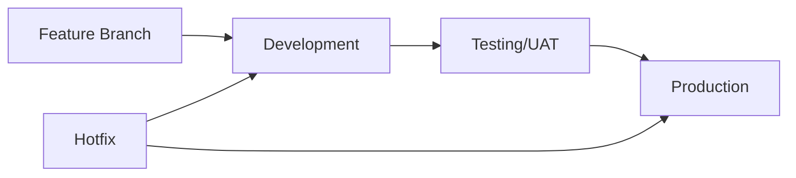

# 🚀 Enterprise Deployment Guide - CapLiquify Manufacturing Platform

## Quick Start Commands

### Daily Development

```bash
# Start new feature
.\scripts\create-feature-branch.ps1 -FeatureName "add-inventory-api" -Description "Add inventory management API"

# Promote to testing
.\scripts\promote-to-environment.ps1 -TargetEnvironment test

# Deploy to production
.\scripts\promote-to-environment.ps1 -TargetEnvironment production

# Emergency hotfix
.\scripts\create-hotfix.ps1 -FixDescription "fix-login-timeout" -Severity critical
```

## Environment URLs

| Environment     | Purpose                   | URL                                                   | Database          |
| --------------- | ------------------------- | ----------------------------------------------------- | ----------------- |
| **Development** | Active development        | https://sentia-manufacturing-development.onrender.com | PostgreSQL (Dev)  |
| **Testing**     | User Acceptance Testing   | https://sentia-manufacturing-testing.onrender.com     | PostgreSQL (Test) |
| **Production**  | Live operations           | https://sentia-manufacturing-production.onrender.com  | PostgreSQL (Prod) |
| **MCP Server**  | AI Central Nervous System | https://mcp-server-tkyu.onrender.com                  | Shared            |

## Workflow Overview



## Standard Development Process

### 1️⃣ Starting New Work

```bash
# Always start from latest development
git checkout development
git pull origin development

# Create feature branch
.\scripts\create-feature-branch.ps1 -FeatureName "your-feature"

# Or manually
git checkout -b feature/your-feature
```

### 2️⃣ Development Guidelines

#### Commit Standards

```bash
# Use conventional commits
git commit -m "feat: add inventory tracking"
git commit -m "fix: resolve login timeout"
git commit -m "docs: update API documentation"
git commit -m "chore: update dependencies"
```

#### Before Committing Checklist

- [ ] Run tests: `npm test`
- [ ] Run linter: `npm run lint`
- [ ] Build check: `npm run build`
- [ ] No console.log statements
- [ ] No hardcoded secrets

### 3️⃣ Code Review Process

1. **Create Pull Request**

   ```bash
   gh pr create --base development --title "feat: your feature"
   ```

2. **Review Requirements**
   - Development → Development: 1 approval
   - Development → Test: 1 approval
   - Test → Production: 2 approvals

3. **Review Checklist**
   - Functionality works as expected
   - Tests included and passing
   - No security vulnerabilities
   - Performance acceptable
   - Documentation updated

### 4️⃣ Testing Environment (UAT)

#### Promoting to Test

```bash
# Automated promotion
.\scripts\promote-to-environment.ps1 -TargetEnvironment test

# Manual process
git checkout test
git pull origin test
git merge development --no-ff
git push origin test
```

#### UAT Checklist

- [ ] All features working
- [ ] No regression issues
- [ ] Performance acceptable
- [ ] External APIs functioning
- [ ] Client approval received

### 5️⃣ Production Deployment

#### Pre-Deployment

```bash
# Backup production database
.\scripts\backup-render-database.ps1 -Environment production

# Run deployment script
.\scripts\promote-to-environment.ps1 -TargetEnvironment production
```

#### Post-Deployment

- Monitor health endpoint: https://sentia-manufacturing-production.onrender.com/health
- Check error logs in Render dashboard
- Verify critical features
- Update stakeholders

## Emergency Procedures

### 🚨 Hotfix Process

#### Severity Levels

| Severity     | Response Time   | Approval      | Examples               |
| ------------ | --------------- | ------------- | ---------------------- |
| **Critical** | 1 hour          | 1 (emergency) | System down, data loss |
| **High**     | 4 hours         | 2             | Major feature broken   |
| **Medium**   | Next deployment | 2             | Minor bugs             |

#### Creating Hotfix

```bash
# Critical hotfix (bypasses normal approval)
.\scripts\create-hotfix.ps1 -FixDescription "fix-critical-bug" -Severity critical -AutoDeploy

# Standard hotfix
.\scripts\create-hotfix.ps1 -FixDescription "fix-bug" -Severity high
```

#### Hotfix Flow

1. Branch from `production`
2. Apply and test fix
3. Merge to `production`
4. Backport to `development` and `test`

### 🔄 Rollback Procedure

```bash
# Quick rollback to previous version
git checkout production
git pull origin production
git revert HEAD --no-edit
git push origin production

# Or use Render dashboard
# 1. Go to https://dashboard.render.com
# 2. Select service
# 3. Click "Rollback" to previous deployment
```

## Monitoring & Health Checks

### Service Health Endpoints

```bash
# Check all environments
curl https://sentia-manufacturing-development.onrender.com/health
curl https://sentia-manufacturing-testing.onrender.com/health
curl https://sentia-manufacturing-production.onrender.com/health
curl https://mcp-server-tkyu.onrender.com/health
```

### Monitoring Script

```bash
# Continuous monitoring
.\monitor-render-services.ps1

# Single check
.\scripts\check-service-health.ps1 -Environment production
```

## Database Management

### Migrations

```bash
# Development/Test (push schema)
npx prisma db push --skip-generate

# Production (use migrations)
npx prisma migrate deploy
```

### Backup & Restore

```bash
# Backup database
.\scripts\backup-render-database.ps1 -Environment production

# Restore database
.\scripts\restore-render-database.ps1 -Environment production -BackupFile backup.sql
```

## Environment Variables

### Adding New Variables

1. Add to `.env.template`
2. Update Render dashboard for each environment
3. Document in `RENDER_ENVIRONMENT_VARIABLES_COMPLETE.md`

### Critical Variables

- `NODE_ENV`: Environment mode
- `DATABASE_URL`: PostgreSQL connection (auto-configured)
- `MCP_SERVER_URL`: AI server endpoint
- `CLERK_SECRET_KEY`: Authentication
- API keys for external services

## CI/CD Pipeline

### GitHub Actions Workflow

- **Trigger**: Push to development/test/production
- **Stages**: Lint → Test → Build → Security → Deploy
- **Checks**: ESLint, Unit tests, Build validation, Security scan

### Pipeline Status

Check at: https://github.com/financeflo-ai/sentia-manufacturing-dashboard/actions

## Team Responsibilities

### Developers

- Follow branch naming conventions
- Write tests for new features
- Complete PR template
- Respond to review comments

### Code Reviewers

- Review within SLA times
- Test functionality locally
- Check security implications
- Provide constructive feedback

### DevOps Lead

- Maintain CI/CD pipeline
- Monitor deployments
- Handle production issues
- Manage environment configs

### Product Owner

- Approve UAT testing
- Sign-off production deployments
- Prioritize hotfixes

## Troubleshooting

### Common Issues

| Issue                     | Solution                      |
| ------------------------- | ----------------------------- |
| Build fails               | Check `npm run build` locally |
| Tests fail                | Run `npm test` and fix issues |
| Deployment stuck          | Check Render dashboard logs   |
| Database connection error | Verify DATABASE_URL in Render |
| MCP server down           | Restart service in Render     |

### Getting Help

- Check logs: https://dashboard.render.com
- Review documentation: `/docs` folder
- GitHub Issues: Create issue with `bug` label
- Emergency: Contact DevOps lead

## Best Practices

### Do's ✅

- Always pull latest before branching
- Test locally before pushing
- Use conventional commits
- Complete PR template
- Document breaking changes
- Monitor after deployment

### Don'ts ❌

- Force push to protected branches
- Skip code reviews
- Deploy untested code
- Ignore failing tests
- Leave console.log in code
- Hardcode secrets

## Quick Reference

### Git Commands

```bash
# Update branches
git fetch --all
git pull origin [branch]

# Create branch
git checkout -b feature/name

# Merge with history
git merge [branch] --no-ff

# Tag release
git tag -a v1.0.0 -m "Release version 1.0.0"

# View logs
git log --oneline --graph
```

### NPM Scripts

```bash
# Development
npm run dev           # Start full stack
npm run dev:client    # Frontend only
npm run dev:server    # Backend only

# Testing
npm test             # Run tests
npm run test:coverage # With coverage
npm run lint         # Check code style

# Production
npm run build        # Build for production
npm start           # Start production server
```

### PowerShell Scripts

```bash
# Development workflow
.\scripts\create-feature-branch.ps1
.\scripts\promote-to-environment.ps1
.\scripts\create-hotfix.ps1

# Deployment
.\deploy-all-render-environments.ps1
.\deploy-mcp-server-to-render.ps1

# Monitoring
.\monitor-render-services.ps1
.\scripts\check-service-health.ps1

# Database
.\scripts\backup-render-database.ps1
.\scripts\database-migration-render.ps1
```

## Security Reminders

⚠️ **NEVER**:

- Commit `.env` files
- Hardcode API keys
- Log sensitive data
- Skip security scans
- Ignore vulnerabilities

✅ **ALWAYS**:

- Use environment variables
- Validate user input
- Sanitize outputs
- Run `npm audit`
- Update dependencies

## Monthly Tasks

### First Monday

- Review and update dependencies
- Run security audit
- Check performance metrics

### Mid-Month

- Review deployment metrics
- Update documentation
- Team retrospective

### End of Month

- Backup production database
- Archive old logs
- Review incident reports

## Contact Information

| Role          | Contact | Responsibility              |
| ------------- | ------- | --------------------------- |
| DevOps Lead   | [Email] | Infrastructure, deployments |
| Tech Lead     | [Email] | Code reviews, architecture  |
| Product Owner | [Email] | Requirements, UAT approval  |
| Security Team | [Email] | Security reviews            |
| On-Call       | [Phone] | Emergency support           |

## Additional Resources

- [Render Dashboard](https://dashboard.render.com)
- [GitHub Repository](https://github.com/financeflo-ai/sentia-manufacturing-dashboard)
- [API Documentation](/docs/api)
- [Database Schema](/prisma/schema.prisma)
- [Environment Variables](/RENDER_ENVIRONMENT_VARIABLES_COMPLETE.md)
- [Git Workflow](/ENTERPRISE_GIT_WORKFLOW.md)
- [Code Review Guidelines](/CODE_REVIEW_GUIDELINES.md)

---

**Last Updated**: December 2024
**Version**: 1.0.0
**Platform**: Render with PostgreSQL

_This guide ensures world-class enterprise deployment practices for the CapLiquify Manufacturing Platform._

