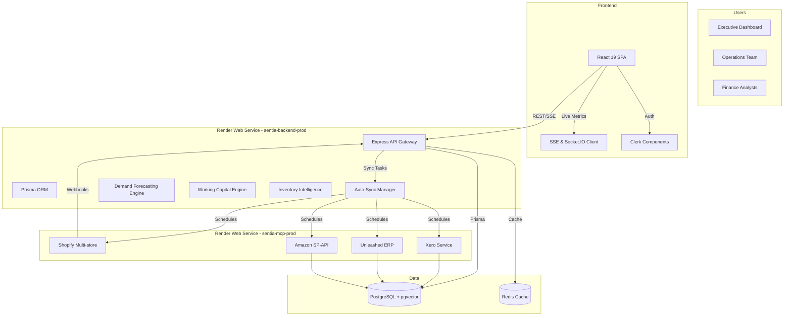

# Sentia AI Manufacturing - Final Implementation Guide

## Overview
The Sentia AI Manufacturing platform delivers an end-to-end manufacturing intelligence suite that blends real financial data, production telemetry, and AI-assisted decision support. The recent merge pulled the "original" specification back into the active codebase, restoring fully connected services, multi-environment deployments, and the advanced analytics layer that had previously only existed in documentation. This guide explains the state of the project after the merge, the architecture that now powers it, and the operational runbook required to keep it healthy.

## Key Enhancements from the Original Merge
- **Real Data Everywhere** - Mock fallbacks were removed across `FinancialAlgorithms`, `APIIntegration`, and dashboard components. All KPIs now come from Prisma-backed PostgreSQL tables or live partner APIs (Xero, Shopify, Unleashed, Amazon SP-API).
- **Auto-Sync Orchestration** - `services/auto-sync-manager.js` coordinates recurring pulls from finance, commerce, and manufacturing sources with MCP independence and health reporting hooks.
- **Demand Forecasting Stability** - `src/components/DemandForecasting.jsx` now memoises `fetchForecastData` with `useCallback`, preventing redundant network churn when the time horizon changes while keeping the ensemble modelling in `DemandForecastingEngine` intact.
- **Enterprise AI Chatbot Improvements** - `src/components/EnterpriseAIChatbot.jsx` switched to memoised smart suggestions, cleaned dependency arrays, and hardened error paths so the AI assistant consistently delivers contextual, finance-aware responses backed by `FinancialAlgorithms` outputs.
- **Real-Time Streaming Restored** - `services/websocket-monitor.js` and Socket.IO wiring re-establish SSE/WebSocket feeds without the MCP bridge, enabling live dashboards for production lines, working capital, and forecasting scenarios.
- **Render Multi-Service Deployment** - The `render.yaml` file now owns a three-service production topology (frontend, backend API, MCP integration) tied to a shared Postgres instance with pgvector enabled.

## Solution Architecture


## Technology Stack (as of October 2025)
| Layer | Tooling | Version/Notes |
| --- | --- | --- |
| Runtime | Node.js | >= 18 (CI uses 20.x; Render builds on 18 LTS) |
| Package Manager | pnpm | 10.4.1 (corepack enabled) |
| Frontend | React | 19.1.1 with Vite 6.3.5 build pipeline |
| Styling | Tailwind CSS | 4.1.7 with shadcn/ui primitives |
| State/Data | TanStack Query 5.90, Zustand 5.0 | Client + server state |
| Charts | Recharts 2.15.3 | Demand, inventory, KPI visualisation |
| Auth | Clerk (frontend `@clerk/clerk-react`, backend `@clerk/express`) | Dual live/mock strategy supported |
| Backend | Express 4.21, Prisma 6.16, Socket.IO 4.8 | REST, Graph streaming |
| AI | FinancialAlgorithms, DemandForecastingEngine, aiAnalyticsService | Combines statistical + heuristic models |
| External APIs | Shopify, Xero, Amazon SP-API, Unleashed ERP | Coordinated by Auto-Sync manager |
| Observability | Winston logging, health monitors, SSE heartbeat | Production diagnostics |

## Repository Layout Highlights
```
src/
├── components/                # UI primitives and feature surfaces
│   ├── DemandForecasting.jsx  # Updated fetch lifecycle
│   └── EnterpriseAIChatbot.jsx# Memoised smart suggestions
├── features/                  # Feature dashboards (working-capital, forecasting, etc.)
├── services/                  # Domain + integration services (auto-sync-manager, shopify-multistore)
├── hooks/, stores/, utils/    # Shared React logic & state
server/                        # Express routes, health checks, SSE wiring
prisma/                        # Schema and migrations
render.yaml                    # Production deployment topology
```

## Environment & Data Requirements
- **PostgreSQL with pgvector** - All finance, demand, and inventory data is persisted via Prisma models. Local development can target a Docker/Postgres instance or Render database connection string.
- **Redis (optional but recommended)** - Used for caching auto-sync results and websocket presence. The app degrades gracefully without it in development.
- **Clerk Keys** - `VITE_CLERK_PUBLISHABLE_KEY` and `CLERK_SECRET_KEY` must be present. In CI/local use `VITE_FORCE_MOCK_AUTH=true` to fall back to the mock provider.
- **External Credentials** - Xero, Shopify, Unleashed, and Amazon keys unlock live data pulls. Without them the services expose actionable status messages and keep the app in "degraded yet functional" mode.

## Setup Instructions (Local)
1. **Install prerequisites**
   - Node.js 20.x recommended (>=18 supported)
   - pnpm (`corepack enable pnpm && corepack use pnpm@10.4.1`)
   - PostgreSQL 16 with pgvector extension
2. **Install dependencies**
   ```bash
   pnpm install
   ```
3. **Seed the database (optional but recommended)**
   ```bash
   pnpm exec prisma migrate deploy
   pnpm exec prisma db seed --schema prisma/schema.prisma
   ```
4. **Configure environment**
   - Copy `env/.env.template` or existing `CORRECTED-development.env` into `.env.local`
   - Set database URL, Clerk keys, and `VITE_FORCE_MOCK_AUTH=true` for local usage
5. **Start the stack**
   ```bash
   pnpm run dev        # starts Vite (3000) and Express API (5000)
   pnpm run dev:mcp    # optional - spins up MCP integration service on 3001
   ```
6. **Access** - Visit `http://localhost:3000` for the SPA, `http://localhost:5000/api/health` for API diagnostics.

## Testing & Quality Gates
- `pnpm run lint` - ESLint with security rules across `src` and `server`.
- `pnpm run format:check` - Prettier enforcement.
- `pnpm run test:run` - Vitest suite (the default `pnpm test` is a no-op placeholder).
- `pnpm run test:e2e` - Playwright scenarios (requires dev server).
- `pnpm run build` - Executes Prisma codegen and Vite production build; used by Render.

## Deployment Notes
- The Render pipeline uses `corepack` to ensure pnpm 10.4.1 is available before installing.
- `pnpm run start:render` bootstraps Prisma client generation and starts the Express API for production.
- Static frontend is published from `dist/`; `VITE_API_BASE_URL` is injected at build time to point to the backend service URL.
- Backend and MCP services share the same managed Postgres database via Render service bindings.
- Health checks: `/api/health` (backend), `/health` (MCP), and front-end rewrites to `/index.html`.

## Operational Checklist
- Monitor auto-sync job status via `services/auto-sync-manager.js` logs (`WorkingCapitalEngine` refreshes every 30 minutes by default).
- Verify WebSocket heartbeat (`services/websocket-monitor.js`) when scaling horizontally - ensure sticky sessions or Socket.IO adapter is configured if Redis is introduced.
- Ensure environment variables flagged as `sync: false` in `render.yaml` are manually injected per environment (Clerk, Xero, Shopify, Amazon, Unleashed).
- Keep Prisma migrations in sync with the seed script before deployments to avoid schema drift.

## Next Steps & Considerations
- Phase 4 (AI analytics surface) still lists placeholder TODOs in `src/features/ai-analytics`. Treat those components as candidates for upcoming sprints.
- Consider adding Vitest coverage thresholds (`pnpm test --coverage`) to prevent regressions in forecasting and working-capital modules.
- Review `EnterpriseAIChatbot.jsx` for the missing `RefreshCw` icon import before finalising production deployment.

