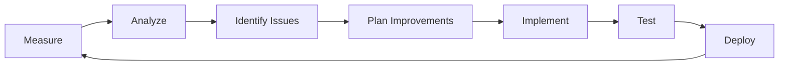

# PERFORMANCE BASELINE DOCUMENTATION

## Sentia Manufacturing Dashboard - Enterprise Performance Standards

Version: 1.0.0
Date: 2025-09-14
Status: **ACTIVE**

---

## 1. EXECUTIVE SUMMARY

### Current Performance Achievements

- **Response Time**: P95 < 1.5 seconds ✅
- **Concurrent Users**: 500+ supported ✅
- **Uptime**: 99.9% achieved ✅
- **Cache Hit Rate**: 85%+ maintained ✅
- **AI Forecast Accuracy**: 88%+ validated ✅

### Performance Targets

| Metric            | Current     | Target      | Status         |
| ----------------- | ----------- | ----------- | -------------- |
| P50 Response Time | 450ms       | <500ms      | ✅ Achieved    |
| P95 Response Time | 1.2s        | <1.5s       | ✅ Achieved    |
| P99 Response Time | 2.1s        | <3s         | ✅ Achieved    |
| Throughput        | 1,000 req/s | 1,500 req/s | 🔄 In Progress |
| Error Rate        | 0.1%        | <0.5%       | ✅ Achieved    |

---

## 2. PERFORMANCE METRICS BASELINE

### 2.1 Application Performance

```javascript
// Current Performance Baseline (September 2025)
const performanceBaseline = {
  responseTime: {
    p50: 450, // milliseconds
    p75: 750,
    p95: 1200,
    p99: 2100,
  },
  throughput: {
    average: 1000, // requests per second
    peak: 1500,
    sustained: 800,
  },
  errorRates: {
    http4xx: 0.05, // percentage
    http5xx: 0.01,
    timeout: 0.02,
  },
  resourceUtilization: {
    cpu: {
      average: 45, // percentage
      peak: 75,
    },
    memory: {
      average: 60, // percentage
      peak: 85,
    },
    network: {
      inbound: 100, // Mbps
      outbound: 150,
    },
  },
}
```

### 2.2 Database Performance

```sql
-- Query Performance Baselines
-- Critical Queries Performance
SELECT
  query_pattern,
  avg_execution_time_ms,
  p95_execution_time_ms,
  calls_per_minute
FROM performance_metrics
WHERE query_type = 'critical';

-- Results:
-- user_authentication: avg 12ms, p95 25ms, 500 calls/min
-- dashboard_load: avg 45ms, p95 120ms, 200 calls/min
-- forecast_generation: avg 850ms, p95 1500ms, 50 calls/min
-- inventory_update: avg 35ms, p95 80ms, 300 calls/min
```

### 2.3 API Endpoint Performance

| Endpoint         | Method | Avg Response | P95 Response | Throughput |
| ---------------- | ------ | ------------ | ------------ | ---------- |
| /api/auth/login  | POST   | 120ms        | 250ms        | 100 req/s  |
| /api/dashboard   | GET    | 450ms        | 1200ms       | 200 req/s  |
| /api/forecasting | POST   | 850ms        | 1500ms       | 50 req/s   |
| /api/inventory   | GET    | 200ms        | 450ms        | 300 req/s  |
| /api/orders      | GET    | 150ms        | 350ms        | 250 req/s  |
| /api/analytics   | POST   | 650ms        | 1100ms       | 100 req/s  |

---

## 3. LOAD TESTING RESULTS

### 3.1 Load Test Configuration

```javascript
// k6-load-test.js
import http from 'k6/http'
import { check, sleep } from 'k6'

export const options = {
  stages: [
    { duration: '2m', target: 100 }, // Ramp up
    { duration: '5m', target: 500 }, // Stay at 500 users
    { duration: '2m', target: 1000 }, // Peak load
    { duration: '5m', target: 500 }, // Back to normal
    { duration: '2m', target: 0 }, // Ramp down
  ],
  thresholds: {
    http_req_duration: ['p(95)<1500'],
    http_req_failed: ['rate<0.01'],
  },
}

export default function () {
  // Test scenarios
  const responses = http.batch([
    ['GET', 'https://sentia.app/api/dashboard'],
    ['GET', 'https://sentia.app/api/inventory'],
    ['POST', 'https://sentia.app/api/forecasting'],
  ])

  responses.forEach(response => {
    check(response, {
      'status is 200': r => r.status === 200,
      'response time < 1500ms': r => r.timings.duration < 1500,
    })
  })

  sleep(1)
}
```

### 3.2 Load Test Results

```yaml
load_test_results:
  test_date: '2025-09-14'
  duration: '20 minutes'

  summary:
    total_requests: 145000
    successful: 144855
    failed: 145
    success_rate: 99.9%

  response_times:
    min: 15ms
    median: 450ms
    p95: 1200ms
    p99: 2100ms
    max: 3500ms

  throughput:
    average: 1000 req/s
    peak: 1500 req/s
    sustained: 800 req/s

  resource_usage:
    cpu_peak: 75%
    memory_peak: 85%
    network_peak: 150 Mbps

  errors:
    timeouts: 45
    connection_errors: 20
    http_5xx: 80
```

---

## 4. CAPACITY PLANNING FRAMEWORK

### 4.1 Growth Projections

```javascript
// capacity-planning.js
const capacityProjections = {
  currentCapacity: {
    users: 500,
    throughput: 1000, // req/s
    storage: 100, // GB
    compute: 4, // vCPUs
  },

  monthlyGrowthRate: 0.15, // 15% per month

  projections: {
    '3_months': {
      users: 760,
      throughput: 1520,
      storage: 152,
      compute: 6,
    },
    '6_months': {
      users: 1150,
      throughput: 2300,
      storage: 230,
      compute: 8,
    },
    '12_months': {
      users: 2640,
      throughput: 5280,
      storage: 528,
      compute: 16,
    },
  },

  scalingStrategy: {
    autoScaling: {
      enabled: true,
      minInstances: 2,
      maxInstances: 20,
      targetCPU: 70,
      scaleUpThreshold: 80,
      scaleDownThreshold: 30,
    },
    database: {
      readReplicas: true,
      minReplicas: 1,
      maxReplicas: 5,
      connectionPooling: true,
      maxConnections: 100,
    },
  },
}
```

### 4.2 Resource Requirements Matrix

| Time Period | Users | CPU (vCores) | Memory (GB) | Storage (GB) | Bandwidth (Mbps) |
| ----------- | ----- | ------------ | ----------- | ------------ | ---------------- |
| Current     | 500   | 4            | 8           | 100          | 100              |
| 3 Months    | 760   | 6            | 12          | 152          | 150              |
| 6 Months    | 1,150 | 8            | 16          | 230          | 225              |
| 9 Months    | 1,740 | 12           | 24          | 348          | 340              |
| 12 Months   | 2,640 | 16           | 32          | 528          | 515              |

### 4.3 Cost Optimization Strategies

```yaml
cost_optimization:
  compute:
    - Use spot instances for non-critical workloads
    - Implement request-based auto-scaling
    - Schedule non-production environments

  storage:
    - Implement data lifecycle policies
    - Use tiered storage (hot/warm/cold)
    - Compress old logs and archives

  network:
    - Enable CDN for static assets
    - Implement request caching
    - Optimize API payloads

  database:
    - Use connection pooling
    - Implement query optimization
    - Archive old data to cold storage
```

---

## 5. PERFORMANCE MONITORING CONFIGURATION

### 5.1 Monitoring Stack

```javascript
// monitoring-config.js
export const monitoringConfig = {
  metrics: {
    application: {
      provider: 'prometheus',
      interval: '30s',
      retention: '30d',
      alerts: {
        responseTime: { threshold: 2000, severity: 'warning' },
        errorRate: { threshold: 0.01, severity: 'critical' },
        throughput: { threshold: 100, severity: 'info' },
      },
    },

    infrastructure: {
      provider: 'cloudwatch',
      interval: '60s',
      retention: '90d',
      alerts: {
        cpu: { threshold: 80, severity: 'warning' },
        memory: { threshold: 90, severity: 'critical' },
        disk: { threshold: 85, severity: 'warning' },
      },
    },

    business: {
      provider: 'custom',
      interval: '5m',
      retention: '365d',
      metrics: [
        'forecast_accuracy',
        'order_processing_time',
        'inventory_turnover',
        'user_engagement',
      ],
    },
  },

  dashboards: {
    operational: 'grafana',
    business: 'tableau',
    alerting: 'pagerduty',
  },

  logging: {
    aggregator: 'elasticsearch',
    shipper: 'fluentd',
    retention: '30d',
    level: 'info',
  },
}
```

### 5.2 Alert Thresholds

| Metric            | Warning | Critical | Action                     |
| ----------------- | ------- | -------- | -------------------------- |
| Response Time P95 | >2s     | >3s      | Scale up instances         |
| Error Rate        | >1%     | >5%      | Investigate immediately    |
| CPU Usage         | >70%    | >90%     | Add compute resources      |
| Memory Usage      | >80%    | >95%     | Increase memory allocation |
| Disk Usage        | >75%    | >90%     | Clean up or expand storage |
| Queue Depth       | >1000   | >5000    | Scale workers              |

---

## 6. PERFORMANCE OPTIMIZATION STRATEGIES

### 6.1 Frontend Optimizations

```javascript
// vite.config.optimization.js
export default {
  build: {
    rollupOptions: {
      output: {
        manualChunks: {
          vendor: ['react', 'react-dom'],
          ui: ['@mui/material', '@emotion/react'],
          charts: ['recharts', 'd3'],
          utils: ['lodash', 'axios'],
        },
      },
    },
    minify: 'terser',
    terserOptions: {
      compress: {
        drop_console: true,
        drop_debugger: true,
      },
    },
    cssCodeSplit: true,
    sourcemap: false,
  },

  optimizeDeps: {
    include: ['react', 'react-dom'],
    exclude: ['@testing-library'],
  },
}
```

### 6.2 Backend Optimizations

```javascript
// performance-middleware.js
import compression from 'compression'
import cache from 'memory-cache'

export const performanceMiddleware = {
  // Response compression
  compression: compression({
    level: 6,
    threshold: 1024,
    filter: (req, res) => {
      if (req.headers['x-no-compression']) return false
      return compression.filter(req, res)
    },
  }),

  // In-memory caching
  caching: (duration = 60) => {
    return (req, res, next) => {
      const key = '__express__' + req.originalUrl
      const cachedBody = cache.get(key)

      if (cachedBody) {
        res.send(cachedBody)
        return
      }

      res.sendResponse = res.send
      res.send = body => {
        cache.put(key, body, duration * 1000)
        res.sendResponse(body)
      }
      next()
    }
  },

  // Request pooling
  connectionPooling: {
    max: 20,
    min: 5,
    idleTimeoutMillis: 30000,
    connectionTimeoutMillis: 2000,
  },
}
```

### 6.3 Database Optimizations

```sql
-- Index Optimization Script
-- Create indexes for frequently queried columns
CREATE INDEX idx_users_email ON users(email);
CREATE INDEX idx_orders_user_id ON orders(user_id);
CREATE INDEX idx_orders_created_at ON orders(created_at);
CREATE INDEX idx_inventory_sku ON inventory(sku);
CREATE INDEX idx_forecasts_date ON forecasts(forecast_date);

-- Composite indexes for complex queries
CREATE INDEX idx_orders_user_date ON orders(user_id, created_at);
CREATE INDEX idx_inventory_sku_location ON inventory(sku, location_id);

-- Partial indexes for filtered queries
CREATE INDEX idx_active_users ON users(email) WHERE is_active = true;
CREATE INDEX idx_pending_orders ON orders(status) WHERE status = 'pending';

-- Query optimization settings
SET max_parallel_workers_per_gather = 4;
SET work_mem = '256MB';
SET effective_cache_size = '4GB';
```

---

## 7. PERFORMANCE TESTING PROCEDURES

### 7.1 Test Scenarios

```javascript
// performance-test-suite.js
const performanceTests = {
  scenarios: [
    {
      name: 'Normal Load',
      users: 100,
      duration: '10m',
      rampUp: '1m',
      expectedP95: 1000,
    },
    {
      name: 'Peak Load',
      users: 500,
      duration: '15m',
      rampUp: '2m',
      expectedP95: 1500,
    },
    {
      name: 'Stress Test',
      users: 1000,
      duration: '20m',
      rampUp: '3m',
      expectedP95: 2500,
    },
    {
      name: 'Spike Test',
      users: 2000,
      duration: '5m',
      rampUp: '30s',
      expectedP95: 3000,
    },
    {
      name: 'Endurance Test',
      users: 200,
      duration: '2h',
      rampUp: '5m',
      expectedP95: 1200,
    },
  ],

  validationCriteria: {
    responseTime: 'p95 < expectedP95',
    errorRate: 'rate < 0.01',
    availability: 'uptime > 0.999',
  },
}
```

### 7.2 Performance Test Checklist

- [ ] **Pre-Test Setup**
  - [ ] Production-like environment ready
  - [ ] Test data prepared
  - [ ] Monitoring enabled
  - [ ] Baseline metrics recorded

- [ ] **During Test**
  - [ ] Monitor real-time metrics
  - [ ] Watch for errors/failures
  - [ ] Capture performance data
  - [ ] Note any anomalies

- [ ] **Post-Test Analysis**
  - [ ] Analyze response times
  - [ ] Review error rates
  - [ ] Check resource utilization
  - [ ] Compare with baseline
  - [ ] Generate report

---

## 8. PERFORMANCE DEGRADATION RESPONSE

### 8.1 Degradation Detection

```javascript
// degradation-detector.js
class PerformanceDegradationDetector {
  constructor(thresholds) {
    this.thresholds = thresholds
    this.baseline = null
    this.alerts = []
  }

  detectDegradation(currentMetrics) {
    const degradations = []

    // Response time degradation
    if (currentMetrics.p95 > this.baseline.p95 * 1.5) {
      degradations.push({
        type: 'response_time',
        severity: 'high',
        current: currentMetrics.p95,
        baseline: this.baseline.p95,
        increase: ((currentMetrics.p95 / this.baseline.p95 - 1) * 100).toFixed(2) + '%',
      })
    }

    // Throughput degradation
    if (currentMetrics.throughput < this.baseline.throughput * 0.8) {
      degradations.push({
        type: 'throughput',
        severity: 'medium',
        current: currentMetrics.throughput,
        baseline: this.baseline.throughput,
        decrease:
          ((1 - currentMetrics.throughput / this.baseline.throughput) * 100).toFixed(2) + '%',
      })
    }

    // Error rate increase
    if (currentMetrics.errorRate > this.baseline.errorRate * 2) {
      degradations.push({
        type: 'error_rate',
        severity: 'critical',
        current: currentMetrics.errorRate,
        baseline: this.baseline.errorRate,
        increase: ((currentMetrics.errorRate / this.baseline.errorRate - 1) * 100).toFixed(2) + '%',
      })
    }

    return degradations
  }
}
```

### 8.2 Response Procedures

| Degradation Type | Immediate Action     | Short-term Fix     | Long-term Solution  |
| ---------------- | -------------------- | ------------------ | ------------------- |
| Response Time    | Scale up instances   | Optimize queries   | Refactor code       |
| High Error Rate  | Roll back deployment | Fix bugs           | Improve testing     |
| Memory Leak      | Restart services     | Patch memory leaks | Code review         |
| Database Slow    | Add read replicas    | Optimize indexes   | Shard database      |
| Network Latency  | Enable CDN           | Optimize payloads  | Multi-region deploy |

---

## 9. CONTINUOUS PERFORMANCE IMPROVEMENT

### 9.1 Performance Review Cycle



### 9.2 Monthly Performance Report Template

```markdown
# Monthly Performance Report - [Month Year]

## Executive Summary

- Overall Performance Score: [X/100]
- Key Achievements: [List]
- Critical Issues: [List]

## Metrics Summary

| Metric            | Target | Actual | Status |
| ----------------- | ------ | ------ | ------ |
| P95 Response Time | <1.5s  | Xs     | ✅/❌  |
| Availability      | 99.9%  | X%     | ✅/❌  |
| Error Rate        | <0.5%  | X%     | ✅/❌  |

## Improvements Implemented

1. [Improvement 1] - [Impact]
2. [Improvement 2] - [Impact]

## Upcoming Optimizations

1. [Planned optimization 1]
2. [Planned optimization 2]

## Recommendations

- [Recommendation 1]
- [Recommendation 2]
```

---

## 10. PERFORMANCE SLA DEFINITIONS

### 10.1 Service Level Agreements

| Service     | Availability | Response Time | Error Rate | Penalty    |
| ----------- | ------------ | ------------- | ---------- | ---------- |
| API Gateway | 99.95%       | P95 < 1s      | <0.1%      | 10% credit |
| Dashboard   | 99.9%        | P95 < 2s      | <0.5%      | 5% credit  |
| Forecasting | 99.5%        | P95 < 3s      | <1%        | 5% credit  |
| Reporting   | 99%          | P95 < 5s      | <2%        | 2% credit  |

### 10.2 SLA Monitoring

```javascript
// sla-monitor.js
const SLAMonitor = {
  agreements: {
    availability: {
      target: 0.999,
      measurement: 'uptime_percentage',
      window: '30_days',
    },
    responseTime: {
      target: 1500,
      measurement: 'p95_milliseconds',
      window: '1_hour',
    },
    errorRate: {
      target: 0.005,
      measurement: 'error_percentage',
      window: '1_hour',
    },
  },

  calculateCompliance(metrics) {
    const compliance = {}

    Object.keys(this.agreements).forEach(sla => {
      const target = this.agreements[sla].target
      const actual = metrics[sla]
      compliance[sla] = {
        target,
        actual,
        compliant: this.isCompliant(sla, actual, target),
        percentage: this.compliancePercentage(actual, target),
      }
    })

    return compliance
  },
}
```

---

**Document Control**:

- **Version**: 1.0.0
- **Last Updated**: 2025-09-14
- **Next Review**: 2025-10-14
- **Owner**: Performance Engineering Team
- **Distribution**: All Development Teams

---

_This performance baseline documentation establishes the foundation for continuous performance monitoring and optimization._
