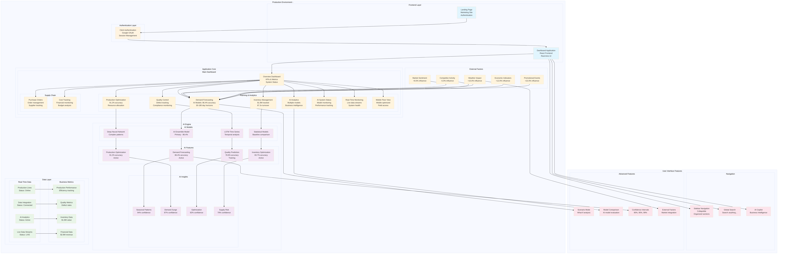

# 🏭 Sentia AI Manufacturing Platform

Enterprise-grade AI platform delivering real-time manufacturing intelligence, finance automation, and auto-synced operational data for Sentia Spirits.

## Platform Overview

- **Live Data Pipelines** - Auto-sync manager orchestrates Shopify, Xero, Amazon SP-API, and Unleashed ERP via Render-managed services (no mock fallbacks).
- **AI Decision Support** - Demand forecasting ensembles, working-capital optimisation, and the enterprise AI chatbot all derive insights directly from PostgreSQL + pgvector.
- **Real-Time Dashboards** - SSE/Socket.IO streaming keeps KPI cards, financials, and production telemetry fresh without page reloads.
- **Enterprise Controls** - Clerk authentication with RBAC, Prisma-backed auditing, comprehensive deployment playbooks, and security hardening guides.



> Up-to-date UI previews for the executive dashboard, working-capital cockpit, and inventory intelligence views are tracked in `docs/user/FEATURE_GUIDES.md` (refresh after each major UI change).

## Feature Highlights

- **Executive Control Centre** - Consolidated dashboard bringing together production status, revenue trajectory, and cash KPIs with drill-down reporting.
- **Working-Capital Intelligence** - Cash conversion optimisation, receivables/payables simulations, and forward-looking liquidity forecasts powered by `WorkingCapitalEngine`.
- **Demand Forecasting Suite** - Ensemble modelling with configurable horizons, seasonal detection, and scenario planning, now using memoised fetches to prevent duplicate loads.
- **Inventory & Production** - Multi-location stock telemetry, ABC analysis, reorder recommendations, and production efficiency metrics synced with Unleashed ERP.
- **Enterprise AI Chatbot** - Context-aware assistant that surfaces KPI breakdowns, generates forecasts, and exports board-ready summaries while handling failure modes gracefully.
- **Auto-Sync Orchestration** - Credential-aware scheduler coordinating partner API pulls, with health reporting endpoints and degraded-mode status for missing secrets.

## Technology Stack (October 2025)

| Layer           | Tooling                                                                         |
| --------------- | ------------------------------------------------------------------------------- |
| Frontend        | React 19, Vite 6, Tailwind 4 + shadcn/ui, TanStack Query 5                      |
| Backend         | Node.js 18+, Express 4, Prisma 6, Socket.IO 4                                   |
| Data            | PostgreSQL 16 with pgvector, optional Redis cache                               |
| AI/Analytics    | `DemandForecastingEngine`, `WorkingCapitalEngine`, FinancialAlgorithms services |
| Integrations    | Shopify multi-store, Xero, Amazon SP-API, Unleashed ERP (Render MCP service)    |
| Auth & Security | Clerk (web + API), Helmet, rate limiting, security playbooks                    |

## Getting Started

### 1. Prerequisites

- Node.js 20.x (>=18 supported)
- pnpm 10.4 (`corepack enable pnpm`)
- PostgreSQL 16 with pgvector extension
- Optional: Redis instance for Socket.IO clustering / auto-sync caching

### 2. Install Dependencies

```bash
git clone <repo-url>
cd capliquify-ai-dashboard-app
pnpm install
```

### 3. Configure Environment

1. Copy `CORRECTED-development.env` to `.env.local` (or create manually).
2. Provide values for:
   - `DATABASE_URL` (local/hosted Postgres)
   - `VITE_CLERK_PUBLISHABLE_KEY` / `CLERK_SECRET_KEY` (set `VITE_FORCE_MOCK_AUTH=true` if absent)
   - Optional integration credentials (`SHOPIFY_*`, `XERO_*`, `UNLEASHED_*`, `AMAZON_SP_API_*`)

### 4. Prepare the Database

```bash
pnpm exec prisma migrate deploy
pnpm exec prisma db seed --schema prisma/schema.prisma
```

The seed script provisions the nine-SKU Sentia product catalogue, historical sales, and baseline working-capital metrics used by dashboards and AI models.

### 5. Run Services

```bash
pnpm run dev        # Vite (3000) + Express API (5000)
pnpm run dev:mcp    # optional - integration/MCP service (3001)
```

Visit `http://localhost:3000` (mock auth enabled when `VITE_FORCE_MOCK_AUTH=true`). Backend health is available at `http://localhost:5000/api/health`.

### 6. Smoke Test Checklist

- Landing on the executive dashboard shows live KPIs without mock-data warnings.
- Switching demand-forecast horizons triggers a single network request (check browser devtools).
- AI chatbot opens with memoised smart suggestions and returns financial insights.
- `/api/status/sync` (auth required) lists latest job timestamps for Shopify, Xero, Unleashed, and Amazon feeds.

### 7. Quality Gates

```bash
pnpm run lint
pnpm run format:check
pnpm run test:run           # Vitest
pnpm run test:e2e           # Playwright (requires servers running)
pnpm run build              # Prisma client + Vite production bundle
```

## Deployment

Render Blueprints manage production-grade infrastructure via `render.yaml`:

- `sentia-frontend-prod` (static site) publishes the Vite bundle.
- `sentia-backend-prod` runs the Express/Prisma API with Socket.IO and health checks at `/api/health`.
- `sentia-mcp-prod` hosts integration services and the auto-sync manager with `/health` reporting.
  Refer to `DEPLOYMENT_STRATEGY_AND_VERIFICATION.md` for environment-variable matrices, verification procedures, rollback strategy, and troubleshooting tips.

## Documentation Map

- `FINAL_IMPLEMENTATION_GUIDE.md` - architecture deep dive, setup, operations checklist.
- `QUICK_START.md` - abbreviated local onboarding steps.
- `CODEX_CLI_PROMPTS_COMPLETE.md` - automation prompt catalogue for Codex/Claude CLI.
- `docs/user/FEATURE_GUIDES.md` - latest UI walkthroughs and screenshots.
- `CHANGELOG.md` - running log of merged features and fixes.

## Contribution Guidelines

- Follow Conventional Commits (`feat:`, `fix:`, `chore:`) and reference the relevant SpecKit issue ID in commit bodies or PR descriptions.
- Before opening a PR run linting, unit tests, Playwright scenarios (if relevant), and `pnpm run build`.
- Include Render preview URL(s), before/after screenshots (link to `docs/user/FEATURE_GUIDES.md` entries), and confirm `pnpm run lint`, `pnpm run format:check`, `pnpm run test:run`, and `pnpm run test:e2e` (when impacted).
- Never commit secrets or `.env` files; configuration flows through Render or local environment management.

## Support & Troubleshooting

- Check auto-sync status endpoints for credential or rate-limit warnings.
- Review `services/auto-sync-manager.js` logs and `services/websocket-monitor.js` heartbeat outputs when data appears stale.
- For authentication issues, confirm Clerk keys are present and fall back to `VITE_FORCE_MOCK_AUTH=true` locally.
- Open issues with detailed reproduction steps, environment details, and mention whether integrations are connected or running in degraded mode.
