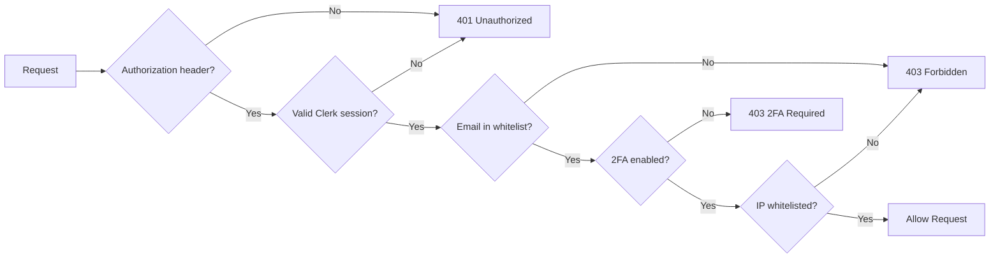

# Story: ADMIN-001 - Master Admin Middleware & Access Control

**Story ID**: ADMIN-001
**Epic**: PHASE-5.1-MASTER-ADMIN-DASHBOARD
**Created**: 2025-10-20
**Status**: 🚧 In Progress
**Priority**: High
**Estimated Effort**: 4 hours
**Actual Effort**: TBD

---

## 📋 **USER STORY**

**As a** platform administrator
**I want** secure master admin authentication with 2FA enforcement
**So that** only authorized personnel can access tenant management features

---

## 🎯 **ACCEPTANCE CRITERIA**

- [ ] Master admin middleware validates email against whitelist
- [ ] 2FA enforcement check via Clerk API
- [ ] Session token verification via Clerk
- [ ] Optional IP whitelisting support
- [ ] Clear error messages for unauthorized access
- [ ] Middleware rejects non-master-admin users with 403
- [ ] All failed access attempts logged

---

## 🏗️ **TECHNICAL DESIGN**

### **File Structure**

```
server/
├── middleware/
│   └── master-admin.middleware.ts    # New file
└── routes/
    └── master-admin.routes.ts         # Will use this middleware
```

### **Environment Variables**

```bash
# Required
MASTER_ADMIN_EMAIL=admin@capliquify.com

# Optional (future enhancement)
MASTER_ADMIN_ALLOWED_IPS=203.0.113.1,198.51.100.0/24
```

### **Middleware Flow**



---

## 💻 **IMPLEMENTATION**

### **1. Create Middleware File**

**Location**: `server/middleware/master-admin.middleware.ts`

```typescript
import { Request, Response, NextFunction } from 'express';
import { clerkClient } from '@clerk/clerk-sdk-node';

// Master admin email whitelist from environment
const MASTER_ADMIN_EMAILS = (process.env.MASTER_ADMIN_EMAIL || '')
  .split(',')
  .map(email => email.trim())
  .filter(Boolean);

// Optional IP whitelist
const MASTER_ADMIN_ALLOWED_IPS = (process.env.MASTER_ADMIN_ALLOWED_IPS || '')
  .split(',')
  .map(ip => ip.trim())
  .filter(Boolean);

// Extend Express Request to include masterAdmin property
declare global {
  namespace Express {
    interface Request {
      masterAdmin?: {
        userId: string;
        email: string;
        fullName: string;
      };
    }
  }
}

/**
 * Master Admin Middleware
 * Verifies:
 * 1. Valid Clerk session token
 * 2. Email is in master admin whitelist
 * 3. 2FA is enabled on user account
 * 4. IP address is whitelisted (optional)
 */
export async function masterAdminMiddleware(
  req: Request,
  res: Response,
  next: NextFunction
): Promise<void> {
  try {
    // Step 1: Extract and validate Authorization header
    const authHeader = req.headers.authorization;
    if (!authHeader || !authHeader.startsWith('Bearer ')) {
      res.status(401).json({
        error: 'Unauthorized',
        message: 'Missing or invalid authorization header'
      });
      return;
    }

    const sessionToken = authHeader.substring(7);

    // Step 2: Verify Clerk session
    let session;
    try {
      session = await clerkClient.sessions.verifySession(sessionToken);
    } catch (error) {
      res.status(401).json({
        error: 'Unauthorized',
        message: 'Invalid or expired session token'
      });
      return;
    }

    if (!session) {
      res.status(401).json({
        error: 'Unauthorized',
        message: 'Session verification failed'
      });
      return;
    }

    // Step 3: Get user details from Clerk
    let user;
    try {
      user = await clerkClient.users.getUser(session.userId);
    } catch (error) {
      res.status(500).json({
        error: 'Internal server error',
        message: 'Failed to retrieve user information'
      });
      return;
    }

    // Step 4: Verify email is in whitelist
    const userEmail = user.emailAddresses[0]?.emailAddress;
    if (!userEmail || !MASTER_ADMIN_EMAILS.includes(userEmail)) {
      // Log unauthorized access attempt
      console.warn('[SECURITY] Unauthorized master admin access attempt', {
        userId: user.id,
        email: userEmail,
        ip: req.ip,
        path: req.path,
        timestamp: new Date().toISOString()
      });

      res.status(403).json({
        error: 'Forbidden',
        message: 'Master admin access denied. This incident has been logged.'
      });
      return;
    }

    // Step 5: Verify 2FA is enabled
    if (!user.twoFactorEnabled) {
      res.status(403).json({
        error: 'Forbidden',
        message: '2FA is required for master admin access. Please enable 2FA in your account settings.'
      });
      return;
    }

    // Step 6: Optional IP whitelist check
    if (MASTER_ADMIN_ALLOWED_IPS.length > 0) {
      const clientIp = req.ip || req.connection.remoteAddress || '';
      const ipAllowed = MASTER_ADMIN_ALLOWED_IPS.some(allowedIp => {
        // Support CIDR notation in the future (simple exact match for now)
        return clientIp === allowedIp;
      });

      if (!ipAllowed) {
        console.warn('[SECURITY] Master admin access denied - IP not whitelisted', {
          userId: user.id,
          email: userEmail,
          ip: clientIp,
          timestamp: new Date().toISOString()
        });

        res.status(403).json({
          error: 'Forbidden',
          message: 'Access denied from your IP address. Please contact support.'
        });
        return;
      }
    }

    // Step 7: Attach master admin details to request
    req.masterAdmin = {
      userId: user.id,
      email: userEmail,
      fullName: `${user.firstName || ''} ${user.lastName || ''}`.trim() || userEmail
    };

    // Log successful access
    console.info('[MASTER-ADMIN] Access granted', {
      userId: user.id,
      email: userEmail,
      path: req.path,
      method: req.method,
      timestamp: new Date().toISOString()
    });

    // Proceed to next middleware/route handler
    next();
  } catch (error) {
    console.error('[MASTER-ADMIN] Middleware error:', error);
    res.status(500).json({
      error: 'Internal server error',
      message: 'An unexpected error occurred during authentication'
    });
  }
}
```

### **2. Create Types File** (Optional - for better TypeScript support)

**Location**: `server/types/express.d.ts`

```typescript
declare namespace Express {
  export interface Request {
    masterAdmin?: {
      userId: string;
      email: string;
      fullName: string;
    };
  }
}
```

---

## 🧪 **TESTING STRATEGY**

### **Unit Tests** (`server/middleware/__tests__/master-admin.middleware.test.ts`)

```typescript
describe('masterAdminMiddleware', () => {
  it('should reject requests without Authorization header', async () => {
    // Test 401 for missing header
  });

  it('should reject requests with invalid session token', async () => {
    // Mock Clerk verifySession to throw error
  });

  it('should reject users not in email whitelist', async () => {
    // Test 403 for non-whitelisted email
  });

  it('should reject users without 2FA enabled', async () => {
    // Test 403 for user with twoFactorEnabled: false
  });

  it('should reject requests from non-whitelisted IPs', async () => {
    // Test 403 for IP mismatch (when MASTER_ADMIN_ALLOWED_IPS set)
  });

  it('should allow valid master admin requests', async () => {
    // Test successful authentication
  });

  it('should attach masterAdmin to request object', async () => {
    // Verify req.masterAdmin is populated correctly
  });
});
```

### **Integration Tests**

```bash
# Manual testing with curl
curl -H "Authorization: Bearer <clerk-session-token>" \
  https://api.capliquify.com/api/master-admin/tenants
```

---

## 📝 **DOCUMENTATION UPDATES**

### **1. Environment Variable Documentation**

Add to `docs/ENVIRONMENT_VARIABLES.md`:

```markdown
### Master Admin Authentication

| Variable | Required | Description | Example |
|----------|----------|-------------|---------|
| `MASTER_ADMIN_EMAIL` | Yes | Comma-separated list of admin emails | `admin@capliquify.com,owner@example.com` |
| `MASTER_ADMIN_ALLOWED_IPS` | No | Comma-separated IP whitelist | `203.0.113.1,198.51.100.0/24` |
```

### **2. Security Documentation**

Add to `docs/MASTER_ADMIN_SECURITY.md` (new file):

```markdown
# Master Admin Security

## Access Requirements

1. **Email Whitelist**: Your email must be in `MASTER_ADMIN_EMAIL`
2. **2FA Required**: Enable 2FA in Clerk dashboard
3. **Valid Session**: Must have active Clerk session
4. **IP Whitelist** (optional): Your IP must be in `MASTER_ADMIN_ALLOWED_IPS`

## Enabling 2FA

1. Log in to https://app.capliquify.com
2. Go to Account Settings → Security
3. Enable Two-Factor Authentication
4. Scan QR code with authenticator app (Google Authenticator, Authy, etc.)
5. Save backup codes

## Security Logging

All master admin access attempts are logged:
- Successful access: INFO level
- Failed attempts: WARN level with incident flag
```

---

## ✅ **DEFINITION OF DONE**

- [ ] Middleware file created and tested
- [ ] Environment variables documented
- [ ] Unit tests written and passing
- [ ] Integration tested with Postman/curl
- [ ] Security logging verified
- [ ] Code reviewed for security vulnerabilities
- [ ] TypeScript types exported correctly
- [ ] Documentation updated

---

## 🔗 **RELATED FILES**

- `server/routes/master-admin.routes.ts` (will use this middleware)
- `docs/ENVIRONMENT_VARIABLES.md`
- `docs/MASTER_ADMIN_SECURITY.md` (new)

---

## 📊 **STORY PROGRESS**

- [x] Story created
- [ ] Middleware implementation complete
- [ ] Unit tests written
- [ ] Integration tests passed
- [ ] Documentation updated
- [ ] Code review complete
- [ ] Merged to main

---

**Last Updated**: 2025-10-20
**Status**: 🚧 In Progress
**Next Steps**: Implement middleware file, write tests, document environment variables
