# Database Schema: Entity Relationships (Enhanced Global Readiness)

## Overview

The CapLiquify Manufacturing Platform database implements a comprehensive relational schema supporting manufacturing planning, e-commerce integration, financial management, and analytics with **full global readiness** for multi-entity, multi-currency operations. The enhanced schema uses PostgreSQL with UUID primary keys for scalability and distributed system compatibility.

### Current Implementation Status
- **Database**: Neon PostgreSQL with Prisma ORM ✅ IMPLEMENTED
- **Global Readiness**: Multi-entity and multi-currency support ✅ IMPLEMENTED
- **Authentication**: Clerk integration with enhanced security ✅ IMPLEMENTED
- **Data Import**: Comprehensive import system with validation ✅ IMPLEMENTED
- **Working Capital**: Advanced financial planning models ✅ IMPLEMENTED
- **Agent AI**: Autonomous agent system for optimization ✅ IMPLEMENTED

### Global Readiness Features
- **Multi-Entity Support**: Full legal entity separation with consolidated reporting ✅ IMPLEMENTED
- **Multi-Currency Operations**: Real-time FX conversion and base currency consolidation ✅ IMPLEMENTED
- **Compliance Management**: VAT/Sales tax jurisdiction handling and import duty tracking ✅ IMPLEMENTED
- **Audit Trails**: Comprehensive audit columns with soft-delete capability ✅ IMPLEMENTED
- **Performance Optimization**: Strategic indexing for global operations ✅ IMPLEMENTED

## Core Entity Relationships

```mermaid
erDiagram
    USERS ||--o{ PRODUCTS : creates
    USERS ||--o{ HISTORICAL_SALES : records
    USERS ||--o{ FORECASTS : generates
    USERS ||--o{ SYSTEM_SETTINGS : manages
    
    MARKETS ||--o{ PRODUCTS : "manufactured for"
    MARKETS ||--o{ SALES_CHANNELS : "operates in"
    MARKETS ||--o{ WORKING_CAPITAL : "projected for"
    
    PRODUCTS ||--o{ HISTORICAL_SALES : "sales of"
    PRODUCTS ||--o{ FORECASTS : "demand for"
    PRODUCTS ||--o{ INVENTORY_LEVELS : "stock of"
    PRODUCTS ||--o{ WORKING_CAPITAL : "cash flow from"
    
    SALES_CHANNELS ||--o{ HISTORICAL_SALES : "sold through"
    SALES_CHANNELS ||--o{ FORECASTS : "predicted via"
    
    USERS ||--o{ JOBS : creates
    USERS ||--o{ SCHEDULES : creates
    SCHEDULES ||--o{ JOBS : contains
    
    %% Global Readiness Entities
    ENTITIES ||--o{ HISTORICAL_SALES : "legal entity for"
    ENTITIES ||--o{ FORECASTS : "entity context"
    ENTITIES ||--o{ INVENTORY_LEVELS : "owned by"
    ENTITIES ||--o{ WORKING_CAPITAL : "consolidated by"
    
    CURRENCIES ||--o{ HISTORICAL_SALES : "transaction currency"
    CURRENCIES ||--o{ HISTORICAL_SALES : "base currency"
    CURRENCIES ||--o{ FORECASTS : "forecast currency"
    CURRENCIES ||--o{ FORECASTS : "base currency"
    CURRENCIES ||--o{ INVENTORY_LEVELS : "valuation currency"
    CURRENCIES ||--o{ WORKING_CAPITAL : "projection currency"
    CURRENCIES ||--o{ FX_RATES : "base currency"
    CURRENCIES ||--o{ FX_RATES : "quote currency"
    
    VAT_RATES ||--o{ WORKING_CAPITAL : "tax rate applied"
    SALES_TAX_US ||--o{ WORKING_CAPITAL : "US tax rate applied"
    IMPORT_PROVENANCE ||--o{ HISTORICAL_SALES : "import tracking"
```

## Entity Definitions

### 1. Users (`users`)
**Purpose**: Authentication, authorization, and audit trails

| Field | Type | Description | Relationships |
|-------|------|-------------|---------------|
| id | UUID | Primary key | Referenced by all audit fields |
| username | String(64) | Unique username | - |
| email | String(120) | Unique email | - |
| role | String(20) | admin/manager/analyst/viewer | - |
| permissions | JSON | Custom permissions override | - |
| is_active | Boolean | Account status | - |

**Key Features**:
- Role-based access control (RBAC)
- Failed login tracking and account lockout
- Timezone and language preferences
- Comprehensive audit trail support

### 2. Markets (`markets`)
**Purpose**: Geographic market definitions and characteristics

| Field | Type | Description | Relationships |
|-------|------|-------------|---------------|
| id | UUID | Primary key | - |
| code | String(10) | UK/EU/USA | Referenced by products, sales_channels |
| name | String(100) | Full market name | - |
| currency_code | String(3) | GBP/EUR/USD | - |
| tax_rate | Decimal(5,4) | VAT/Sales tax rate | - |

**Key Features**:
- Shipping time estimates (standard/express)
- Regulatory requirements storage
- Import/export restrictions

### 3. Products (`products`)
**Purpose**: Product catalog with manufacturing and pricing data

| Field | Type | Description | Relationships |
|-------|------|-------------|---------------|
| id | UUID | Primary key | Referenced by sales, forecasts, inventory |
| sku | String(50) | Unique product identifier | - |
| category | String(50) | GABA Red/Black/Gold | - |
| market_region | String(10) | UK/EU/USA | Foreign key to markets.code |
| unit_cost | Decimal(10,2) | Manufacturing cost | - |
| selling_price | Decimal(10,2) | Market price | - |

**Key Features**:
- Production time and batch size specifications
- Regional variations and compliance data
- Cost and pricing management

### 4. Sales Channels (`sales_channels`)
**Purpose**: E-commerce platform configuration and performance

| Field | Type | Description | Relationships |
|-------|------|-------------|---------------|
| id | UUID | Primary key | Referenced by sales, forecasts |
| name | String(100) | Channel name | - |
| channel_type | String(50) | Amazon/Shopify | - |
| market_code | String(10) | Target market | Foreign key to markets.code |
| commission_rate | Decimal(5,4) | Platform commission % | - |
| fulfillment_method | String(20) | FBA/FBM/Own | - |

**Key Features**:
- API integration settings (encrypted credentials)
- Sync status and error handling
- Performance metrics (conversion rates, targets)

### 5. Historical Sales (`historical_sales`)
**Purpose**: Transaction-level sales data for analytics and forecasting

| Field | Type | Description | Relationships |
|-------|------|-------------|---------------|
| id | UUID | Primary key | - |
| product_id | UUID | Product sold | Foreign key to products.id |
| sales_channel_id | UUID | Channel used | Foreign key to sales_channels.id |
| sale_date | Date | Transaction date | Indexed for time-series |
| quantity_sold | Integer | Units sold | - |
| net_revenue | Decimal(12,2) | Revenue after discounts | - |
| net_profit | Decimal(10,2) | Profit after all costs | - |

**Key Features**:
- Comprehensive cost breakdown (COGS, shipping, fees, taxes)
- Data quality scoring and validation flags
- Geographic and seasonal categorization
- High-performance time-series indexing

### 6. Forecasts (`forecasts`)
**Purpose**: Demand predictions with confidence intervals

| Field | Type | Description | Relationships |
|-------|------|-------------|---------------|
| id | UUID | Primary key | - |
| product_id | UUID | Product forecasted | Foreign key to products.id |
| sales_channel_id | UUID | Channel forecasted | Foreign key to sales_channels.id |
| forecast_date | Date | Prediction date | - |
| predicted_demand | Integer | Expected units | - |
| confidence_score | Decimal(3,2) | Model confidence (0-1) | - |
| model_type | String(50) | ARIMA/Prophet/ML/Manual | - |

**Key Features**:
- Upper/lower bounds for uncertainty
- Model versioning and accuracy tracking
- Seasonal and trend factor decomposition
- Approval workflow integration

### 7. Inventory Levels (`inventory_levels`)
**Purpose**: Multi-location stock management

| Field | Type | Description | Relationships |
|-------|------|-------------|---------------|
| id | UUID | Primary key | - |
| product_id | UUID | Product stocked | Foreign key to products.id |
| location_id | String(100) | Warehouse/FBA center ID | - |
| available_quantity | Integer | Available for sale | - |
| reserved_quantity | Integer | Allocated but not shipped | - |
| reorder_point | Integer | Minimum stock threshold | - |
| days_of_supply | Integer | Days until stockout | - |

**Key Features**:
- Multiple quantity types (available, reserved, inbound, defective)
- Automatic reorder point calculations
- Age tracking and turnover metrics
- Stock status alerts and risk scoring

### 8. Working Capital (`working_capital`)
**Purpose**: Financial projections and cash flow management

| Field | Type | Description | Relationships |
|-------|------|-------------|---------------|
| id | UUID | Primary key | - |
| projection_date | Date | Forecast date | - |
| product_id | UUID | Product context | Foreign key to products.id |
| market_code | String(10) | Market context | Foreign key to markets.code |
| projected_sales_revenue | Decimal(15,2) | Expected revenue | - |
| net_cash_flow | Decimal(15,2) | Calculated cash flow | - |
| working_capital_requirement | Decimal(15,2) | Capital needed | - |

**Key Features**:
- Multi-currency support with conversion tracking
- Scenario analysis (optimistic/base/pessimistic)
- Tax obligations across jurisdictions
- Cash conversion cycle calculations

### 9. System Settings (`system_settings`)
**Purpose**: Flexible application configuration with versioning

| Field | Type | Description | Relationships |
|-------|------|-------------|---------------|
| id | UUID | Primary key | - |
| category | String(50) | Setting group | - |
| key | String(100) | Setting identifier | - |
| data_type | String(20) | Value type | - |
| value_* | Various | Type-specific storage | - |
| version | Integer | Setting version | - |

**Key Features**:
- Multi-type value storage (text, integer, decimal, JSON, etc.)
- Environment-specific settings (dev/test/prod)
- Scoped settings (global, user, product)
- Change tracking with audit trail

## Global Readiness Entities

### 10. Entities (`entities`)
**Purpose**: Legal entity management for multi-entity operations

| Field | Type | Description | Relationships |
|-------|------|-------------|---------------|
| id | UUID | Primary key | Referenced by all financial tables |
| name | String(100) | Legal entity name | - |
| country_code | String(2) | ISO-3166-1 alpha-2 country | - |
| currency_code | String(3) | ISO-4217 currency code | Foreign key to currencies.code |
| tax_number | String(50) | VAT/EIN/tax ID | - |
| address | Text | Legal address | - |
| is_active | Boolean | Entity status | - |

**Key Features**:
- Legal entity separation with consolidated reporting capability
- Country and currency association for compliance
- Comprehensive audit trail with soft-delete support
- Referenced by all financial and operational tables

### 11. Currencies (`currencies`)
**Purpose**: Multi-currency support with FX conversion

| Field | Type | Description | Relationships |
|-------|------|-------------|---------------|
| code | String(3) | ISO-4217 currency code (PK) | Referenced by FX rates and transactions |
| name | String(100) | Currency full name | - |
| symbol | String(10) | Currency symbol | - |
| decimal_places | Integer | Decimal precision (typically 2) | - |
| is_active | Boolean | Currency status | - |

**Key Features**:
- ISO-4217 compliant currency definitions
- Supports major trading currencies (GBP, EUR, USD, etc.)
- Referenced by all financial tables for multi-currency operations
- Automatic FX conversion support

### 12. FX Rates (`fx_rates`)
**Purpose**: Foreign exchange rate management

| Field | Type | Description | Relationships |
|-------|------|-------------|---------------|
| id | UUID | Primary key | - |
| as_of_date | Date | Rate effective date | Indexed for time-series |
| base_code | String(3) | Base currency | Foreign key to currencies.code |
| quote_code | String(3) | Quote currency | Foreign key to currencies.code |
| rate | Decimal(18,8) | High-precision FX rate | - |
| source | String(50) | Rate provider (ECB, OANDA, etc.) | - |

**Key Features**:
- High-precision decimal storage for accurate conversions
- Time-series data with historical rates
- Multiple rate sources supported
- Unique constraints prevent duplicate rates

### 13. VAT Rates (`vat_rates`)
**Purpose**: European VAT and UK VAT rate management

| Field | Type | Description | Relationships |
|-------|------|-------------|---------------|
| id | UUID | Primary key | - |
| country_code | String(2) | ISO country code | - |
| rate_name | String(50) | Rate category (Standard/Reduced/Zero) | - |
| rate_pct | Decimal(5,4) | VAT percentage (e.g., 0.2000 = 20%) | - |
| valid_from | Date | Rate effective start | - |
| valid_to | Date | Rate effective end (nullable) | - |

**Key Features**:
- Historical VAT rate tracking with validity periods
- Multiple rate types per country (standard, reduced, zero)
- Supports all EU countries plus UK post-Brexit

### 14. Sales Tax US (`sales_tax_us`)
**Purpose**: US state sales tax management

| Field | Type | Description | Relationships |
|-------|------|-------------|---------------|
| id | UUID | Primary key | - |
| state_code | String(2) | US state code | - |
| locality | String(100) | City/county (nullable) | - |
| rate_pct | Decimal(5,4) | Sales tax percentage | - |
| valid_from | Date | Rate effective start | - |
| valid_to | Date | Rate effective end (nullable) | - |

**Key Features**:
- State-level and local-level tax rates
- Historical rate tracking for compliance
- Covers all US states including zero-tax states

### 15. Import Provenance (`import_provenance`)
**Purpose**: Data import tracking and regulatory compliance

| Field | Type | Description | Relationships |
|-------|------|-------------|---------------|
| id | UUID | Primary key | - |
| import_job_id | UUID | Data import batch ID | - |
| source_system | String(100) | Source system identifier | - |
| batch_identifier | String(100) | Unique batch reference | - |
| import_timestamp | DateTime | Import date/time | - |
| record_count | Integer | Records in batch | - |

**Key Features**:
- Complete data lineage for regulatory compliance
- Batch-level import tracking
- Source system identification
- Audit trail for all imported financial data

## Enhanced Core Entity Extensions

### Historical Sales Global Extensions
**New Fields Added**:
- `entity_id` (UUID): Legal entity reference
- `region` (String): Geographic region (UK/EU/USA)
- `currency_code_tx` (String): Transaction currency
- `currency_code_base` (String): Base currency for consolidation
- `amount_tx` (Decimal): Amount in transaction currency
- `amount_base` (Decimal): Amount in base currency (GBP)
- `fx_rate_used` (Decimal): Applied FX rate for conversion
- `import_batch_id` (UUID): Import provenance tracking

### Forecast Global Extensions
**New Fields Added**:
- `entity_id` (UUID): Entity context for forecast
- `region` (String): Regional forecast scope
- `currency_code_tx` (String): Forecast currency
- `currency_code_base` (String): Base currency
- `predicted_revenue_tx` (Decimal): Revenue in forecast currency
- `predicted_revenue_base` (Decimal): Revenue in base currency
- `fx_rate_assumption` (Decimal): FX rate assumption used
- `series_id` (String): Computed series identifier

### Inventory Level Global Extensions
**New Fields Added**:
- `entity_id` (UUID): Owning entity
- `region` (String): Regional location
- `currency_code_valuation` (String): Valuation currency
- `currency_code_base` (String): Base currency
- `unit_cost_base` (Decimal): Unit cost in base currency
- `total_value_base` (Decimal): Total value in base currency
- `fx_rate_valuation` (Decimal): Applied valuation FX rate

### Working Capital Global Extensions
**New Fields Added**:
- `entity_id` (UUID): Legal entity for projection
- `region` (String): Regional scope
- `currency_code_base` (String): Base currency for consolidation
- `fx_rate_to_base` (Decimal): Conversion rate to base currency
- `tax_jurisdiction` (String): Tax jurisdiction code
- `vat_rate_applied` (Decimal): Applied VAT/sales tax rate
- `import_duty_rate` (Decimal): Applied import duty rate
- `compliance_status` (String): Compliance status flag
- `risk_category` (String): Risk category (LOW/MEDIUM/HIGH/CRITICAL)
- `consolidation_group` (String): Consolidation grouping
- `intercompany_elimination_flag` (Boolean): Intercompany elimination marker

## Legacy Manufacturing Models

### 16. Jobs (`jobs`)
**Purpose**: Manufacturing job tracking

| Field | Type | Description | Relationships |
|-------|------|-------------|---------------|
| id | UUID | Primary key | - |
| job_number | String(50) | Unique job identifier | - |
| schedule_id | UUID | Parent schedule | Foreign key to schedules.id |
| customer_name | String(200) | Customer/order info | - |
| status | String(20) | pending/active/completed | - |

### 17. Schedules (`schedules`)
**Purpose**: Production schedule management

| Field | Type | Description | Relationships |
|-------|------|-------------|---------------|
| id | UUID | Primary key | - |
| name | String(100) | Schedule name | - |
| created_by | UUID | User who created | Foreign key to users.id |
| start_date | DateTime | Schedule start | - |
| end_date | DateTime | Schedule end | - |

### 18. Resources (`resources`)
**Purpose**: Manufacturing resource management

| Field | Type | Description | Relationships |
|-------|------|-------------|---------------|
| id | UUID | Primary key | - |
| name | String(100) | Resource name | - |
| type | String(50) | Resource category | - |
| capacity | Float | Resource capacity | - |
| status | String(20) | available/maintenance/offline | - |

## Indexing Strategy

### Enhanced Time-Series Performance
- **Historical Sales**: 
  - Core: `(product_id, sales_channel_id, sale_date, quantity_sold)`
  - Global: `(entity_id, sale_date)`, `(region, sale_date)`, `(currency_code_tx, sale_date)`
- **Forecasts**: 
  - Core: `(forecast_date, product_id, sales_channel_id)`
  - Global: `(entity_id, forecast_date)`, `(region, forecast_date)`, `(series_id)`
- **Working Capital**: 
  - Core: `(projection_date, scenario_type, status)`
  - Global: `(entity_id, projection_date, scenario_type)`, `(region, projection_date)`
- **Inventory Levels**:
  - Core: `(product_id, location_id, snapshot_date)`
  - Global: `(entity_id, snapshot_date)`, `(currency_code_valuation, snapshot_date)`

### Global Readiness Indexes
- **Multi-Entity Access**: All financial tables indexed by `entity_id` for rapid entity-scoped queries
- **Multi-Currency Operations**: Currency code indexes for FX conversion lookups
- **Compliance Queries**: `(tax_jurisdiction, projection_date)`, `(compliance_status, risk_category)`
- **Consolidation Support**: `(consolidation_group, projection_date)`, `(intercompany_elimination_flag)`

### Reference Data Performance
- **FX Rates**: `(as_of_date)`, `(base_code, quote_code)` for rapid currency conversions
- **VAT/Sales Tax**: `(country_code, valid_from)`, `(state_code, valid_from)` for tax calculations
- **Entities**: `(country_code)`, `(currency_code)`, `(is_active)` for entity management

### Lookup Performance  
- **Products**: SKU unique index, category+market composite index
- **Sales Channels**: Type+market composite index
- **Users**: Username and email unique indexes, role+active status
- **Currencies**: ISO code primary key for rapid currency lookups
- **Import Provenance**: `(source_system, import_timestamp)`, `(batch_identifier)`

### Referential Integrity & Constraints
- All foreign key relationships enforced at database level
- Cascade delete policies defined for hierarchical data
- Check constraints for enumerated values
- Unique constraints on business keys (e.g., FX rate date/currency pairs)
- Index-backed constraints for performance (e.g., entity active status)

## Data Lifecycle Management

### Audit Trail
- All entities include created_at, updated_at, created_by fields
- Change tracking via updated_by fields where applicable
- System settings include previous_value for change history

### Data Retention
- **Historical Sales**: Indefinite retention for analytics
- **Forecasts**: Superseded forecasts marked but retained
- **System Settings**: Version history maintained
- **Logs**: Application-defined retention policies

### Data Quality
- **Validation Rules**: Data type constraints, range checks
- **Quality Scoring**: Automated quality assessment for imported data
- **Cleanup Processes**: Scheduled data validation and correction

## Security Considerations

### Access Control
- Row-level security via user context
- Role-based permissions enforced in application layer
- Sensitive data encryption (API keys, credentials)

### Data Privacy
- PII handling in compliance with GDPR/CCPA
- Audit logging of sensitive data access
- Data anonymization capabilities

---

*This schema supports the full lifecycle of manufacturing planning, from demand forecasting through production scheduling to financial analysis, while maintaining data integrity and performance at scale.*