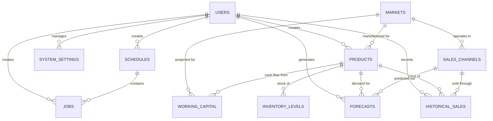

# Database Schema: Entity Relationships

## Overview

The Sentia Manufacturing Dashboard database implements a comprehensive relational schema supporting manufacturing planning, e-commerce integration, financial management, and analytics. The schema uses PostgreSQL with UUID primary keys for scalability and distributed system compatibility.

## Core Entity Relationships

## Entity Definitions

### 1. Users (`users`)
**Purpose**: Authentication, authorization, and audit trails

| Field | Type | Description | Relationships |
|-------|------|-------------|---------------|
| id | UUID | Primary key | Referenced by all audit fields |
| username | String(64) | Unique username | - |
| email | String(120) | Unique email | - |
| role | String(20) | admin/manager/analyst/viewer | - |
| permissions | JSON | Custom permissions override | - |
| is_active | Boolean | Account status | - |

**Key Features**:
- Role-based access control (RBAC)
- Failed login tracking and account lockout
- Timezone and language preferences
- Comprehensive audit trail support

### 2. Markets (`markets`)
**Purpose**: Geographic market definitions and characteristics

| Field | Type | Description | Relationships |
|-------|------|-------------|---------------|
| id | UUID | Primary key | - |
| code | String(10) | UK/EU/USA | Referenced by products, sales_channels |
| name | String(100) | Full market name | - |
| currency_code | String(3) | GBP/EUR/USD | - |
| tax_rate | Decimal(5,4) | VAT/Sales tax rate | - |

**Key Features**:
- Shipping time estimates (standard/express)
- Regulatory requirements storage
- Import/export restrictions

### 3. Products (`products`)
**Purpose**: Product catalog with manufacturing and pricing data

| Field | Type | Description | Relationships |
|-------|------|-------------|---------------|
| id | UUID | Primary key | Referenced by sales, forecasts, inventory |
| sku | String(50) | Unique product identifier | - |
| category | String(50) | GABA Red/Black/Gold | - |
| market_region | String(10) | UK/EU/USA | Foreign key to markets.code |
| unit_cost | Decimal(10,2) | Manufacturing cost | - |
| selling_price | Decimal(10,2) | Market price | - |

**Key Features**:
- Production time and batch size specifications
- Regional variations and compliance data
- Cost and pricing management

### 4. Sales Channels (`sales_channels`)
**Purpose**: E-commerce platform configuration and performance

| Field | Type | Description | Relationships |
|-------|------|-------------|---------------|
| id | UUID | Primary key | Referenced by sales, forecasts |
| name | String(100) | Channel name | - |
| channel_type | String(50) | Amazon/Shopify | - |
| market_code | String(10) | Target market | Foreign key to markets.code |
| commission_rate | Decimal(5,4) | Platform commission % | - |
| fulfillment_method | String(20) | FBA/FBM/Own | - |

**Key Features**:
- API integration settings (encrypted credentials)
- Sync status and error handling
- Performance metrics (conversion rates, targets)

### 5. Historical Sales (`historical_sales`)
**Purpose**: Transaction-level sales data for analytics and forecasting

| Field | Type | Description | Relationships |
|-------|------|-------------|---------------|
| id | UUID | Primary key | - |
| product_id | UUID | Product sold | Foreign key to products.id |
| sales_channel_id | UUID | Channel used | Foreign key to sales_channels.id |
| sale_date | Date | Transaction date | Indexed for time-series |
| quantity_sold | Integer | Units sold | - |
| net_revenue | Decimal(12,2) | Revenue after discounts | - |
| net_profit | Decimal(10,2) | Profit after all costs | - |

**Key Features**:
- Comprehensive cost breakdown (COGS, shipping, fees, taxes)
- Data quality scoring and validation flags
- Geographic and seasonal categorization
- High-performance time-series indexing

### 6. Forecasts (`forecasts`)
**Purpose**: Demand predictions with confidence intervals

| Field | Type | Description | Relationships |
|-------|------|-------------|---------------|
| id | UUID | Primary key | - |
| product_id | UUID | Product forecasted | Foreign key to products.id |
| sales_channel_id | UUID | Channel forecasted | Foreign key to sales_channels.id |
| forecast_date | Date | Prediction date | - |
| predicted_demand | Integer | Expected units | - |
| confidence_score | Decimal(3,2) | Model confidence (0-1) | - |
| model_type | String(50) | ARIMA/Prophet/ML/Manual | - |

**Key Features**:
- Upper/lower bounds for uncertainty
- Model versioning and accuracy tracking
- Seasonal and trend factor decomposition
- Approval workflow integration

### 7. Inventory Levels (`inventory_levels`)
**Purpose**: Multi-location stock management

| Field | Type | Description | Relationships |
|-------|------|-------------|---------------|
| id | UUID | Primary key | - |
| product_id | UUID | Product stocked | Foreign key to products.id |
| location_id | String(100) | Warehouse/FBA center ID | - |
| available_quantity | Integer | Available for sale | - |
| reserved_quantity | Integer | Allocated but not shipped | - |
| reorder_point | Integer | Minimum stock threshold | - |
| days_of_supply | Integer | Days until stockout | - |

**Key Features**:
- Multiple quantity types (available, reserved, inbound, defective)
- Automatic reorder point calculations
- Age tracking and turnover metrics
- Stock status alerts and risk scoring

### 8. Working Capital (`working_capital`)
**Purpose**: Financial projections and cash flow management

| Field | Type | Description | Relationships |
|-------|------|-------------|---------------|
| id | UUID | Primary key | - |
| projection_date | Date | Forecast date | - |
| product_id | UUID | Product context | Foreign key to products.id |
| market_code | String(10) | Market context | Foreign key to markets.code |
| projected_sales_revenue | Decimal(15,2) | Expected revenue | - |
| net_cash_flow | Decimal(15,2) | Calculated cash flow | - |
| working_capital_requirement | Decimal(15,2) | Capital needed | - |

**Key Features**:
- Multi-currency support with conversion tracking
- Scenario analysis (optimistic/base/pessimistic)
- Tax obligations across jurisdictions
- Cash conversion cycle calculations

### 9. System Settings (`system_settings`)
**Purpose**: Flexible application configuration with versioning

| Field | Type | Description | Relationships |
|-------|------|-------------|---------------|
| id | UUID | Primary key | - |
| category | String(50) | Setting group | - |
| key | String(100) | Setting identifier | - |
| data_type | String(20) | Value type | - |
| value_* | Various | Type-specific storage | - |
| version | Integer | Setting version | - |

**Key Features**:
- Multi-type value storage (text, integer, decimal, JSON, etc.)
- Environment-specific settings (dev/test/prod)
- Scoped settings (global, user, product)
- Change tracking with audit trail

## Legacy Manufacturing Models

### 10. Jobs (`jobs`)
**Purpose**: Manufacturing job tracking

| Field | Type | Description | Relationships |
|-------|------|-------------|---------------|
| id | UUID | Primary key | - |
| job_number | String(50) | Unique job identifier | - |
| schedule_id | UUID | Parent schedule | Foreign key to schedules.id |
| customer_name | String(200) | Customer/order info | - |
| status | String(20) | pending/active/completed | - |

### 11. Schedules (`schedules`)
**Purpose**: Production schedule management

| Field | Type | Description | Relationships |
|-------|------|-------------|---------------|
| id | UUID | Primary key | - |
| name | String(100) | Schedule name | - |
| created_by | UUID | User who created | Foreign key to users.id |
| start_date | DateTime | Schedule start | - |
| end_date | DateTime | Schedule end | - |

### 12. Resources (`resources`)
**Purpose**: Manufacturing resource management

| Field | Type | Description | Relationships |
|-------|------|-------------|---------------|
| id | UUID | Primary key | - |
| name | String(100) | Resource name | - |
| type | String(50) | Resource category | - |
| capacity | Float | Resource capacity | - |
| status | String(20) | available/maintenance/offline | - |

## Indexing Strategy

### Time-Series Performance
- **Historical Sales**: Composite indexes on (product_id, sales_channel_id, sale_date, quantity_sold)
- **Forecasts**: Indexes on forecast_date, product_id, sales_channel_id combinations
- **Working Capital**: Date-based indexes for time-series queries

### Lookup Performance  
- **Products**: SKU unique index, category+market composite index
- **Sales Channels**: Type+market composite index
- **Users**: Username and email unique indexes

### Referential Integrity
- All foreign key relationships enforced at database level
- Cascade delete policies defined for hierarchical data
- Check constraints for enumerated values

## Data Lifecycle Management

### Audit Trail
- All entities include created_at, updated_at, created_by fields
- Change tracking via updated_by fields where applicable
- System settings include previous_value for change history

### Data Retention
- **Historical Sales**: Indefinite retention for analytics
- **Forecasts**: Superseded forecasts marked but retained
- **System Settings**: Version history maintained
- **Logs**: Application-defined retention policies

### Data Quality
- **Validation Rules**: Data type constraints, range checks
- **Quality Scoring**: Automated quality assessment for imported data
- **Cleanup Processes**: Scheduled data validation and correction

## Security Considerations

### Access Control
- Row-level security via user context
- Role-based permissions enforced in application layer
- Sensitive data encryption (API keys, credentials)

### Data Privacy
- PII handling in compliance with GDPR/CCPA
- Audit logging of sensitive data access
- Data anonymization capabilities

---

*This schema supports the full lifecycle of manufacturing planning, from demand forecasting through production scheduling to financial analysis, while maintaining data integrity and performance at scale.*