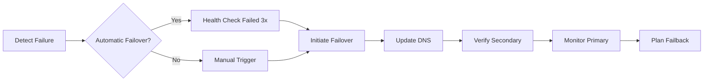

# Disaster Recovery Plan

## CapLiquify Manufacturing Platform - Enterprise DR Procedures

### Executive Summary
This document outlines the disaster recovery procedures for the CapLiquify Manufacturing Platform, ensuring business continuity and minimal downtime in case of system failures or disasters.

---

## 1. Recovery Objectives

### Recovery Time Objective (RTO)
- **Critical Systems**: < 1 hour
- **Core Functions**: < 2 hours
- **Full Recovery**: < 4 hours

### Recovery Point Objective (RPO)
- **Database**: < 15 minutes
- **Files/Assets**: < 1 hour
- **Configurations**: Real-time (Git)

---

## 2. Disaster Scenarios

### 2.1 Service Outages

#### Render Platform Outage
**Impact**: Complete application unavailability
**Detection**: Automated monitoring alerts

**Recovery Steps**:
```bash
# 1. Verify outage status
curl -I https://sentia-manufacturing-production.onrender.com

# 2. Check Render status page
open https://status.render.com

# 3. If extended outage (>30 min), failover to backup
./scripts/failover-to-backup.sh production

# 4. Update DNS to point to backup
./scripts/update-dns.sh backup-production

# 5. Notify stakeholders
./scripts/send-alert.sh "Production failover initiated"
```

#### Database Failure
**Impact**: Data unavailability, application errors
**Detection**: Database monitoring, connection errors

**Recovery Steps**:
```bash
# 1. Identify failure type
npm run db:health-check

# 2. Attempt automatic recovery
npm run db:auto-recover

# 3. If connection issue, restart connections
npm run db:restart-pool

# 4. If data corruption, restore from backup
npm run db:restore-latest

# 5. Verify data integrity
npm run db:verify-integrity
```

### 2.2 Data Loss Scenarios

#### Accidental Data Deletion
**Recovery Steps**:
```bash
# 1. Stop all write operations
npm run maintenance:enable

# 2. Identify deletion scope
npm run audit:review --last-hour

# 3. Restore from point-in-time backup
npm run db:restore --timestamp="2025-01-15T10:00:00Z"

# 4. Verify restored data
npm run db:verify --table=affected_table

# 5. Resume operations
npm run maintenance:disable
```

#### Database Corruption
**Recovery Steps**:
```bash
# 1. Take corrupted database offline
npm run db:emergency-shutdown

# 2. Create corruption report
npm run db:corruption-scan > corruption-report.txt

# 3. Restore from last known good backup
npm run db:restore --last-known-good

# 4. Apply transaction logs if available
npm run db:apply-wal --from=last-backup

# 5. Full integrity check
npm run db:full-integrity-check
```

### 2.3 Security Incidents

#### Data Breach
**Immediate Response**:
```bash
# 1. Isolate affected systems
npm run security:isolate-system

# 2. Revoke all access tokens
npm run security:revoke-all-tokens

# 3. Enable emergency security mode
npm run security:emergency-mode

# 4. Capture forensic data
npm run security:forensic-capture

# 5. Reset all credentials
npm run security:rotate-all-credentials
```

#### Ransomware Attack
**Recovery Steps**:
```bash
# 1. Disconnect from network
npm run network:emergency-disconnect

# 2. Identify infection scope
npm run security:ransomware-scan

# 3. Restore from clean backups
npm run restore:from-clean-backup

# 4. Rebuild affected systems
npm run system:rebuild --clean

# 5. Security audit
npm run security:post-incident-audit
```

---

## 3. Backup and Recovery Procedures

### 3.1 Automated Backups

#### Database Backups
```bash
# Daily automated backup (2 AM UTC)
0 2 * * * npm run backup:database

# Weekly full backup (Sunday 3 AM UTC)
0 3 * * 0 npm run backup:database --full

# Monthly archive (1st day, 4 AM UTC)
0 4 1 * * npm run backup:database --archive
```

#### Application Backups
```bash
# Configuration backup (every commit)
git push --mirror backup-repo

# Static assets backup (daily)
npm run backup:assets

# Environment backup
npm run backup:environment
```

### 3.2 Manual Recovery

#### Quick Recovery Script
```bash
#!/bin/bash
# emergency-recovery.sh

echo "Starting Emergency Recovery..."

# 1. Check system status
npm run health:check

# 2. Identify failure points
npm run diagnose:failures

# 3. Execute recovery based on failure type
case $FAILURE_TYPE in
  "database")
    npm run recover:database
    ;;
  "application")
    npm run recover:application
    ;;
  "network")
    npm run recover:network
    ;;
  *)
    npm run recover:full
    ;;
esac

# 4. Verify recovery
npm run verify:recovery

echo "Recovery completed"
```

### 3.3 Backup Verification

#### Weekly Verification
```bash
# Test restore to staging
npm run backup:test-restore --env=staging

# Verify data integrity
npm run backup:verify-integrity

# Check backup completeness
npm run backup:completeness-check
```

---

## 4. Failover Procedures

### 4.1 Primary to Secondary Failover



### 4.2 Failover Commands

```bash
# Automatic failover (if configured)
npm run failover:auto

# Manual failover
npm run failover:manual --target=secondary

# Verify failover
npm run failover:verify

# Failback to primary
npm run failback:to-primary
```

---

## 5. Communication Procedures

### 5.1 Incident Communication

#### Severity Levels
- **SEV1 (Critical)**: Complete outage, data loss
- **SEV2 (Major)**: Partial outage, performance degradation
- **SEV3 (Minor)**: Feature unavailable, non-critical issue

#### Communication Matrix

| Severity | Notification Time | Stakeholders | Channel |
|----------|------------------|--------------|---------|
| SEV1 | Immediate | All | Phone, Email, Slack |
| SEV2 | 15 minutes | Tech, Management | Email, Slack |
| SEV3 | 1 hour | Tech Team | Slack |

### 5.2 Status Updates

```bash
# Send initial alert
npm run alert:send --severity=1 --message="Service disruption detected"

# Update status page
npm run status:update --status=investigating

# Send progress update
npm run alert:update --message="Recovery in progress, ETA 30 minutes"

# Send resolution notice
npm run alert:resolve --message="Service restored"
```

---

## 6. Recovery Testing

### 6.1 Monthly DR Drills

```bash
# Schedule monthly DR test
npm run dr:schedule-test

# Execute DR drill
npm run dr:execute-drill

# Document results
npm run dr:document-results

# Update procedures based on findings
npm run dr:update-procedures
```

### 6.2 Test Scenarios

1. **Database Failure Simulation**
```bash
npm run test:simulate-db-failure
npm run test:execute-db-recovery
npm run test:verify-db-recovery
```

2. **Application Crash Simulation**
```bash
npm run test:simulate-app-crash
npm run test:execute-app-recovery
npm run test:verify-app-recovery
```

3. **Network Partition Test**
```bash
npm run test:simulate-network-partition
npm run test:execute-network-recovery
npm run test:verify-network-recovery
```

---

## 7. Recovery Runbooks

### 7.1 Database Recovery Runbook

```yaml
name: Database Recovery
trigger: Database connection failure
steps:
  - name: Initial Assessment
    commands:
      - npm run db:status
      - npm run db:connection-test
    timeout: 30s

  - name: Attempt Reconnection
    commands:
      - npm run db:reconnect
      - npm run db:verify-connection
    retries: 3

  - name: Failover to Replica
    condition: reconnection_failed
    commands:
      - npm run db:failover-replica
      - npm run app:update-connection

  - name: Restore from Backup
    condition: replica_unavailable
    commands:
      - npm run db:restore-latest
      - npm run db:verify-integrity

  - name: Post-Recovery
    commands:
      - npm run db:analyze-failure
      - npm run alert:send-report
```

### 7.2 Application Recovery Runbook

```yaml
name: Application Recovery
trigger: Application health check failure
steps:
  - name: Service Restart
    commands:
      - npm run app:graceful-shutdown
      - npm run app:start
      - npm run app:health-check

  - name: Roll Back Deployment
    condition: restart_failed
    commands:
      - npm run deploy:rollback
      - npm run app:verify-rollback

  - name: Scale Resources
    condition: resource_exhaustion
    commands:
      - npm run scale:up --instances=2
      - npm run scale:verify

  - name: Emergency Mode
    condition: critical_failure
    commands:
      - npm run app:emergency-mode
      - npm run app:minimal-service
```

---

## 8. Post-Recovery Actions

### 8.1 Immediate Actions
1. Verify system functionality
2. Check data integrity
3. Review audit logs
4. Document incident

### 8.2 Follow-up Actions
1. Root cause analysis
2. Update DR procedures
3. Stakeholder debriefing
4. Preventive measures implementation

### 8.3 Documentation Requirements
```bash
# Generate incident report
npm run report:incident --id=INC-2025-001

# Create RCA document
npm run report:rca --incident=INC-2025-001

# Update DR documentation
npm run docs:update-dr --lessons-learned

# Schedule review meeting
npm run meeting:schedule-postmortem
```

---

## 9. Contact Information

### Emergency Contacts

| Role | Name | Phone | Email | Escalation |
|------|------|-------|-------|------------|
| CTO | John Smith | +1-555-0001 | cto@sentia.com | Primary |
| DevOps Lead | Jane Doe | +1-555-0002 | devops@sentia.com | Primary |
| Database Admin | Bob Wilson | +1-555-0003 | dba@sentia.com | Secondary |
| Security Lead | Alice Brown | +1-555-0004 | security@sentia.com | Secondary |

### External Support

| Service | Contact | Account # | Priority |
|---------|---------|-----------|----------|
| Render Support | support@render.com | ENT-12345 | P1 |
| Database Support | support@neon.tech | PRO-67890 | P1 |
| CDN Support | support@cloudflare.com | ENT-11111 | P2 |

---

## 10. Appendices

### A. Recovery Scripts Location
- Local: `/scripts/disaster-recovery/`
- Git: `https://github.com/sentia/dr-scripts`
- Backup: S3://sentia-dr-scripts/

### B. Backup Locations
- Primary: S3://sentia-backups-primary/
- Secondary: S3://sentia-backups-secondary/
- Archive: Glacier://sentia-archives/

### C. Documentation
- Wiki: https://wiki.sentia.com/dr
- Runbooks: https://runbooks.sentia.com
- Status Page: https://status.sentia.com

---

**Document Version**: 1.0.0
**Last Updated**: January 2025
**Review Cycle**: Quarterly
**Owner**: DevOps Team

---

## Quick Reference Card

### Critical Commands
```bash
# Emergency shutdown
npm run emergency:shutdown-all

# Quick recovery
npm run recover:auto

# Status check
npm run status:all

# Backup now
npm run backup:emergency

# Restore latest
npm run restore:latest

# Failover
npm run failover:execute

# Health check
npm run health:comprehensive
```

### Emergency Checklist
- [ ] Assess situation severity
- [ ] Notify stakeholders
- [ ] Execute recovery procedure
- [ ] Verify recovery success
- [ ] Document incident
- [ ] Schedule postmortem

---

Remember: **Stay calm, follow procedures, document everything**