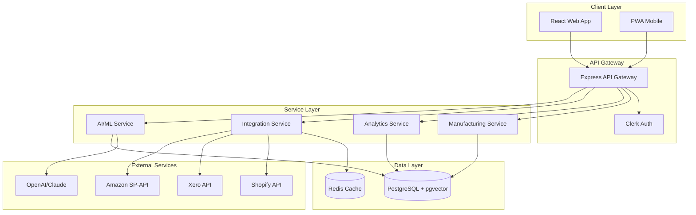
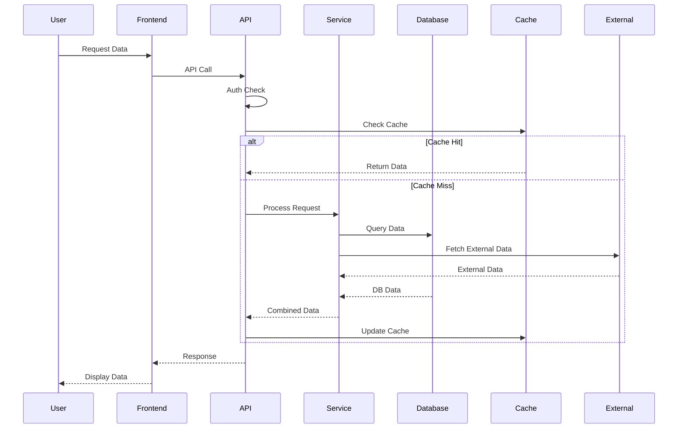

# 📐 Architecture Overview
## Sentia Manufacturing Dashboard - Enterprise Architecture

### System Architecture



### Component Architecture

#### Frontend Components
- **Layout System**: Responsive grid with drag-and-drop widgets
- **State Management**: Zustand for app state, TanStack Query for server state
- **Real-time Updates**: Server-Sent Events (SSE) for live data
- **Theme System**: Dark/light modes with CSS variables
- **Authentication**: Clerk integration with RBAC

#### Backend Services
- **API Gateway**: Express with rate limiting and security middleware
- **Microservices**: Domain-driven design with service boundaries
- **Database**: PostgreSQL with pgvector for AI features
- **Caching**: Redis for session and data caching
- **Message Queue**: Bull for background job processing

### Data Flow Architecture



### Database Schema

#### Core Tables
- **users**: Authentication and profile data
- **products**: Product catalog with embeddings
- **forecasts**: AI-powered demand predictions
- **inventory_levels**: Real-time stock tracking
- **working_capital**: Financial metrics
- **audit_logs**: Complete audit trail

#### Vector Tables (AI Features)
- **product_embeddings**: Semantic search vectors
- **forecast_patterns**: Historical pattern matching
- **quality_vectors**: Quality control AI
- **customer_sentiment**: Sentiment analysis

### Security Architecture

#### Defense Layers
1. **Network**: Cloudflare WAF and DDoS protection
2. **Application**: Rate limiting, input validation
3. **Authentication**: Clerk with MFA
4. **Authorization**: Fine-grained RBAC
5. **Data**: Encryption at rest and in transit

#### Security Controls
- OWASP Top 10 protection
- SQL injection prevention
- XSS protection
- CSRF tokens
- Security headers (CSP, HSTS, etc.)

### Deployment Architecture

#### Infrastructure
```yaml
Render Platform:
  Web Services:
    - sentia-manufacturing-development
    - sentia-manufacturing-testing
    - sentia-manufacturing-production
  Databases:
    - PostgreSQL with pgvector (3 environments)
  Static Assets:
    - Cloudflare CDN

Monitoring:
  - Application: Datadog APM
  - Errors: Sentry
  - Logs: LogDNA
  - Uptime: Pingdom
```

#### CI/CD Pipeline
1. **Code Push**: GitHub repository
2. **CI Checks**: ESLint, TypeScript, Tests
3. **Security Scan**: Claude Security Review
4. **Build**: Vite production build
5. **Deploy**: Render auto-deployment
6. **Health Check**: Automated verification
7. **Rollback**: Automatic on failure

### Performance Architecture

#### Optimization Strategies
- **Code Splitting**: Lazy loading for routes
- **Bundle Optimization**: Tree shaking, minification
- **Image Optimization**: WebP with fallbacks
- **Caching Strategy**: Multi-layer caching
- **Database Optimization**: Indexes, partitioning
- **CDN Distribution**: Global edge caching

#### Performance Targets
- Page Load: < 2 seconds
- Time to Interactive: < 3 seconds
- API Response: < 200ms (p95)
- Database Queries: < 100ms
- Bundle Size: < 500KB gzipped

### Scalability Architecture

#### Horizontal Scaling
- Stateless services for easy scaling
- Database read replicas
- Redis cluster for caching
- Load balancing across instances

#### Vertical Scaling
- Auto-scaling based on metrics
- Database connection pooling
- Optimized query patterns
- Efficient data structures

### AI/ML Architecture

#### Model Integration
```python
Models:
  - Demand Forecasting: Ensemble of 4 models
  - Anomaly Detection: Isolation Forest
  - NLP: Claude 3.5 Sonnet
  - Embeddings: OpenAI text-embedding-ada-002
  - Vector Search: pgvector similarity
```

#### ML Pipeline
1. Data Collection → 2. Feature Engineering → 3. Model Training → 4. Validation → 5. Deployment → 6. Monitoring

### Monitoring & Observability

#### Metrics Collection
- **Application Metrics**: Response times, error rates
- **Business Metrics**: Orders, inventory, revenue
- **Infrastructure Metrics**: CPU, memory, disk
- **Custom Metrics**: AI model performance

#### Alerting Strategy
- Critical: Immediate page (downtime, security)
- High: Email + Slack (performance degradation)
- Medium: Slack notification (threshold warnings)
- Low: Daily digest (optimization opportunities)

### Disaster Recovery

#### Backup Strategy
- **Database**: Daily automated backups, 30-day retention
- **Code**: Git repository with multiple remotes
- **Configuration**: Encrypted secret backup
- **Documentation**: Versioned in repository

#### Recovery Procedures
- RTO (Recovery Time Objective): < 1 hour
- RPO (Recovery Point Objective): < 24 hours
- Automated failover for critical services
- Documented runbooks for manual recovery

---

For detailed component documentation, see individual architecture guides in this directory.