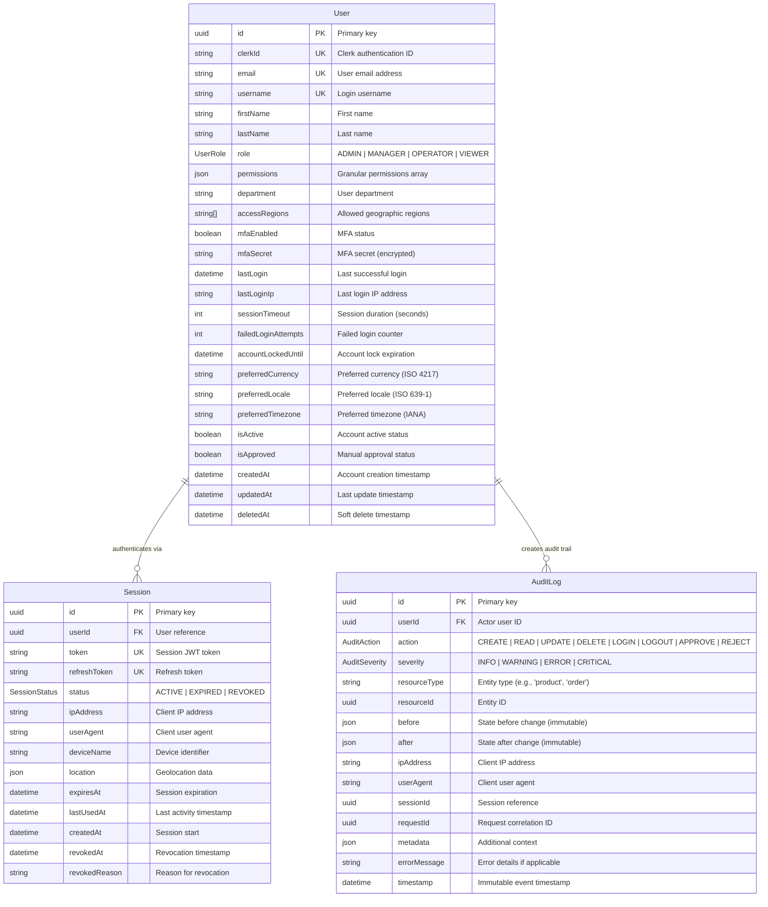
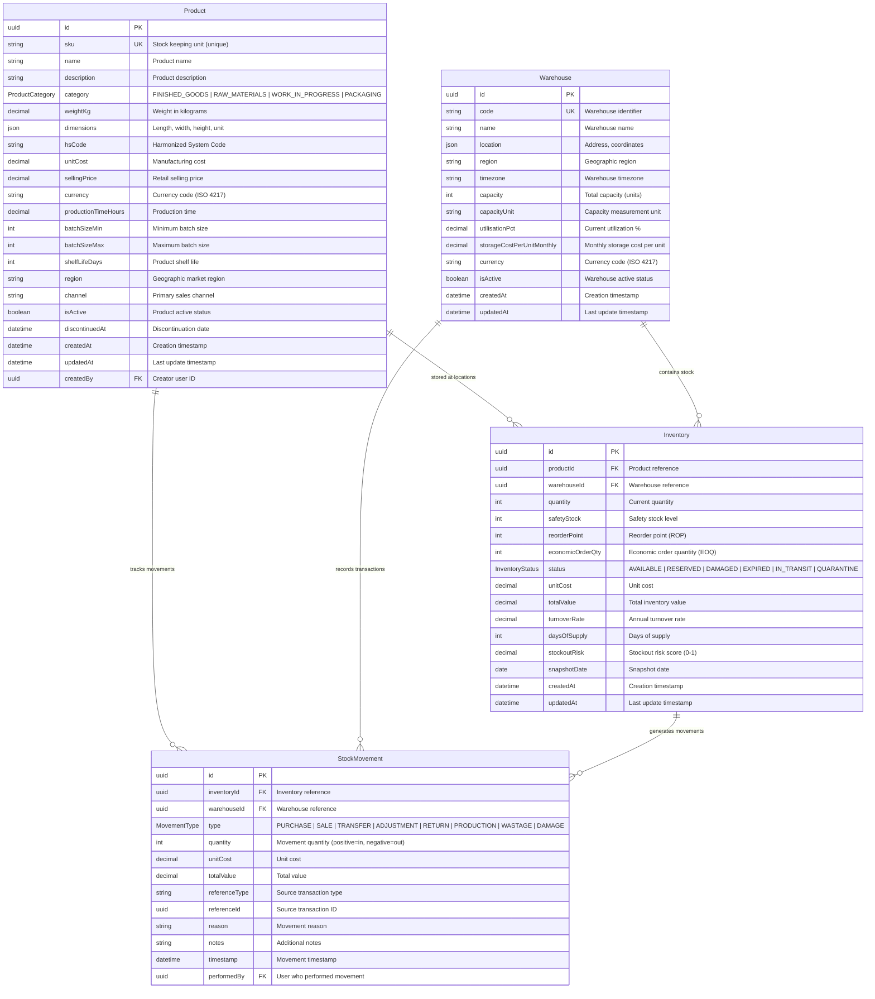
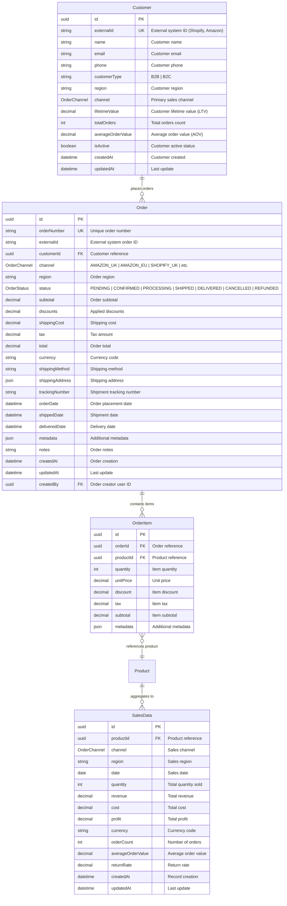
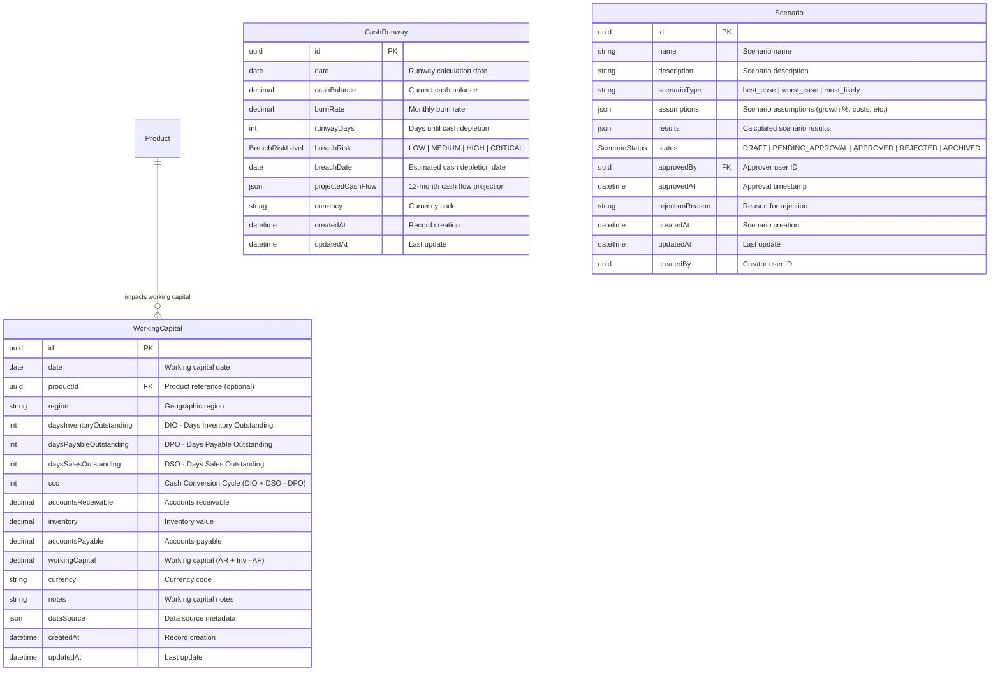
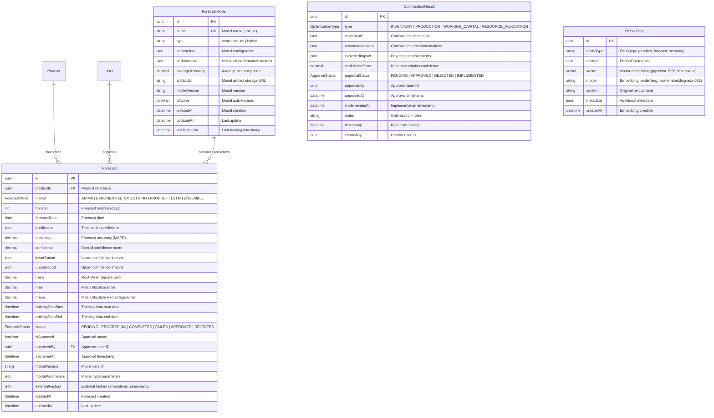
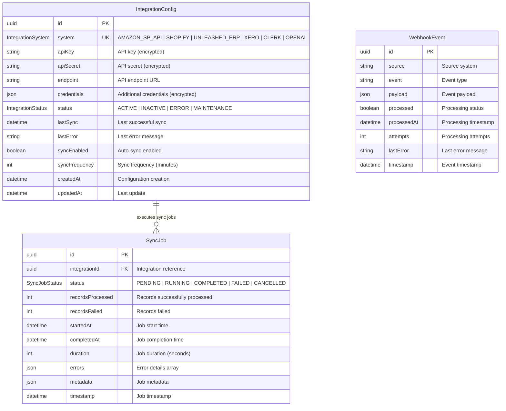

# CapLiquify Manufacturing Platform - Entity Relationship Diagrams

**Version**: 1.0
**Date**: October 17, 2025

---

## Complete System ER Diagram

```mermaid
erDiagram
    %% USER MANAGEMENT
    User ||--o{ Session : "has sessions"
    User ||--o{ AuditLog : "performs actions"
    User ||--o{ Product : "creates products"
    User ||--o{ Order : "creates orders"
    User ||--o{ ProductionJob : "creates jobs"
    User ||--o{ Scenario : "approves scenarios"
    User ||--o{ Forecast : "approves forecasts"

    %% PRODUCT & INVENTORY
    Product ||--o{ Inventory : "stored at"
    Product ||--o{ StockMovement : "moved as"
    Product ||--o{ SalesData : "generates sales"
    Product ||--o{ OrderItem : "sold as"
    Product ||--o{ Forecast : "forecasted"
    Product ||--o{ ProductionJob : "produced"
    Product ||--o{ WorkingCapital : "impacts capital"

    Warehouse ||--o{ Inventory : "contains inventory"
    Warehouse ||--o{ StockMovement : "records movements"
    Inventory ||--o{ StockMovement : "tracks changes"

    %% SALES & ORDERS
    Customer ||--o{ Order : "places orders"
    Order ||--o{ OrderItem : "contains items"
    OrderItem }o--|| Product : "references product"

    %% PRODUCTION
    ProductionJob ||--o| ProductionSchedule : "scheduled by"
    ProductionJob ||--o{ QualityMetric : "measured by"
    ProductionJob ||--o{ DowntimeEvent : "experiences downtime"
    ProductionJob }o--|| Product : "produces product"

    %% FORECASTING
    Forecast }o--|| Product : "predicts demand for"
    Forecast }o--|| User : "approved by"
    ForecastModel ||--o{ Forecast : "generates predictions"
    OptimizationResult ||--o{ Forecast : "uses forecasts"

    %% INTEGRATION
    IntegrationConfig ||--o{ SyncJob : "executes sync jobs"
    IntegrationConfig ||--o{ WebhookEvent : "receives webhooks"

    %% ENTITIES
    User {
        uuid id PK
        string clerkId UK
        string email UK
        string username UK
        UserRole role
        boolean mfaEnabled
        int sessionTimeout
        datetime lastLogin
    }

    Session {
        uuid id PK
        uuid userId FK
        string token UK
        SessionStatus status
        string ipAddress
        datetime expiresAt
        datetime lastUsedAt
    }

    AuditLog {
        uuid id PK
        uuid userId FK
        AuditAction action
        AuditSeverity severity
        string resourceType
        uuid resourceId
        json before
        json after
        datetime timestamp
    }

    Product {
        uuid id PK
        string sku UK
        string name
        ProductCategory category
        string region
        string channel
        decimal unitCost
        decimal sellingPrice
        boolean isActive
    }

    Warehouse {
        uuid id PK
        string code UK
        string name
        json location
        int capacity
        decimal storageCostPerUnitMonthly
    }

    Inventory {
        uuid id PK
        uuid productId FK
        uuid warehouseId FK
        int quantity
        int safetyStock
        int reorderPoint
        int economicOrderQty
        InventoryStatus status
        date snapshotDate
    }

    StockMovement {
        uuid id PK
        uuid inventoryId FK
        uuid warehouseId FK
        MovementType type
        int quantity
        datetime timestamp
    }

    Customer {
        uuid id PK
        string externalId UK
        string name
        OrderChannel channel
        string region
        decimal lifetimeValue
    }

    Order {
        uuid id PK
        string orderNumber UK
        uuid customerId FK
        OrderChannel channel
        OrderStatus status
        decimal total
        datetime orderDate
    }

    OrderItem {
        uuid id PK
        uuid orderId FK
        uuid productId FK
        int quantity
        decimal unitPrice
        decimal subtotal
    }

    SalesData {
        uuid id PK
        uuid productId FK
        OrderChannel channel
        string region
        date date
        int quantity
        decimal revenue
    }

    ProductionJob {
        uuid id PK
        string jobNumber UK
        uuid productId FK
        int quantity
        ProductionJobStatus status
        datetime scheduledStart
        datetime actualStart
        decimal oee
    }

    ProductionSchedule {
        uuid id PK
        uuid jobId FK UK
        datetime scheduledStart
        datetime scheduledEnd
        int priority
    }

    QualityMetric {
        uuid id PK
        uuid jobId FK
        decimal firstPassYield
        decimal defectRate
        datetime inspectionDate
    }

    DowntimeEvent {
        uuid id PK
        uuid jobId FK
        DowntimeReason reason
        int duration
        datetime startTime
    }

    WorkingCapital {
        uuid id PK
        date date
        uuid productId FK
        int daysInventoryOutstanding
        int daysPayableOutstanding
        int daysSalesOutstanding
        int ccc
    }

    CashRunway {
        uuid id PK
        date date
        decimal cashBalance
        decimal burnRate
        int runwayDays
        BreachRiskLevel breachRisk
    }

    Scenario {
        uuid id PK
        string name
        string scenarioType
        json assumptions
        json results
        ScenarioStatus status
    }

    Forecast {
        uuid id PK
        uuid productId FK
        ForecastModel model
        int horizon
        date forecastDate
        json predictions
        decimal accuracy
        ForecastStatus status
    }

    ForecastModel {
        uuid id PK
        string name UK
        string type
        json parameters
        decimal averageAccuracy
        boolean isActive
    }

    OptimizationResult {
        uuid id PK
        OptimizationType type
        json constraints
        json recommendations
        ApprovalStatus approvalStatus
    }

    Embedding {
        uuid id PK
        string entityType
        uuid entityId
        vector vector
        string content
    }

    IntegrationConfig {
        uuid id PK
        IntegrationSystem system UK
        IntegrationStatus status
        boolean syncEnabled
        datetime lastSync
    }

    SyncJob {
        uuid id PK
        uuid integrationId FK
        SyncJobStatus status
        int recordsProcessed
        int recordsFailed
        datetime startedAt
    }

    WebhookEvent {
        uuid id PK
        string source
        string event
        json payload
        boolean processed
        datetime timestamp
    }
```

---

## User Management Domain



---

## Product & Inventory Domain



---

## Sales & Orders Domain



---

## Production Management Domain

```mermaid
erDiagram
    Product ||--o{ ProductionJob : "produced by jobs"
    ProductionJob ||--o| ProductionSchedule : "scheduled by"
    ProductionJob ||--o{ QualityMetric : "measured by metrics"
    ProductionJob ||--o{ DowntimeEvent : "experiences downtime"

    ProductionJob {
        uuid id PK
        string jobNumber UK "Unique job identifier"
        uuid productId FK "Product reference"
        int quantity "Production quantity"
        int batchSize "Production batch size"
        int priority "Job priority (1-10)"
        ProductionJobStatus status "SCHEDULED | IN_PROGRESS | PAUSED | COMPLETED | CANCELLED | FAILED"
        datetime scheduledStart "Scheduled start time"
        datetime scheduledEnd "Scheduled end time"
        datetime actualStart "Actual start time"
        datetime actualEnd "Actual end time"
        decimal oee "Overall Equipment Effectiveness"
        decimal firstPassYield "First pass yield percentage"
        decimal defectRate "Defect rate percentage"
        int quantityProduced "Actual quantity produced"
        int quantityDefective "Defective quantity"
        int quantityScrap "Scrapped quantity"
        string notes "Job notes"
        datetime createdAt "Job creation"
        datetime updatedAt "Last update"
        uuid createdBy FK "Job creator user ID"
    }

    ProductionSchedule {
        uuid id PK
        uuid jobId FK UK "Production job reference (one-to-one)"
        datetime scheduledStart "Scheduled start time"
        datetime scheduledEnd "Scheduled end time"
        int priority "Schedule priority"
        json assignedResources "Assigned resource IDs"
        string[] dependencies "Dependent job IDs"
        boolean isLocked "Schedule locked status"
        datetime createdAt "Schedule creation"
        datetime updatedAt "Last update"
    }

    QualityMetric {
        uuid id PK
        uuid jobId FK "Production job reference"
        decimal firstPassYield "First pass yield %"
        decimal defectRate "Defect rate %"
        decimal reworkRate "Rework rate %"
        decimal scrapRate "Scrap rate %"
        json defectTypes "Defect type counts"
        decimal defectCost "Cost of defects"
        datetime inspectionDate "Inspection date"
        uuid inspectorId "Inspector user ID"
        string notes "Quality notes"
        datetime timestamp "Metric timestamp"
    }

    DowntimeEvent {
        uuid id PK
        uuid jobId FK "Production job reference"
        DowntimeReason reason "BREAKDOWN | MAINTENANCE | CHANGEOVER | NO_MATERIALS | NO_OPERATOR | QUALITY_ISSUE | POWER_OUTAGE | OTHER"
        string reasonDetails "Detailed reason"
        int duration "Duration in minutes"
        datetime startTime "Downtime start"
        datetime endTime "Downtime end"
        int productionLoss "Units not produced"
        decimal costImpact "Financial impact"
        string notes "Downtime notes"
        datetime timestamp "Event timestamp"
        uuid reportedBy "Reporter user ID"
    }
```

---

## Financial Management Domain



---

## Forecasting & AI Domain



---

## Integration Domain



---

**Document Version**: 1.0
**Last Updated**: October 17, 2025
**Next Review**: November 17, 2025
**Maintained By**: Data Engineering Team
