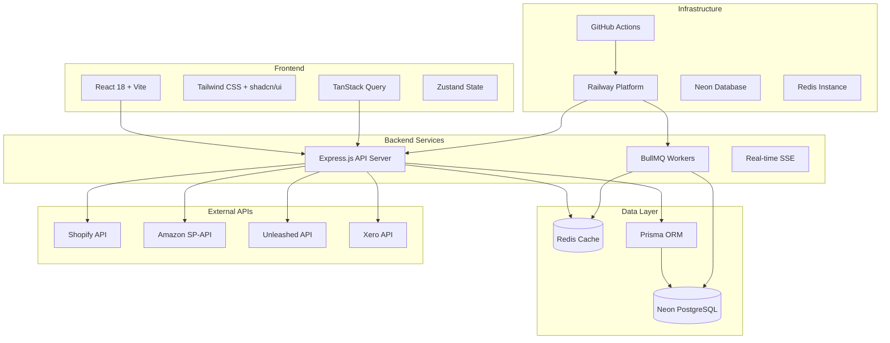

# System Architecture

*For Developers* | *Last Updated: January 2025*

This document provides a comprehensive overview of the CapLiquify Manufacturing Platform architecture, covering the full-stack Node.js/React application, infrastructure, and deployment strategy.

## Architecture Overview

### High-Level Architecture



### Technology Stack

#### Frontend Stack
- **React 18**: Component-based UI with Hooks and Concurrent Features
- **Vite 4**: Fast development server and optimized production builds
- **TypeScript**: Type safety and enhanced developer experience
- **Tailwind CSS**: Utility-first styling framework
- **shadcn/ui**: Reusable component library built on Radix UI
- **TanStack Query**: Data fetching, caching, and synchronization
- **Zustand**: Lightweight state management
- **React Router**: Client-side routing and navigation
- **Recharts**: Data visualization and charting

#### Backend Stack
- **Node.js 18+**: JavaScript runtime with ES modules
- **Express.js**: Web framework with comprehensive middleware
- **Prisma**: Type-safe database ORM with migrations
- **BullMQ**: Redis-based job queue for background processing
- **Clerk**: Authentication and user management
- **Winston**: Structured logging with rotation
- **Helmet**: Security headers and middleware
- **Express Rate Limit**: DDoS protection and rate limiting

#### Database & Storage
- **Neon PostgreSQL**: Serverless PostgreSQL with automatic scaling
- **Redis**: In-memory cache and session store
- **Railway**: Cloud deployment platform
- **GitHub**: Version control and CI/CD

#### Monitoring & Observability
- **Prometheus**: Metrics collection
- **OpenTelemetry**: Distributed tracing
- **Winston**: Application logging
- **Sentry**: Error tracking and performance monitoring

## Project Structure

### Repository Organization

```
sentia-manufacturing-dashboard/
├── src/                           # React frontend source
│   ├── components/               # Reusable UI components
│   │   ├── auth/                # Authentication components
│   │   ├── layout/              # Layout components (Header, Sidebar)
│   │   ├── ui/                  # shadcn/ui components
│   │   └── widgets/             # Dashboard widgets
│   ├── pages/                   # Route components
│   │   ├── Dashboard/           # Dashboard pages
│   │   ├── AdminPanel/          # Admin functionality
│   │   └── WorkingCapital/      # Financial management
│   ├── hooks/                   # Custom React hooks
│   │   ├── useAuthRole.js       # Role-based authentication
│   │   ├── useSSE.js           # Server-sent events
│   │   └── useLocalStorage.js   # Browser storage
│   ├── services/                # API services and query client
│   │   ├── api.js              # Axios configuration
│   │   ├── queries/            # TanStack Query definitions
│   │   └── mutations/          # Data mutation operations
│   ├── stores/                  # Zustand state stores
│   │   ├── layoutStore.js      # Dashboard layout state
│   │   ├── userStore.js        # User preferences
│   │   └── themeStore.js       # Theme management
│   ├── utils/                   # Helper utilities
│   │   ├── auth.js             # Authentication utilities
│   │   ├── formatting.js       # Data formatting
│   │   └── validation.js       # Input validation
│   └── styles/                  # CSS and theme files
├── services/                     # Backend Node.js services
│   ├── api/                     # API route handlers
│   │   ├── auth/               # Authentication routes
│   │   ├── data/               # Data management endpoints
│   │   ├── forecasting/        # Demand forecasting
│   │   ├── optimization/       # Stock optimization
│   │   └── workingCapital/     # Financial calculations
│   ├── workers/                 # BullMQ job processors
│   │   ├── importWorker.js     # Data import processing
│   │   ├── forecastWorker.js   # Forecasting calculations
│   │   ├── optimizationWorker.js # Stock optimization
│   │   └── integrationWorker.js # API synchronization
│   ├── integrations/            # External API services
│   │   ├── shopify/            # Shopify integration
│   │   ├── amazon/             # Amazon SP-API
│   │   ├── unleashed/          # Unleashed software
│   │   └── xero/               # Xero accounting
│   ├── monitoring/              # Observability services
│   │   ├── metrics.js          # Prometheus metrics
│   │   ├── telemetry.js        # OpenTelemetry setup
│   │   └── logging.js          # Winston configuration
│   └── security/                # Security middleware
├── prisma/                       # Database schema and migrations
│   ├── schema.prisma           # Database schema definition
│   ├── migrations/             # Database migrations
│   └── seed.js                 # Database seeding
├── tests/                        # Testing suite
│   ├── unit/                   # Vitest unit tests
│   ├── integration/            # API integration tests
│   └── e2e/                    # Playwright end-to-end tests
├── context/                      # Documentation and specifications
│   ├── business-requirements/   # Business logic documentation
│   ├── technical-specifications/ # Technical architecture docs
│   ├── api-documentation/       # API documentation
│   └── deployment-configs/      # Infrastructure configuration
├── scripts/                      # Utility and deployment scripts
├── public/                       # Static assets
├── dist/                         # Production build output
└── docs/                         # Documentation site (this portal)
```

## Frontend Architecture

### Component Architecture

#### Component Hierarchy

```
App
├── AuthProvider (Clerk)
├── QueryClientProvider (TanStack Query)
├── ThemeProvider
└── Router
    ├── Layout
    │   ├── Header
    │   │   ├── UserMenu
    │   │   ├── NotificationCenter
    │   │   └── ThemeToggle
    │   ├── Sidebar
    │   │   ├── Navigation
    │   │   └── RoleBasedMenu
    │   └── MainContent
    └── Routes
        ├── Dashboard
        │   ├── KPIStrip
        │   ├── DemandForecast
        │   ├── WorkingCapital
        │   └── InventoryOverview
        ├── WorkingCapital
        ├── AdminPanel
        └── Settings
```

#### Component Design Patterns

**Composition over Inheritance**
```jsx
// Good: Composable components
const Dashboard = () => (
  <DashboardLayout>
    <KPIStrip metrics={kpiData} />
    <GridLayout>
      <Widget component={DemandForecast} />
      <Widget component={WorkingCapital} />
    </GridLayout>
  </DashboardLayout>
);

// Avoid: Inheritance-based components
class Dashboard extends BaseDashboard {
  // Complex inheritance chain
}
```

**Custom Hooks for Logic Reuse**
```jsx
// Custom hook for role-based access
export const useAuthRole = () => {
  const { user } = useUser();
  const { getRole, hasPermission } = useAuth();
  
  return {
    role: getRole(user),
    hasPermission: (permission) => hasPermission(user, permission),
    isAdmin: () => getRole(user) === 'admin',
    isManager: () => ['admin', 'manager'].includes(getRole(user))
  };
};

// Usage in components
const AdminPanel = () => {
  const { isAdmin } = useAuthRole();
  
  if (!isAdmin()) {
    return <AccessDenied />;
  }
  
  return <AdminInterface />;
};
```

### State Management

#### Zustand Store Architecture

```javascript
// Layout Store - Dashboard layout persistence
export const useLayoutStore = create((set, get) => ({
  layouts: {
    lg: [],
    md: [],
    sm: [],
    xs: [],
    xxs: []
  },
  
  // Actions
  updateLayout: (breakpoint, layout) => 
    set((state) => ({
      layouts: {
        ...state.layouts,
        [breakpoint]: layout
      }
    })),
    
  resetLayout: (breakpoint) =>
    set((state) => ({
      layouts: {
        ...state.layouts,
        [breakpoint]: getDefaultLayout(breakpoint)
      }
    })),
    
  // Persistence
  saveToStorage: () => {
    const { layouts } = get();
    localStorage.setItem('dashboardLayouts', JSON.stringify(layouts));
  },
  
  loadFromStorage: () => {
    const stored = localStorage.getItem('dashboardLayouts');
    if (stored) {
      set({ layouts: JSON.parse(stored) });
    }
  }
}));
```

#### TanStack Query Configuration

```javascript
// Query Client Configuration
export const queryClient = new QueryClient({
  defaultOptions: {
    queries: {
      staleTime: 5 * 60 * 1000, // 5 minutes
      cacheTime: 10 * 60 * 1000, // 10 minutes
      retry: (failureCount, error) => {
        if (error.status === 404) return false;
        return failureCount < 3;
      },
      refetchOnWindowFocus: false,
      refetchOnReconnect: true
    },
    mutations: {
      retry: 1,
      onError: (error) => {
        // Global error handling
        console.error('Mutation error:', error);
        toast.error('Operation failed. Please try again.');
      }
    }
  }
});

// Query Definitions
export const useKPIData = (timeRange) => 
  useQuery({
    queryKey: ['kpi', timeRange],
    queryFn: () => api.getKPIData(timeRange),
    enabled: !!timeRange,
    staleTime: 2 * 60 * 1000 // 2 minutes for real-time data
  });

export const useForecastData = (productId, horizon) =>
  useQuery({
    queryKey: ['forecast', productId, horizon],
    queryFn: () => api.getForecast(productId, horizon),
    enabled: !!productId && !!horizon,
    staleTime: 30 * 60 * 1000 // 30 minutes for forecast data
  });
```

## Backend Architecture

### Express.js Application Structure

#### Server Configuration

```javascript
// server.js - Main application entry point
import express from 'express';
import cors from 'cors';
import helmet from 'helmet';
import compression from 'compression';
import { metricsMiddleware } from './services/monitoring/metrics.js';
import { securityConfig } from './services/security/config.js';
import { initTelemetry } from './services/monitoring/telemetry.js';

const app = express();
const PORT = process.env.PORT || 5000;

// Initialize telemetry first
await initTelemetry();

// Security middleware
app.use(helmet(securityConfig.helmetConfig));
app.use(cors(securityConfig.corsOptions));
app.use(securityConfig.securityHeaders);

// Performance middleware
app.use(compression());
app.use(metricsMiddleware);

// Body parsing
app.use(express.json({ limit: '10mb' }));
app.use(express.urlencoded({ extended: true }));

// API routes
app.use('/api/auth', authRoutes);
app.use('/api/data', dataRoutes);
app.use('/api/forecasting', forecastingRoutes);
app.use('/api/optimization', optimizationRoutes);
app.use('/api/working-capital', workingCapitalRoutes);
app.use('/api/integrations', integrationRoutes);
app.use('/api/admin', adminRoutes);

// Health and metrics endpoints
app.get('/health', healthHandler);
app.get('/api/health', detailedHealthHandler);
app.get('/metrics', metricsHandler);

// Error handling
app.use(errorHandler);

// Start server
app.listen(PORT, () => {
  logger.info(`Server running on port ${PORT}`);
});
```

#### API Route Structure

```javascript
// services/api/data/index.js - Data management routes
import express from 'express';
import { requireAuth } from '../../middleware/auth.js';
import { validateRole } from '../../middleware/rbac.js';
import { importLimiter } from '../../security/config.js';

const router = express.Router();

// Import endpoints
router.post('/import',
  requireAuth,
  validateRole(['operator', 'manager', 'admin']),
  importLimiter,
  importHandler
);

router.get('/import/:id/status',
  requireAuth,
  getImportStatus
);

router.post('/import/:id/retry',
  requireAuth,
  validateRole(['operator', 'manager', 'admin']),
  retryImport
);

// Data retrieval endpoints
router.get('/products',
  requireAuth,
  cacheMiddleware('5m'),
  getProducts
);

router.get('/inventory',
  requireAuth,
  cacheMiddleware('1m'),
  getInventory
);

export default router;
```

### Worker Architecture (BullMQ)

#### Queue Configuration

```javascript
// services/workers/index.js - Worker service entry point
import { Queue, Worker } from 'bullmq';
import { redis } from '../cache/redis.js';
import { logger } from '../logging/logger.js';

// Queue definitions
export const queues = {
  imports: new Queue('imports', { connection: redis }),
  forecasting: new Queue('forecasting', { connection: redis }),
  optimization: new Queue('optimization', { connection: redis }),
  integrations: new Queue('integrations', { connection: redis })
};

// Worker configurations
const workerConfig = {
  connection: redis,
  concurrency: parseInt(process.env.WORKER_CONCURRENCY) || 5,
  removeOnComplete: 100,
  removeOnFail: 50
};

// Import worker
export const importWorker = new Worker('imports', async (job) => {
  const { type, data, userId } = job.data;
  
  logger.info('Processing import job', { 
    jobId: job.id, 
    type, 
    userId 
  });
  
  try {
    switch (type) {
      case 'shopify-products':
        return await processShopifyProducts(data, userId);
      case 'excel-upload':
        return await processExcelUpload(data, userId);
      case 'csv-import':
        return await processCsvImport(data, userId);
      default:
        throw new Error(`Unknown import type: ${type}`);
    }
  } catch (error) {
    logger.error('Import job failed', {
      jobId: job.id,
      error: error.message,
      stack: error.stack
    });
    throw error;
  }
}, workerConfig);

// Job progress tracking
importWorker.on('progress', (job, progress) => {
  logger.info('Job progress', {
    jobId: job.id,
    progress: `${progress}%`
  });
  
  // Emit SSE update to frontend
  sseEmitter.emit('job-progress', {
    jobId: job.id,
    progress,
    userId: job.data.userId
  });
});
```

#### Background Processing Examples

```javascript
// services/workers/forecastWorker.js - Forecasting calculations
import { Worker } from 'bullmq';
import { prisma } from '../database/client.js';
import { runForecastModel } from '../algorithms/forecasting.js';

export const forecastWorker = new Worker('forecasting', async (job) => {
  const { productIds, horizon, userId } = job.data;
  
  // Update job progress
  await job.updateProgress(10);
  
  // Fetch historical data
  const historicalData = await prisma.salesData.findMany({
    where: {
      productId: { in: productIds },
      date: {
        gte: new Date(Date.now() - horizon * 30 * 24 * 60 * 60 * 1000)
      }
    }
  });
  
  await job.updateProgress(30);
  
  // Run forecasting algorithm
  const forecasts = await Promise.all(
    productIds.map(async (productId) => {
      const productData = historicalData.filter(d => d.productId === productId);
      const forecast = await runForecastModel(productData, horizon);
      
      // Store forecast results
      await prisma.forecast.create({
        data: {
          productId,
          horizon,
          predictions: forecast.predictions,
          accuracy: forecast.accuracy,
          confidence: forecast.confidence,
          createdBy: userId
        }
      });
      
      return { productId, forecast };
    })
  );
  
  await job.updateProgress(100);
  
  return {
    success: true,
    forecastCount: forecasts.length,
    averageAccuracy: forecasts.reduce((sum, f) => sum + f.forecast.accuracy, 0) / forecasts.length
  };
});
```

### Real-time Features (Server-Sent Events)

```javascript
// services/realtime/sse.js - Server-Sent Events implementation
import { EventEmitter } from 'events';

class SSEManager extends EventEmitter {
  constructor() {
    super();
    this.connections = new Map();
  }
  
  addConnection(userId, res) {
    // Set SSE headers
    res.writeHead(200, {
      'Content-Type': 'text/event-stream',
      'Cache-Control': 'no-cache',
      'Connection': 'keep-alive',
      'Access-Control-Allow-Origin': '*',
      'Access-Control-Allow-Headers': 'Cache-Control'
    });
    
    // Store connection
    this.connections.set(userId, res);
    
    // Send initial connection event
    this.sendToUser(userId, 'connected', { timestamp: new Date() });
    
    // Handle client disconnect
    res.on('close', () => {
      this.connections.delete(userId);
    });
  }
  
  sendToUser(userId, event, data) {
    const connection = this.connections.get(userId);
    if (connection) {
      connection.write(`event: ${event}\n`);
      connection.write(`data: ${JSON.stringify(data)}\n\n`);
    }
  }
  
  broadcast(event, data) {
    for (const [userId, connection] of this.connections) {
      this.sendToUser(userId, event, data);
    }
  }
  
  // Business event handlers
  onJobProgress(jobId, progress, userId) {
    this.sendToUser(userId, 'job-progress', { jobId, progress });
  }
  
  onDataUpdate(type, data) {
    this.broadcast('data-update', { type, data, timestamp: new Date() });
  }
  
  onAlert(level, message, userId) {
    if (userId) {
      this.sendToUser(userId, 'alert', { level, message });
    } else {
      this.broadcast('alert', { level, message });
    }
  }
}

export const sseManager = new SSEManager();
```

## Database Architecture

### Prisma Schema Design

```prisma
// prisma/schema.prisma - Database schema definition
generator client {
  provider = "prisma-client-js"
}

datasource db {
  provider = "postgresql"
  url      = env("DATABASE_URL")
}

// User Management
model User {
  id          String   @id @default(cuid())
  clerkId     String   @unique
  email       String   @unique
  firstName   String?
  lastName    String?
  role        Role     @default(VIEWER)
  department  String?
  isActive    Boolean  @default(true)
  createdAt   DateTime @default(now())
  updatedAt   DateTime @updatedAt
  
  // Relationships
  imports     Import[]
  forecasts   Forecast[]
  approvals   Approval[]
  
  @@map("users")
}

enum Role {
  VIEWER
  OPERATOR
  MANAGER
  ADMIN
}

// Product Management
model Product {
  id          String   @id @default(cuid())
  sku         String   @unique
  name        String
  description String?
  category    String?
  unitPrice   Decimal?
  unitCost    Decimal?
  supplier    String?
  isActive    Boolean  @default(true)
  createdAt   DateTime @default(now())
  updatedAt   DateTime @updatedAt
  
  // Relationships
  inventory   Inventory[]
  salesData   SalesData[]
  forecasts   Forecast[]
  
  @@map("products")
}

// Inventory Management
model Inventory {
  id            String   @id @default(cuid())
  productId     String
  warehouse     String?
  quantityOnHand Int     @default(0)
  reservedQty   Int     @default(0)
  availableQty  Int     @default(0)
  reorderPoint  Int?
  reorderQty    Int?
  lastUpdated   DateTime @default(now())
  
  // Relationships
  product       Product @relation(fields: [productId], references: [id])
  
  @@unique([productId, warehouse])
  @@map("inventory")
}

// Forecasting
model Forecast {
  id           String   @id @default(cuid())
  productId    String
  horizon      Int      // Months
  predictions  Json     // Array of predictions
  accuracy     Float?   // MAPE
  confidence   Float?   // Confidence level
  modelType    String?  // Algorithm used
  parameters   Json?    // Model parameters
  createdBy    String
  createdAt    DateTime @default(now())
  
  // Relationships
  product      Product @relation(fields: [productId], references: [id])
  user         User    @relation(fields: [createdBy], references: [id])
  
  @@map("forecasts")
}

// Working Capital
model WorkingCapital {
  id                String   @id @default(cuid())
  date             DateTime
  accountsReceivable Decimal
  inventory        Decimal
  accountsPayable  Decimal
  workingCapital   Decimal
  ccc              Int      // Cash Conversion Cycle (days)
  dso              Int      // Days Sales Outstanding
  dio              Int      // Days Inventory Outstanding
  dpo              Int      // Days Payable Outstanding
  createdAt        DateTime @default(now())
  
  @@unique([date])
  @@map("working_capital")
}

// Import Management
model Import {
  id          String      @id @default(cuid())
  filename    String
  type        ImportType
  status      ImportStatus @default(PENDING)
  totalRows   Int?
  processedRows Int?
  errorRows   Int?
  errors      Json?       // Error details
  metadata    Json?       // Additional import info
  createdBy   String
  createdAt   DateTime    @default(now())
  completedAt DateTime?
  
  // Relationships
  user        User        @relation(fields: [createdBy], references: [id])
  
  @@map("imports")
}

enum ImportType {
  PRODUCTS
  INVENTORY
  SALES_DATA
  FINANCIAL_DATA
}

enum ImportStatus {
  PENDING
  PROCESSING
  COMPLETED
  FAILED
  CANCELLED
}
```

### Database Optimization

#### Indexing Strategy

```sql
-- Performance-critical indexes
CREATE INDEX CONCURRENTLY idx_products_sku ON products(sku);
CREATE INDEX CONCURRENTLY idx_products_category ON products(category);
CREATE INDEX CONCURRENTLY idx_inventory_product_warehouse ON inventory(product_id, warehouse);
CREATE INDEX CONCURRENTLY idx_sales_data_date ON sales_data(date DESC);
CREATE INDEX CONCURRENTLY idx_sales_data_product_date ON sales_data(product_id, date DESC);
CREATE INDEX CONCURRENTLY idx_forecasts_product_created ON forecasts(product_id, created_at DESC);

-- Composite indexes for complex queries
CREATE INDEX CONCURRENTLY idx_inventory_available_reorder ON inventory(available_qty, reorder_point) 
WHERE available_qty <= reorder_point;

-- Partial indexes for active records
CREATE INDEX CONCURRENTLY idx_products_active ON products(name) 
WHERE is_active = true;

-- JSON indexes for metadata queries
CREATE INDEX CONCURRENTLY idx_imports_metadata_gin ON imports USING GIN(metadata);
```

#### Connection Pooling

```javascript
// services/database/client.js - Prisma client configuration
import { PrismaClient } from '@prisma/client';

const globalForPrisma = globalThis;

export const prisma = globalForPrisma.prisma ??
  new PrismaClient({
    log: process.env.NODE_ENV === 'development' 
      ? ['query', 'error', 'warn'] 
      : ['error'],
    
    datasources: {
      db: {
        url: process.env.DATABASE_URL,
      },
    },
    
    // Connection pooling configuration
    connectionLimit: parseInt(process.env.DATABASE_POOL_MAX) || 10,
    
    // Query optimization
    transactionOptions: {
      maxWait: 5000, // 5 seconds
      timeout: 10000, // 10 seconds
    },
  });

if (process.env.NODE_ENV !== 'production') {
  globalForPrisma.prisma = prisma;
}

// Graceful shutdown
process.on('SIGINT', async () => {
  await prisma.$disconnect();
  process.exit(0);
});

process.on('SIGTERM', async () => {
  await prisma.$disconnect();
  process.exit(0);
});
```

## Deployment Architecture

### Railway Configuration

#### Multi-Service Deployment

```toml
# railway.toml - Railway service configuration
[build]
builder = "NIXPACKS"
buildCommand = "npm ci && npm run build"

# Web Service - Express API + React frontend
[services.web]
name = "sentia-web"
deploy.startCommand = "node server.js"
deploy.healthcheckPath = "/api/health"
deploy.port = 5000

[services.web.production]
deploy.numReplicas = 2
deploy.minReplicas = 2
deploy.maxReplicas = 5
resources.cpu = "1"
resources.memory = "2Gi"

# Worker Service - BullMQ job processing
[services.worker]
name = "sentia-worker" 
deploy.startCommand = "node services/workers/index.js"
deploy.numReplicas = 1
resources.cpu = "1"
resources.memory = "2Gi"

# Database - Neon PostgreSQL
[services.database]
plugin = "postgresql"
plan = "production"

# Redis - Cache and queue storage
[services.redis]
plugin = "redis"
plan = "production"
```

#### Environment-Specific Configuration

```yaml
# Environment deployment matrix
environments:
  development:
    branch: development
    services:
      web: { replicas: 1, cpu: "0.25", memory: "512Mi" }
      worker: { replicas: 1, cpu: "0.25", memory: "512Mi" }
    database: { tier: "free", storage: "3GB" }
    redis: { tier: "free", memory: "25MB" }
    
  test:
    branch: test
    services:
      web: { replicas: 1, cpu: "0.5", memory: "1Gi" }
      worker: { replicas: 1, cpu: "0.5", memory: "1Gi" }
    database: { tier: "starter", storage: "10GB" }
    redis: { tier: "starter", memory: "512MB" }
    
  production:
    branch: production
    services:
      web: { replicas: 2, cpu: "1", memory: "2Gi", autoscale: true }
      worker: { replicas: 2, cpu: "1", memory: "2Gi" }
    database: { tier: "pro", storage: "100GB", backup: "daily" }
    redis: { tier: "pro", memory: "2GB", persistence: true }
```

### CI/CD Pipeline

#### GitHub Actions Workflow

```yaml
# .github/workflows/deploy.yml - Deployment pipeline
name: Deploy to Railway

on:
  push:
    branches: [development, test, production]

jobs:
  test:
    runs-on: ubuntu-latest
    steps:
      - uses: actions/checkout@v4
      - uses: actions/setup-node@v4
        with:
          node-version: '18'
          cache: 'npm'
      
      - run: npm ci
      - run: npm run lint
      - run: npm run test:run
      - run: npm run build
      
      - name: Upload coverage
        uses: codecov/codecov-action@v3
        
  security-scan:
    runs-on: ubuntu-latest
    steps:
      - uses: actions/checkout@v4
      - run: npm audit --audit-level=moderate
      - uses: aquasecurity/trivy-action@master
        with:
          scan-type: 'config'
          
  deploy:
    needs: [test, security-scan]
    runs-on: ubuntu-latest
    environment: ${{ github.ref_name }}
    steps:
      - uses: actions/checkout@v4
      - run: npm install -g @railway/cli
      
      - name: Deploy to Railway
        run: railway up --environment ${{ github.ref_name }}
        env:
          RAILWAY_TOKEN: ${{ secrets.RAILWAY_TOKEN }}
          
      - name: Health check
        run: |
          sleep 30
          curl -f ${{ vars.APP_URL }}/api/health
```

## Integration Architecture

### API Integration Pattern

```javascript
// services/integrations/base/ApiClient.js - Base API client
export class BaseApiClient {
  constructor(config) {
    this.baseURL = config.baseURL;
    this.timeout = config.timeout || 30000;
    this.retries = config.retries || 3;
    this.backoffMultiplier = config.backoffMultiplier || 2;
  }
  
  async request(method, endpoint, data = null, options = {}) {
    const config = {
      method,
      url: `${this.baseURL}${endpoint}`,
      timeout: this.timeout,
      ...options
    };
    
    if (data) {
      config.data = data;
    }
    
    // Add authentication headers
    config.headers = {
      ...config.headers,
      ...await this.getAuthHeaders()
    };
    
    return this.executeWithRetry(config);
  }
  
  async executeWithRetry(config, attempt = 1) {
    try {
      const response = await axios(config);
      return this.handleResponse(response);
    } catch (error) {
      if (attempt < this.retries && this.shouldRetry(error)) {
        const delay = this.calculateBackoffDelay(attempt);
        await this.sleep(delay);
        return this.executeWithRetry(config, attempt + 1);
      }
      throw this.handleError(error);
    }
  }
  
  shouldRetry(error) {
    // Retry on network errors, timeouts, and 5xx responses
    return (
      !error.response ||
      error.code === 'ECONNRESET' ||
      error.code === 'ETIMEDOUT' ||
      (error.response.status >= 500 && error.response.status < 600)
    );
  }
  
  calculateBackoffDelay(attempt) {
    return Math.min(1000 * Math.pow(this.backoffMultiplier, attempt), 30000);
  }
}

// Shopify-specific implementation
export class ShopifyApiClient extends BaseApiClient {
  constructor() {
    super({
      baseURL: `https://${process.env.SHOPIFY_SHOP_DOMAIN}/admin/api/2023-10`,
      timeout: 30000,
      retries: 3
    });
  }
  
  async getAuthHeaders() {
    return {
      'X-Shopify-Access-Token': process.env.SHOPIFY_ACCESS_TOKEN,
      'Content-Type': 'application/json'
    };
  }
  
  async getProducts(params = {}) {
    return this.request('GET', '/products.json', null, { params });
  }
  
  async getOrders(params = {}) {
    return this.request('GET', '/orders.json', null, { params });
  }
  
  async updateInventoryLevel(inventoryItemId, locationId, available) {
    return this.request('POST', '/inventory_levels/set.json', {
      inventory_item_id: inventoryItemId,
      location_id: locationId,
      available
    });
  }
}
```

## Monitoring & Observability

### Metrics Collection

```javascript
// services/monitoring/businessMetrics.js - Business-specific metrics
import { register, Counter, Histogram, Gauge } from 'prom-client';

// Business KPI metrics
export const revenueGauge = new Gauge({
  name: 'sentia_revenue_total',
  help: 'Total revenue in USD',
  labelNames: ['period', 'product_category']
});

export const inventoryTurnoverGauge = new Gauge({
  name: 'sentia_inventory_turnover',
  help: 'Inventory turnover ratio',
  labelNames: ['product_category', 'warehouse']
});

export const forecastAccuracyGauge = new Gauge({
  name: 'sentia_forecast_accuracy',
  help: 'Forecast accuracy (MAPE)',
  labelNames: ['product', 'horizon_months']
});

export const workingCapitalGauge = new Gauge({
  name: 'sentia_working_capital_usd',
  help: 'Working capital in USD',
  labelNames: ['component'] // ar, inventory, ap, net
});

// API performance metrics
export const apiDurationHistogram = new Histogram({
  name: 'sentia_api_duration_seconds',
  help: 'API endpoint response time',
  labelNames: ['method', 'route', 'status_code'],
  buckets: [0.005, 0.01, 0.025, 0.05, 0.1, 0.25, 0.5, 1, 2.5, 5, 10]
});

// Integration health metrics
export const integrationStatusGauge = new Gauge({
  name: 'sentia_integration_status',
  help: 'Integration health status (1=healthy, 0=unhealthy)',
  labelNames: ['integration', 'operation']
});

// Queue metrics
export const queueSizeGauge = new Gauge({
  name: 'sentia_queue_size',
  help: 'Number of jobs in queue',
  labelNames: ['queue_name', 'status']
});

// Update business metrics periodically
setInterval(async () => {
  try {
    await updateBusinessMetrics();
  } catch (error) {
    logger.error('Failed to update business metrics', error);
  }
}, 60000); // Every minute

async function updateBusinessMetrics() {
  // Revenue metrics
  const revenue = await calculateRevenue();
  revenueGauge.set({ period: 'current_month', product_category: 'all' }, revenue);
  
  // Inventory turnover
  const turnover = await calculateInventoryTurnover();
  inventoryTurnoverGauge.set({ product_category: 'all', warehouse: 'all' }, turnover);
  
  // Forecast accuracy
  const accuracy = await calculateForecastAccuracy();
  forecastAccuracyGauge.set({ product: 'all', horizon_months: '6' }, accuracy);
  
  // Working capital
  const wc = await calculateWorkingCapital();
  workingCapitalGauge.set({ component: 'ar' }, wc.accountsReceivable);
  workingCapitalGauge.set({ component: 'inventory' }, wc.inventory);
  workingCapitalGauge.set({ component: 'ap' }, wc.accountsPayable);
  workingCapitalGauge.set({ component: 'net' }, wc.net);
}
```

### Error Tracking & Logging

```javascript
// services/monitoring/errorTracking.js - Centralized error handling
import Sentry from '@sentry/node';
import { logger } from './logger.js';

// Initialize Sentry
if (process.env.SENTRY_DSN) {
  Sentry.init({
    dsn: process.env.SENTRY_DSN,
    environment: process.env.NODE_ENV,
    tracesSampleRate: parseFloat(process.env.SENTRY_TRACES_SAMPLE_RATE) || 0.1,
    
    beforeSend(event) {
      // Filter out sensitive information
      if (event.request) {
        delete event.request.headers?.authorization;
        delete event.request.headers?.cookie;
      }
      return event;
    }
  });
}

export class ErrorTracker {
  static captureException(error, context = {}) {
    // Log to Winston
    logger.error('Exception captured', {
      error: error.message,
      stack: error.stack,
      context
    });
    
    // Send to Sentry
    Sentry.withScope((scope) => {
      Object.entries(context).forEach(([key, value]) => {
        scope.setTag(key, value);
      });
      scope.setLevel('error');
      Sentry.captureException(error);
    });
  }
  
  static captureMessage(message, level = 'info', context = {}) {
    logger[level](message, context);
    
    Sentry.withScope((scope) => {
      Object.entries(context).forEach(([key, value]) => {
        scope.setTag(key, value);
      });
      scope.setLevel(level);
      Sentry.captureMessage(message);
    });
  }
  
  static setUser(user) {
    Sentry.setUser({
      id: user.id,
      email: user.email,
      role: user.role
    });
  }
  
  static addBreadcrumb(message, category = 'default', data = {}) {
    Sentry.addBreadcrumb({
      message,
      category,
      data,
      timestamp: Date.now() / 1000
    });
  }
}
```

---

This architecture documentation provides developers with a comprehensive understanding of the system design, technology choices, and implementation patterns used throughout the CapLiquify Manufacturing Platform. It serves as a foundation for development, maintenance, and future enhancements.