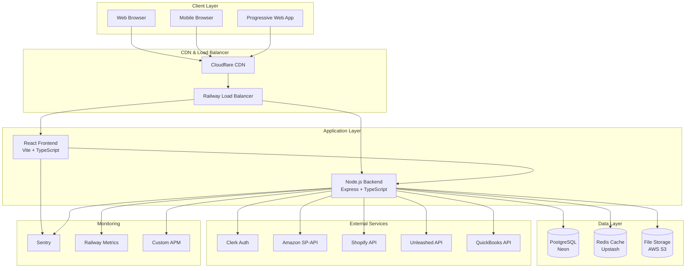
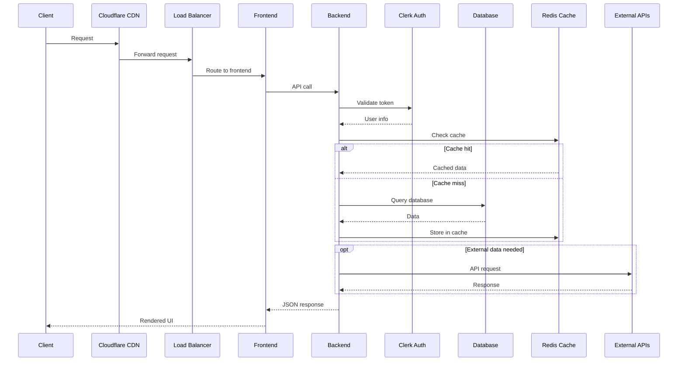
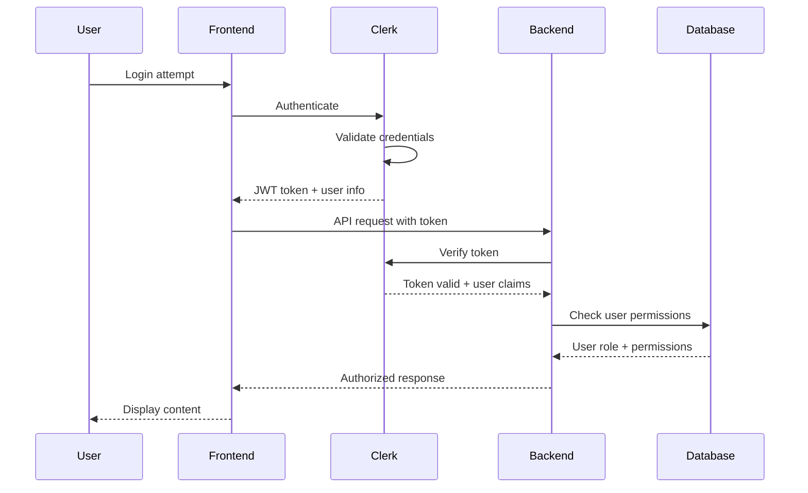

# System Architecture

## Overview
The Sentia Manufacturing Dashboard is a comprehensive full-stack application built with modern web technologies, designed for scalability, security, and maintainability.

## Table of Contents
- [High-Level Architecture](#high-level-architecture)
- [Technology Stack](#technology-stack)
- [System Components](#system-components)
- [Data Flow](#data-flow)
- [Security Architecture](#security-architecture)
- [Deployment Architecture](#deployment-architecture)
- [Monitoring & Observability](#monitoring--observability)

---

## High-Level Architecture



---

## Technology Stack

### Frontend Stack
```yaml
Core Framework: React 18
Build Tool: Vite 4
Language: TypeScript 5
Styling: Tailwind CSS 3
Icons: Heroicons
UI Components: Headless UI + shadcn/ui
```

### State Management
```yaml
Client State: Zustand
Server State: TanStack Query (React Query)
Form State: React Hook Form
Local Storage: Zustand Persist
```

### Routing & Navigation
```yaml
Router: React Router DOM v6
Code Splitting: React.lazy + Suspense
Navigation: Programmatic + Declarative
Protected Routes: Role-based guards
```

### Backend Stack
```yaml
Runtime: Node.js 18+
Framework: Express.js
Language: TypeScript
ORM: Prisma
Validation: Zod + express-validator
Authentication: Clerk SDK
```

### Database & Storage
```yaml
Primary DB: PostgreSQL (Neon)
Cache: Redis (Upstash)
File Storage: AWS S3
Search: Built-in PostgreSQL text search
Migrations: Prisma Migrate
```

### DevOps & Deployment
```yaml
Platform: Railway
CI/CD: GitHub Actions
Monitoring: Sentry + Custom APM
Logging: Winston
Environment: Railway Nixpacks deployment
```

---

## System Components

### Frontend Architecture

```typescript
// Component hierarchy
src/
├── components/           # Reusable UI components
│   ├── auth/            # Authentication components
│   ├── layout/          # Layout components (Header, Sidebar)
│   ├── widgets/         # Dashboard widgets
│   ├── forms/           # Form components
│   └── ui/              # Base UI components
├── pages/               # Page-level components
│   ├── Dashboard/       # Dashboard pages
│   ├── WorkingCapital/  # Financial pages
│   └── Admin/           # Admin pages
├── hooks/               # Custom React hooks
├── stores/              # Zustand state stores
├── services/            # API services
└── utils/               # Utility functions
```

#### Component Design Patterns
```typescript
// 1. Compound Components
const Dashboard = {
  Root: DashboardRoot,
  Header: DashboardHeader,
  Sidebar: DashboardSidebar,
  Content: DashboardContent,
  Widget: DashboardWidget
};

// Usage
<Dashboard.Root>
  <Dashboard.Header />
  <Dashboard.Sidebar />
  <Dashboard.Content>
    <Dashboard.Widget type="kpi" />
    <Dashboard.Widget type="chart" />
  </Dashboard.Content>
</Dashboard.Root>

// 2. Render Props Pattern
<DataFetcher url="/api/orders">
  {({ data, loading, error }) => (
    loading ? <Spinner /> : 
    error ? <ErrorMessage error={error} /> :
    <OrdersList orders={data} />
  )}
</DataFetcher>

// 3. Higher-Order Components
const withAuth = (Component, requiredRole) => {
  return (props) => {
    const { user, isLoading } = useAuth();
    
    if (isLoading) return <LoadingSpinner />;
    if (!user || !hasRole(user, requiredRole)) {
      return <AccessDenied />;
    }
    
    return <Component {...props} />;
  };
};
```

### Backend Architecture

```typescript
// Service layer architecture
src/
├── controllers/         # Request handlers
├── services/           # Business logic
├── models/             # Data models (Prisma)
├── middleware/         # Express middleware
├── routes/             # API routes
├── utils/              # Utility functions
├── types/              # TypeScript types
└── config/             # Configuration files

// Example service structure
class OrderService {
  constructor(
    private orderRepository: OrderRepository,
    private inventoryService: InventoryService,
    private emailService: EmailService
  ) {}

  async createOrder(orderData: CreateOrderDTO): Promise<Order> {
    // 1. Validate order data
    const validatedData = await this.validateOrder(orderData);
    
    // 2. Check inventory availability
    await this.inventoryService.checkAvailability(validatedData.items);
    
    // 3. Create order in database
    const order = await this.orderRepository.create(validatedData);
    
    // 4. Send confirmation email
    await this.emailService.sendOrderConfirmation(order);
    
    // 5. Emit order created event
    EventBus.emit('order.created', order);
    
    return order;
  }
}
```

### Database Architecture

#### Schema Design
```sql
-- Core entities
CREATE TABLE users (
  id UUID PRIMARY KEY DEFAULT gen_random_uuid(),
  clerk_user_id VARCHAR(255) UNIQUE NOT NULL,
  email VARCHAR(255) UNIQUE NOT NULL,
  role user_role NOT NULL DEFAULT 'viewer',
  preferences JSONB DEFAULT '{}',
  created_at TIMESTAMP DEFAULT NOW(),
  updated_at TIMESTAMP DEFAULT NOW()
);

-- Business entities
CREATE TABLE orders (
  id UUID PRIMARY KEY DEFAULT gen_random_uuid(),
  order_number VARCHAR(100) UNIQUE NOT NULL,
  customer_id UUID REFERENCES customers(id),
  status order_status NOT NULL DEFAULT 'pending',
  total_amount DECIMAL(10,2) NOT NULL,
  currency VARCHAR(3) DEFAULT 'GBP',
  metadata JSONB DEFAULT '{}',
  created_at TIMESTAMP DEFAULT NOW(),
  updated_at TIMESTAMP DEFAULT NOW()
);

CREATE TABLE order_items (
  id UUID PRIMARY KEY DEFAULT gen_random_uuid(),
  order_id UUID REFERENCES orders(id) ON DELETE CASCADE,
  product_id UUID REFERENCES products(id),
  quantity INTEGER NOT NULL CHECK (quantity > 0),
  unit_price DECIMAL(10,2) NOT NULL,
  total_price DECIMAL(10,2) GENERATED ALWAYS AS (quantity * unit_price) STORED
);
```

#### Indexing Strategy
```sql
-- Performance indexes
CREATE INDEX idx_orders_status ON orders(status);
CREATE INDEX idx_orders_created_date ON orders(created_at DESC);
CREATE INDEX idx_orders_customer_status ON orders(customer_id, status);

-- Full-text search indexes
CREATE INDEX idx_products_search ON products USING gin(to_tsvector('english', name || ' ' || description));

-- Partial indexes for common queries
CREATE INDEX idx_pending_orders ON orders(created_at) WHERE status = 'pending';
```

---

## Data Flow

### Request Flow Diagram



### State Management Flow

```typescript
// Zustand store pattern
interface DashboardStore {
  // State
  layout: LayoutConfig;
  widgets: Widget[];
  isEditMode: boolean;
  
  // Actions
  updateLayout: (layout: LayoutConfig) => void;
  addWidget: (widget: Widget) => void;
  removeWidget: (widgetId: string) => void;
  toggleEditMode: () => void;
}

// TanStack Query integration
const useDashboardData = () => {
  const { layout, widgets } = useDashboardStore();
  
  return useQuery({
    queryKey: ['dashboard', layout.id, widgets.map(w => w.id)],
    queryFn: () => fetchDashboardData(layout, widgets),
    staleTime: 5 * 60 * 1000, // 5 minutes
    refetchInterval: 30 * 1000, // 30 seconds
  });
};
```

### Event-Driven Architecture

```typescript
// Event system
class EventBus {
  private static instance: EventBus;
  private events: Map<string, Function[]> = new Map();
  
  static getInstance(): EventBus {
    if (!EventBus.instance) {
      EventBus.instance = new EventBus();
    }
    return EventBus.instance;
  }
  
  emit<T>(event: string, data: T): void {
    const handlers = this.events.get(event) || [];
    handlers.forEach(handler => handler(data));
  }
  
  on<T>(event: string, handler: (data: T) => void): void {
    const handlers = this.events.get(event) || [];
    handlers.push(handler);
    this.events.set(event, handlers);
  }
}

// Usage example
EventBus.getInstance().on('order.created', (order) => {
  // Update inventory
  InventoryService.updateStock(order.items);
  
  // Send notifications
  NotificationService.notifyOrderCreated(order);
  
  // Update dashboard metrics
  MetricsService.updateOrderMetrics();
});
```

---

## Security Architecture

### Authentication Flow



### Authorization Model

```typescript
// Role-based access control
enum UserRole {
  SUPER_ADMIN = 'super_admin',
  ADMIN = 'admin',
  MANAGER = 'manager',
  OPERATOR = 'operator',
  VIEWER = 'viewer'
}

// Permission system
const PERMISSIONS = {
  DASHBOARD_VIEW: 'dashboard.view',
  DASHBOARD_EDIT: 'dashboard.edit',
  USERS_MANAGE: 'users.manage',
  SYSTEM_CONFIGURE: 'system.configure',
  REPORTS_VIEW: 'reports.view',
  FINANCIAL_VIEW: 'financial.view',
  FINANCIAL_EDIT: 'financial.edit',
} as const;

// Role-permission mapping
const rolePermissions: Record<UserRole, string[]> = {
  [UserRole.SUPER_ADMIN]: Object.values(PERMISSIONS),
  [UserRole.ADMIN]: [
    PERMISSIONS.DASHBOARD_VIEW,
    PERMISSIONS.DASHBOARD_EDIT,
    PERMISSIONS.USERS_MANAGE,
    PERMISSIONS.REPORTS_VIEW,
    PERMISSIONS.FINANCIAL_VIEW,
  ],
  [UserRole.MANAGER]: [
    PERMISSIONS.DASHBOARD_VIEW,
    PERMISSIONS.DASHBOARD_EDIT,
    PERMISSIONS.REPORTS_VIEW,
    PERMISSIONS.FINANCIAL_VIEW,
  ],
  [UserRole.OPERATOR]: [
    PERMISSIONS.DASHBOARD_VIEW,
    PERMISSIONS.REPORTS_VIEW,
  ],
  [UserRole.VIEWER]: [
    PERMISSIONS.DASHBOARD_VIEW,
  ],
};
```

### Data Protection

```typescript
// Encryption utilities
class CryptoService {
  private static readonly ALGORITHM = 'aes-256-gcm';
  private static readonly KEY = process.env.ENCRYPTION_KEY;
  
  static encrypt(text: string): string {
    const iv = crypto.randomBytes(16);
    const cipher = crypto.createCipher(this.ALGORITHM, this.KEY, iv);
    
    let encrypted = cipher.update(text, 'utf8', 'hex');
    encrypted += cipher.final('hex');
    
    const authTag = cipher.getAuthTag();
    
    return `${iv.toString('hex')}:${authTag.toString('hex')}:${encrypted}`;
  }
  
  static decrypt(encryptedData: string): string {
    const [ivHex, authTagHex, encrypted] = encryptedData.split(':');
    
    const iv = Buffer.from(ivHex, 'hex');
    const authTag = Buffer.from(authTagHex, 'hex');
    
    const decipher = crypto.createDecipher(this.ALGORITHM, this.KEY, iv);
    decipher.setAuthTag(authTag);
    
    let decrypted = decipher.update(encrypted, 'hex', 'utf8');
    decrypted += decipher.final('utf8');
    
    return decrypted;
  }
}
```

---

## Deployment Architecture

### Environment Structure

```yaml
Development:
  URL: https://dev.sentia-manufacturing.railway.app
  Database: Neon (Development tier)
  Features: Debug enabled, hot reload
  
Staging:
  URL: https://staging.sentia-manufacturing.railway.app  
  Database: Neon (Production tier)
  Features: Production build, testing data
  
Production:
  URL: https://sentia-manufacturing.com
  Database: Neon (Production tier with replicas)
  Features: Optimized build, monitoring enabled
```

### Railway Nixpacks Deployment

```toml
[phases.setup]
nixPkgs = ['nodejs_20']

[phases.install]
cmds = ['npm install --production=false']

[phases.build] 
cmds = ['npm run build']

[phases.start]
cmd = 'node server.js'

[variables]
NODE_ENV = 'production'
PORT = '$PORT'
```

### Scaling Strategy

```yaml
Horizontal Scaling:
  Min Replicas: 2
  Max Replicas: 10
  Scale Trigger: CPU > 70% or Memory > 80%
  Load Balancer: Railway built-in

Database Scaling:
  Read Replicas: 2 (for read-heavy operations)
  Connection Pooling: PgBouncer
  Query Optimization: Automatic index suggestions

Caching Strategy:
  L1 Cache: In-memory (Node.js)
  L2 Cache: Redis (Upstash)
  L3 Cache: CDN (Cloudflare)
```

---

## Monitoring & Observability

### Metrics Collection

```typescript
// Custom metrics service
class MetricsService {
  private static metrics: Map<string, number> = new Map();
  
  static increment(metric: string, value: number = 1): void {
    const current = this.metrics.get(metric) || 0;
    this.metrics.set(metric, current + value);
  }
  
  static gauge(metric: string, value: number): void {
    this.metrics.set(metric, value);
  }
  
  static timing(metric: string, startTime: number): void {
    const duration = Date.now() - startTime;
    this.histogram(`${metric}.duration`, duration);
  }
  
  private static histogram(metric: string, value: number): void {
    // Implementation for histogram metrics
  }
  
  static getMetrics(): Record<string, number> {
    return Object.fromEntries(this.metrics);
  }
}

// Usage in middleware
app.use((req, res, next) => {
  const startTime = Date.now();
  
  res.on('finish', () => {
    MetricsService.increment('http.requests.total');
    MetricsService.increment(`http.requests.${res.statusCode}`);
    MetricsService.timing('http.request.duration', startTime);
  });
  
  next();
});
```

### Distributed Tracing

```typescript
// APM integration
import { getAPM } from '@/services/monitoring/apm';

class OrderController {
  async createOrder(req: Request, res: Response): Promise<void> {
    const apm = getAPM();
    const transactionId = apm.startTransaction('order.create', 'http');
    
    try {
      // Database operation
      const dbSpanId = apm.startSpan(transactionId, 'database.create', 'db');
      const order = await OrderService.create(req.body);
      apm.endSpan(transactionId, dbSpanId);
      
      // External API call
      const apiSpanId = apm.startSpan(transactionId, 'inventory.update', 'external');
      await InventoryService.updateStock(order.items);
      apm.endSpan(transactionId, apiSpanId);
      
      apm.endTransaction(transactionId, 'success');
      res.json({ success: true, order });
      
    } catch (error) {
      apm.endTransaction(transactionId, 'error');
      res.status(500).json({ error: error.message });
    }
  }
}
```

### Health Checks

```typescript
// Comprehensive health checks
class HealthCheckService {
  static async getHealth(): Promise<HealthStatus> {
    const checks = await Promise.allSettled([
      this.checkDatabase(),
      this.checkRedis(),
      this.checkExternalAPIs(),
      this.checkFileSystem(),
    ]);
    
    return {
      status: checks.every(c => c.status === 'fulfilled') ? 'healthy' : 'unhealthy',
      timestamp: new Date().toISOString(),
      checks: {
        database: checks[0].status === 'fulfilled' ? 'healthy' : 'unhealthy',
        redis: checks[1].status === 'fulfilled' ? 'healthy' : 'unhealthy',
        externalAPIs: checks[2].status === 'fulfilled' ? 'healthy' : 'unhealthy',
        fileSystem: checks[3].status === 'fulfilled' ? 'healthy' : 'unhealthy',
      },
      uptime: process.uptime(),
      memory: process.memoryUsage(),
      version: process.env.npm_package_version,
    };
  }
  
  private static async checkDatabase(): Promise<boolean> {
    const result = await prisma.$queryRaw`SELECT 1`;
    return result !== null;
  }
  
  private static async checkRedis(): Promise<boolean> {
    await redis.ping();
    return true;
  }
  
  private static async checkExternalAPIs(): Promise<boolean> {
    // Check critical external APIs
    const responses = await Promise.allSettled([
      fetch('https://api.clerk.dev/v1/health'),
      fetch('https://api.example.com/health'),
    ]);
    
    return responses.some(r => r.status === 'fulfilled');
  }
  
  private static async checkFileSystem(): Promise<boolean> {
    const fs = require('fs').promises;
    await fs.access('/tmp', fs.constants.W_OK);
    return true;
  }
}
```

---

## Performance Considerations

### Frontend Performance

```typescript
// Code splitting by route
const Dashboard = lazy(() => import('@/pages/Dashboard'));
const WorkingCapital = lazy(() => import('@/pages/WorkingCapital'));
const Admin = lazy(() => import('@/pages/Admin'));

// Component memoization
const ExpensiveComponent = memo(({ data }) => {
  const processedData = useMemo(() => {
    return data.map(item => ({
      ...item,
      calculated: heavyCalculation(item)
    }));
  }, [data]);
  
  return <div>{/* Render processed data */}</div>;
});

// Virtual scrolling for large lists
import { FixedSizeList as List } from 'react-window';

const VirtualizedList = ({ items }) => (
  <List
    height={600}
    itemCount={items.length}
    itemSize={50}
    itemData={items}
  >
    {({ index, style, data }) => (
      <div style={style}>
        {data[index].name}
      </div>
    )}
  </List>
);
```

### Backend Performance

```typescript
// Database query optimization
class OrderRepository {
  async findOrdersWithItems(filters: OrderFilters): Promise<Order[]> {
    return await prisma.order.findMany({
      where: filters,
      include: {
        items: {
          include: {
            product: true
          }
        },
        customer: true
      },
      orderBy: {
        createdAt: 'desc'
      },
      take: 50, // Pagination limit
    });
  }
  
  // Use raw queries for complex operations
  async getOrderStatistics(): Promise<OrderStats> {
    const result = await prisma.$queryRaw`
      SELECT 
        DATE_TRUNC('day', created_at) as date,
        COUNT(*) as order_count,
        SUM(total_amount) as revenue
      FROM orders 
      WHERE created_at >= NOW() - INTERVAL '30 days'
      GROUP BY DATE_TRUNC('day', created_at)
      ORDER BY date
    `;
    
    return result;
  }
}

// Caching strategy
class CacheService {
  static async get<T>(key: string): Promise<T | null> {
    const cached = await redis.get(key);
    return cached ? JSON.parse(cached) : null;
  }
  
  static async set<T>(key: string, value: T, ttl: number = 3600): Promise<void> {
    await redis.setex(key, ttl, JSON.stringify(value));
  }
  
  static async invalidate(pattern: string): Promise<void> {
    const keys = await redis.keys(pattern);
    if (keys.length > 0) {
      await redis.del(...keys);
    }
  }
}
```

---

## Integration Patterns

### API Integration

```typescript
// Generic API client
class APIClient {
  private baseURL: string;
  private defaultHeaders: Record<string, string>;
  
  constructor(baseURL: string, headers: Record<string, string> = {}) {
    this.baseURL = baseURL;
    this.defaultHeaders = headers;
  }
  
  async request<T>(
    endpoint: string, 
    options: RequestInit = {}
  ): Promise<T> {
    const url = `${this.baseURL}${endpoint}`;
    const config: RequestInit = {
      ...options,
      headers: {
        'Content-Type': 'application/json',
        ...this.defaultHeaders,
        ...options.headers,
      },
    };
    
    const response = await fetch(url, config);
    
    if (!response.ok) {
      throw new APIError(`HTTP ${response.status}: ${response.statusText}`);
    }
    
    return response.json();
  }
}

// Specific API clients
class ShopifyClient extends APIClient {
  constructor(shopDomain: string, accessToken: string) {
    super(`https://${shopDomain}.myshopify.com/admin/api/2024-01`, {
      'X-Shopify-Access-Token': accessToken,
    });
  }
  
  async getProducts(): Promise<ShopifyProduct[]> {
    const response = await this.request<{products: ShopifyProduct[]}>('/products.json');
    return response.products;
  }
}
```

### Webhook Handling

```typescript
// Webhook processor
class WebhookProcessor {
  private handlers: Map<string, WebhookHandler[]> = new Map();
  
  register(event: string, handler: WebhookHandler): void {
    const handlers = this.handlers.get(event) || [];
    handlers.push(handler);
    this.handlers.set(event, handlers);
  }
  
  async process(webhook: IncomingWebhook): Promise<void> {
    const handlers = this.handlers.get(webhook.type) || [];
    
    await Promise.allSettled(
      handlers.map(handler => handler.handle(webhook.data))
    );
  }
}

// Webhook handlers
const orderWebhookHandler: WebhookHandler = {
  async handle(data: ShopifyOrderWebhook): Promise<void> {
    // Update local order data
    await OrderService.syncFromShopify(data.order);
    
    // Update inventory
    await InventoryService.updateStock(data.order.line_items);
    
    // Send notifications
    await NotificationService.notifyOrderUpdate(data.order);
  }
};
```

This architecture documentation provides a comprehensive overview of the system's technical design, patterns, and best practices. The modular architecture ensures scalability, maintainability, and security while providing clear separation of concerns across all layers.