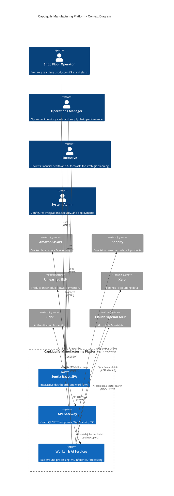
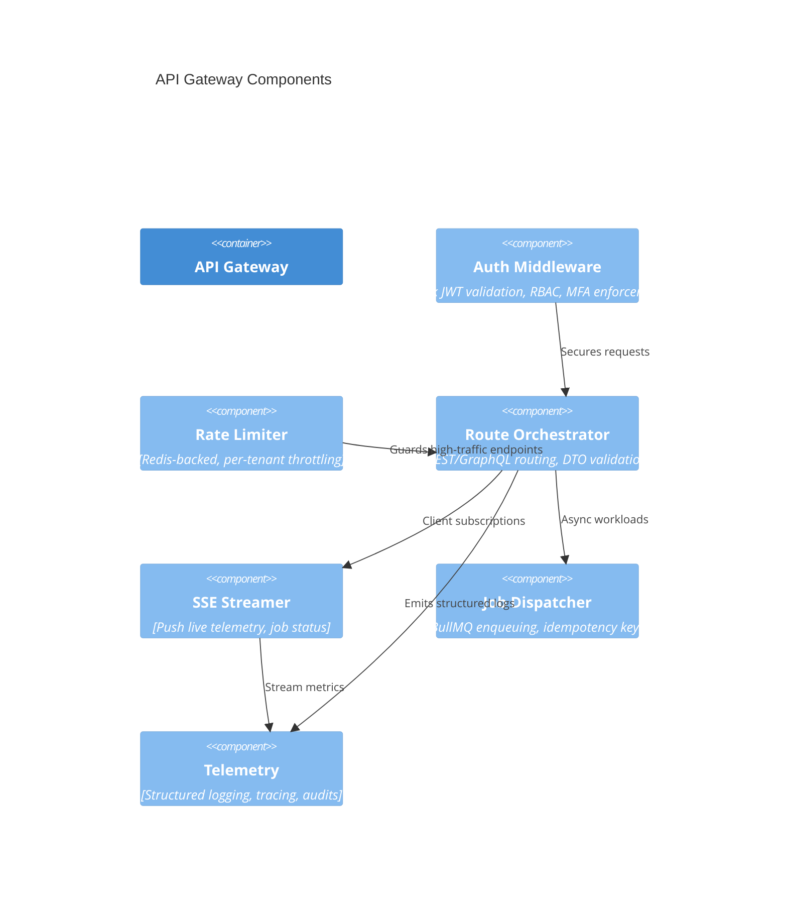
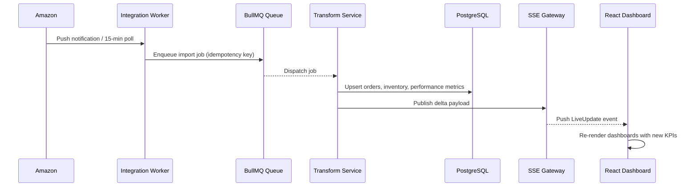
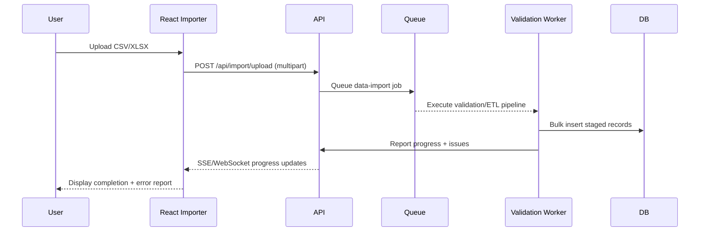
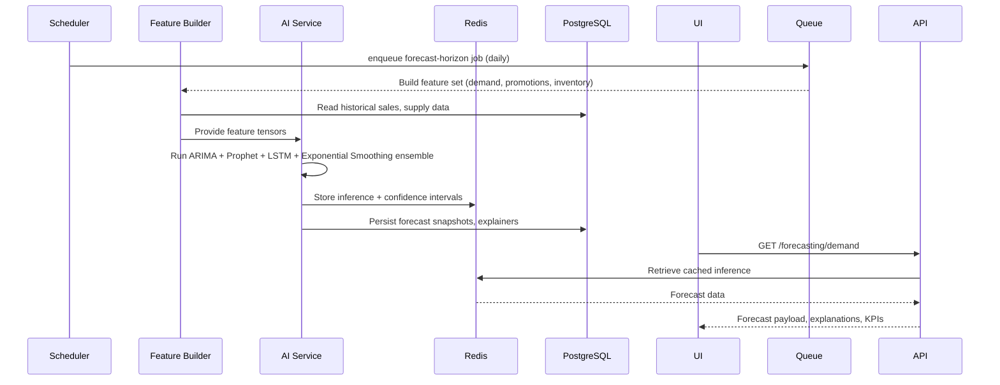
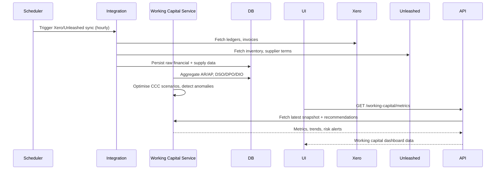

# CapLiquify Manufacturing Platform – System Architecture

## Document Purpose
This document captures the authoritative architecture blueprint for the CapLiquify Manufacturing Platform. It reflects the 2025 production target state that engineering, data, and operations teams are building toward, and supersedes all legacy Flask/Railway references. The system is centred on a React + Node.js platform, orchestrating real-time manufacturing, financial, and AI-driven insights across Sentia's enterprise footprint.

## Architecture Summary
- **Experience layer**: React SPA (Vite) served via CDN, consuming an HTTPS API gateway and subscribing to Server-Sent Events (SSE) for live updates.
- **Application layer**: Node.js/Express gateway routing into domain-specific services (Working Capital, Inventory, Production, AI/ML, Integrations) with shared authentication, logging, and observability middleware.
- **Data & intelligence layer**: PostgreSQL for transactional/state data, Redis for caching, BullMQ queues for asynchronous workloads, and TensorFlow.js + forecasting models driving AI insights.
- **Integration fabric**: Dedicated service adapters for Amazon SP-API, Shopify, Unleashed, Xero, and MCP-based AI assistants (OpenAI/Claude), secured with OAuth2, signature validation, and rate limiting.
- **Operations & resilience**: Multi-AZ deployment, auto-scaling pools (2–10 instances), automated CI/CD, layered security controls, and disaster recovery with 15-minute RTO / 1-hour RPO.

---

## C4 Model Views

### Level 1 – Context


### Level 2 – Container
```mermaid
C4Container
title CapLiquify Manufacturing Platform - Container Diagram
Person(user, "Users", "Operators, Managers, Executives, Admins")
Container(web, "React SPA", "React 19, Vite, SWR/React Query", "Dashboards, workflow UI, SSE client")
Container(api, "API Gateway", "Node.js 20, Express", "Auth, orchestration, domain routing, SSE")
Container(biz, "Business Services", "Node.js", "Working capital, inventory, production, reporting orchestration")
Container(ai, "AI & Forecasting Service", "Node.js, TensorFlow.js, Prophet", "Forecast models, optimization, recommendations")
Container(integration, "Integration Service", "Node.js", "Amazon, Shopify, Xero, Unleashed adapters, signature validation")
Container(queue, "BullMQ Queues", "BullMQ + Redis", "Async jobs, retries, DLQ")
Container(worker, "Worker Pods", "Node.js", "Long-running processing, ETL, ML training")
ContainerDb(db, "PostgreSQL", "Managed Postgres", "Transactional + analytical store")
ContainerDb(cache, "Redis", "Redis Cluster", "Caching, rate limits, BullMQ backend")
Container(observability, "Observability Stack", "OpenTelemetry, Grafana, Loki", "Logs, metrics, traces")
Rel(user, web, "Interacts via", "HTTPS")
Rel(web, api, "REST / GraphQL / SSE", "HTTPS")
Rel(api, biz, "Service calls", "In-memory / gRPC")
Rel(api, integration, "Integration requests", "gRPC / REST")
Rel(api, queue, "Publish background jobs", "BullMQ")
Rel(biz, db, "Read/Write", "SQL (TLS)")
Rel(biz, cache, "Cache lookups", "TLS")
Rel(ai, queue, "Schedules training / inference", "BullMQ")
Rel(ai, db, "Feature store access", "SQL")
Rel(integration, external, "External APIs", "HTTPS")
Rel(queue, worker, "Dispatch jobs", "BullMQ")
Rel(worker, db, "Persist results", "SQL")
Rel(worker, cache, "Intermediate state", "TLS")
Rel(api, observability, "Metrics & logs", "OTel / HTTPS")
Rel(worker, observability, "Tracing & alerts", "OTel / HTTPS")
```

### Level 3 – API Gateway Component View


---

## Data Flow Architecture

### Real-Time Marketplace Ingestion


### Batch CSV Import


### AI Forecast Pipeline


### Working Capital Engine


---

## Integration Architecture

| Integration | Channel | Authentication | Cadence | Notes |
|-------------|---------|----------------|---------|-------|
| Amazon SP-API | REST polling + throttled retries | LWA OAuth2 + refresh tokens | Every 15 minutes with exponential backoff | Tracks FBA/FBM orders, inventory, fees |
| Shopify | Webhooks (primary) + REST polling fallback | HMAC signature validation + API key | Near real-time webhooks; hourly fallback | Multi-store support, 2.9% commission tracking |
| Unleashed ERP | REST API | API key + signature header | Hourly | Syncs production schedules, BOMs, stock levels |
| Xero | REST API | OAuth2 with auto-refresh | Daily full sync; on-demand deltas | Financial statements, GL entries, invoices |
| Clerk | REST API | Publishable + secret keys | Per-request | Identity provider for users, MFA, RBAC |
| MCP (OpenAI/Claude) | MCP protocol over HTTPS | API keys, semantic cache | On-demand | Generates AI insights, aligns with MCP governance |

---

## Security Architecture

1. **Network perimeter**: CDN + WAF + TLS 1.3 enforcing strict cipher suites and HSTS.
2. **Gateway controls**: Clerk-backed JWT validation, MFA enforcement, Redis rate limiting, request signing for sensitive endpoints.
3. **Application security**: Centralised RBAC (Admin, Manager, Operator, Viewer), zod schema validation, secure headers via Helmet, SQL injection guards via Prisma.
4. **Data protection**: Encryption at rest (PostgreSQL TDE, Redis TLS), column-level encryption for sensitive PII, secrets from Render/Clerk vaults.
5. **Monitoring & detection**: Audit logging (immutable ledger tables), anomaly detection on auth events, SIEM forwarding to SOC.
6. **Governance**: SOC2-aligned change management, GDPR consent & data export tooling, regular penetration testing.

---

## Scalability & Reliability

- **Auto-scaling**: Horizontal pod auto-scaling (2–10 instances) driven by CPU (>65%) and queue depth thresholds.
- **High availability**: Multi-AZ app nodes, managed PostgreSQL read replicas, Redis cluster with sentinel failover.
- **BullMQ resilience**: Retry policies (3 attempts with exponential backoff), Dead Letter Queue review jobs, idempotent job handlers.
- **Performance targets**: <200 ms p95 API latency, <1 s Largest Contentful Paint, <100 ms SSE push latency, sustained 1,000 concurrent users.
- **Disaster recovery**: Automated backups every 15 minutes, point-in-time recovery, warm DR environment, tested 15-minute RTO / 1-hour RPO.

---

## Deployment Architecture

```mermaid
C4Deployment
title Production Deployment (Render equivalent stack)
Deployment_Node(cdn, "Global CDN / WAF") {
  Container(webAssets, "Static Assets", "S3 + CDN", "Versioned React bundles")
}
Deployment_Node(lb, "Regional Load Balancer") {
  Deployment_Node(appPool, "App Service (HPA)") {
    Container(apiPod, "API Pods", "Node.js", "Express gateway + business services")
  }
  Deployment_Node(workerPool, "Worker Pool") {
    Container(workerPod, "Worker Pods", "Node.js", "BullMQ processors, ML jobs")
  }
}
Deployment_Node(data, "Data Layer") {
  ContainerDb(pg, "PostgreSQL Cluster", "Managed Postgres", "Primary + replica")
  ContainerDb(redis, "Redis Cluster", "Redis", "Cache + queue backend")
}
Deployment_Node(observability, "Observability") {
  Container(metrics, "Metrics", "Prometheus/Grafana")
  Container(logs, "Logs", "Loki/Winston exporters")
}
Rel(cdn, lb, "TLS 1.3")
Rel(lb, appPool, "mTLS")
Rel(lb, workerPool, "Private network")
Rel(appPool, data, "TLS")
Rel(workerPool, data, "TLS")
Rel(appPool, observability, "OTel exporters")
Rel(workerPool, observability, "OTel exporters")
```

- **Environments**: Development (mock auth + local services), Testing (CI, full integration suite), Production (auto deployments via tagged releases).
- **CI/CD pipeline**: GitHub Actions ➝ lint ➝ typecheck ➝ unit tests ➝ e2e smoke ➝ build ➝ deploy ➝ post-deploy health checks ➝ automated rollback on failure.
- **Infrastructure as code**: `render.yaml` + Terraform modules define services, queues, Redis, PostgreSQL, secrets, scaling policies.

---

## Technology Decision Matrix

| Domain | Technology | Rationale | Alternatives | Status |
|--------|------------|-----------|--------------|--------|
| Frontend | React 19 + Vite | Fast dev/test, modern SSR/SSG support, hooks ecosystem | Next.js, Remix | Adopted |
| Styling | Tailwind CSS + Radix UI | Design system consistency, theming | Chakra, MUI | Adopted |
| State/Data | React Query, Zustand | Declarative fetching + lightweight local state | Redux Toolkit | Adopted |
| API Gateway | Node.js 20 + Express | Alignment with team skillset, rich middleware | Fastify, NestJS | Adopted |
| Auth | Clerk + JWT + MFA | Managed identity, quick rollout | Auth0, Cognito | Adopted |
| Async Jobs | BullMQ + Redis | Native Node integration, mature retry semantics | RabbitMQ, Kafka | Planned (Phase 1) |
| Database | PostgreSQL 16 | Relational + JSONB analytics | MySQL, Aurora | Adopted |
| ML Stack | TensorFlow.js, Prophet, ARIMA, LSTM ensemble | Hybrid classical + deep learning, runs in Node | SageMaker, Python microservices | Phase 2 rollout |
| Observability | OpenTelemetry, Grafana, Loki | Vendor-neutral tracing/metrics/logging | Datadog, New Relic | Adopted |
| Deployments | Render + GitHub Actions | Managed platform, simple scaling | AWS ECS, GCP GKE | Adopted |

---

## Cross-Cutting Concerns

- **Error handling**: Domain-specific error classes (operational vs programming), centralized middleware serializing RFC7807 payloads, audit IDs per request.
- **Logging**: Winston with daily rotate file + JSON streams to Loki; correlation IDs flow through headers and BullMQ metadata.
- **Caching**: Tiered strategy (Redis for hot reads, HTTP cache-control for CDN assets, client-side memoization for dashboards) with explicit invalidation hooks.
- **Performance**: Code splitting via Vite, React Suspense for streaming data, API-side response compression, database indexes (working capital, forecasting metrics, audit logs), query planners reviewed monthly.
- **Testing**: Vitest for unit tests, Playwright for e2e, contract tests against mocked integrations, load tests (k6) before major releases.
- **Compliance**: GDPR tooling (data export/erase), SOC2-aligned policies, quarterly security reviews, secrets rotation every 90 days.

---

## Roadmap Alignment
- **Phase 1 (4 weeks)**: BullMQ enablement, TensorFlow.js dependency hardening, rate limiting, webhook signature validation.
- **Phase 2 (8 weeks)**: ML training pipeline activation, webhook ingestion hardening, MFA rollout, performance tuning to interim targets (<300 ms API p95).
- **Phase 3 (8 weeks)**: Production hardening (model serving, expanded tests, audit logging), DR rehearsals.
- **Phase 4 (8 weeks)**: Advanced analytics (Prophet ensembles, feature store), enterprise E2E test coverage reaching 80%+.

This document now represents the single source of truth for engineering, product, and operations teams when designing, building, and validating the CapLiquify Manufacturing Platform platform.
