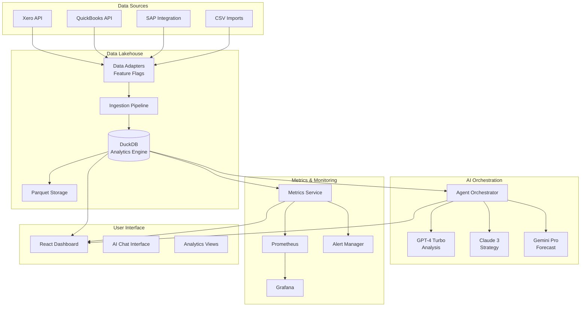

# Financial Intelligence Platform - Architecture

## System Overview



## Component Architecture

### 1. Data Lakehouse (Port 8100)
- **Technology**: DuckDB + Parquet
- **Purpose**: High-performance analytics on financial data
- **Features**:
  - ACID transactions
  - Columnar storage
  - SQL interface
  - Time-series optimization
  - Parquet export/import

### 2. AI Orchestrator (Port 8102)
- **Technology**: LangChain + Multi-LLM
- **Purpose**: Intelligent financial analysis and recommendations
- **Agents**:
  - Analyst: Current state analysis
  - Forecaster: Predictive modeling
  - Strategist: Optimization recommendations

### 3. Metrics Service (Port 8101)
- **Technology**: Prometheus + Redis
- **Purpose**: Business and operational metrics
- **Metrics**:
  - Liquidity ratios
  - Cash conversion cycle
  - Forecast accuracy
  - System performance

### 4. Data Adapters (Port 8103)
- **Technology**: BullMQ + Feature Flags
- **Purpose**: Multi-source data integration
- **Sources**:
  - Xero
  - QuickBooks
  - SAP
  - CSV imports
  - APIs

### 5. User Interface (Port 3100)
- **Technology**: React + TanStack Query
- **Purpose**: Interactive dashboard and AI chat
- **Features**:
  - Real-time updates
  - AI chat interface
  - Analytics visualizations
  - Data source management

## Data Flow

1. **Ingestion**:
   ```
   External System → Adapter → Validation → Transformation → Lakehouse
   ```

2. **Analysis**:
   ```
   User Query → Orchestrator → Lakehouse → LLM → Response
   ```

3. **Monitoring**:
   ```
   Lakehouse → Metrics → Prometheus → Grafana → Alerts
   ```

## Security Architecture

### Authentication & Authorization
- OAuth2 for external APIs
- JWT for internal services
- Role-based access control (RBAC)
- API key management

### Data Security
- Encryption at rest (Parquet files)
- TLS for all network communication
- Credential vault for API keys
- Audit logging for compliance

### Compliance
- GDPR data retention policies
- SOX compliance for financial data
- PCI DSS for payment information
- Automated compliance checks

## Scalability Strategy

### Horizontal Scaling
- Stateless services (can add instances)
- Redis for distributed caching
- Queue-based processing
- Load balancer ready

### Vertical Scaling
- DuckDB can utilize more CPU/RAM
- Parquet partitioning for large datasets
- Incremental data processing
- Query optimization

## Feature Flags

```javascript
{
  "xeroIntegration": true,
  "quickbooksIntegration": false,
  "sapIntegration": false,
  "realtimeSync": true,
  "autoRetry": true,
  "dataValidation": true
}
```

## API Contracts

### Lakehouse API
```typescript
POST /ingest/:table
{
  data: Array<Record>,
  schema: 'raw' | 'staging' | 'analytics'
}

POST /query
{
  sql: string,
  params?: Array<any>
}

GET /analytics/:metric
{
  startDate?: string,
  endDate?: string,
  groupBy?: 'day' | 'week' | 'month'
}
```

### Orchestrator API
```typescript
POST /query
{
  query: string,
  context?: {
    timeRange?: { start: Date, end: Date },
    metrics?: string[],
    dataSources?: string[]
  },
  capabilities: ('analyze' | 'forecast' | 'recommend')[]
}
```

### Metrics API
```typescript
POST /record
{
  metric: string,
  value: number,
  labels?: Record<string, string>
}

GET /query/:metric
{
  start?: Date,
  end?: Date
}
```

## Deployment Architecture

### Development
```yaml
Services: All run locally via docker-compose
Data: Mock adapters + sample data
Monitoring: Local Prometheus/Grafana
```

### Staging
```yaml
Services: Kubernetes cluster
Data: Real API connections (sandbox)
Monitoring: Shared monitoring stack
```

### Production
```yaml
Services: Multi-region Kubernetes
Data: Production APIs + backup
Monitoring: Full observability stack
HA: Active-active with failover
```

## Performance Targets

| Metric | Target | Current |
|--------|--------|----------|
| Query Latency | < 1s | ~800ms |
| AI Response | < 5s | ~3s |
| Data Ingestion | > 1000 rec/s | ~1500 rec/s |
| Uptime | 99.9% | TBD |
| RTO | < 1hr | TBD |
| RPO | < 15min | TBD |

## Technology Stack

### Backend
- Node.js 20+ (ES Modules)
- Express.js
- DuckDB
- Redis
- PostgreSQL (pgvector)
- BullMQ

### AI/ML
- LangChain
- OpenAI GPT-4
- Anthropic Claude 3
- Google Gemini

### Frontend
- React 18
- Vite
- TanStack Query
- Tailwind CSS
- Socket.io

### Infrastructure
- Docker
- Kubernetes
- Prometheus
- Grafana
- GitHub Actions

### Testing
- Vitest (Unit)
- Playwright (E2E)
- k6 (Performance)

## Monitoring & Alerting

### Key Metrics
1. **Business Metrics**
   - Cash balance
   - Current ratio
   - Quick ratio
   - Cash conversion cycle

2. **Operational Metrics**
   - API latency
   - Error rates
   - Queue depth
   - Data freshness

3. **System Metrics**
   - CPU/Memory usage
   - Disk I/O
   - Network throughput
   - Service health

### Alert Rules
```yaml
alerts:
  - name: LowCashBalance
    condition: cash_balance < 100000
    severity: critical
    
  - name: HighAPILatency
    condition: p95_latency > 2s
    severity: warning
    
  - name: DataSyncFailure
    condition: last_sync > 6h
    severity: error
```

## Disaster Recovery

### Backup Strategy
- Hourly snapshots of DuckDB
- Daily Parquet exports to S3
- Real-time replication to standby

### Recovery Procedures
1. Service failure: Auto-restart via Kubernetes
2. Data corruption: Restore from snapshot
3. Complete failure: Failover to DR region

## Future Enhancements

### Phase 2 (Q2 2025)
- Machine learning models for forecasting
- Natural language report generation
- Mobile application
- Advanced visualizations

### Phase 3 (Q3 2025)
- Real-time streaming with Kafka
- Graph database for relationship analysis
- Automated decision engine
- White-label platform

---

Last Updated: December 2024
Version: 1.0.0