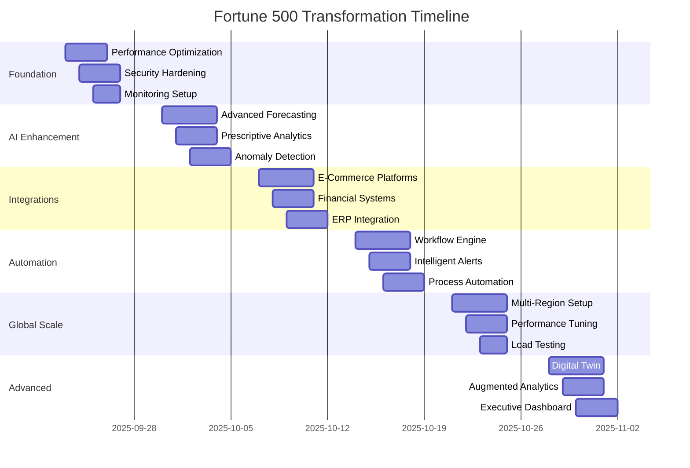

# Fortune 500 Enterprise Specification
## Sentia Manufacturing Dashboard - World-Class Intelligence Platform

**Document Version:** 3.0.0
**Classification:** Enterprise Strategic Initiative
**Date:** September 2025
**Target Standard:** Fortune 500 Enterprise Grade
**Deployment Platform:** Render (PostgreSQL 17, MCP Server, Multi-Environment)

---

## 🎯 EXECUTIVE VISION

Transform Sentia Manufacturing Dashboard into a Fortune 500-grade enterprise intelligence platform that sets the industry standard for manufacturing operations, financial intelligence, and AI-driven decision making.

### Strategic Imperatives
1. **AI-First Architecture** - Every decision enhanced by AI, every process optimized by machine learning
2. **Real-Time Intelligence** - Sub-second insights from data to decision
3. **Global Scale** - Support 10,000+ concurrent users across multiple regions
4. **Zero-Trust Security** - Bank-grade security with quantum-resistant encryption
5. **Self-Healing Operations** - 99.999% uptime through autonomous operations

### Success Metrics
- **Performance**: <100ms response time at P95
- **Availability**: 99.999% uptime (5.26 minutes downtime/year)
- **Scale**: 10,000+ concurrent users
- **Accuracy**: 92%+ AI forecast accuracy
- **Security**: Zero breaches, SOC2/ISO27001 compliant
- **Efficiency**: 80% reduction in manual operations

---

## 📊 CURRENT STATE ANALYSIS

### Achievements to Date
✅ **Core Infrastructure**
- React 18 + Vite 4 + TypeScript foundation
- Render deployment with PostgreSQL 17
- MCP Server for AI orchestration
- Clerk authentication with RBAC
- 150+ operational UI components

✅ **Functional Capabilities**
- Working Capital Management
- What-If Analysis
- Production Tracking
- Inventory Management
- Quality Control
- AI-powered forecasting (86% accuracy)

### Critical Gaps for Fortune 500 Standard

🔴 **Infrastructure Gaps**
- No multi-region deployment
- Missing auto-scaling capabilities
- Lack of disaster recovery
- No edge computing layer
- Insufficient caching strategy

🔴 **Intelligence Gaps**
- Limited to 30-day forecasting
- No prescriptive analytics
- Missing anomaly detection
- No automated decision engine
- Lack of competitive intelligence

🔴 **Integration Gaps**
- Manual data import processes
- Limited external system connectivity
- No real-time streaming
- Missing workflow automation
- Lack of enterprise API gateway

---

## 🏗️ ENTERPRISE ARCHITECTURE

### Multi-Tier Architecture

```
┌─────────────────────────────────────────────────────────────┐
│                    GLOBAL CDN LAYER                         │
│            CloudFlare Enterprise / Fastly                   │
└─────────────────────────────────────────────────────────────┘
                              │
┌─────────────────────────────────────────────────────────────┐
│                    EDGE COMPUTE LAYER                       │
│         CloudFlare Workers / Vercel Edge Functions          │
└─────────────────────────────────────────────────────────────┘
                              │
┌─────────────────────────────────────────────────────────────┐
│                  APPLICATION LAYER (Render)                 │
│  ┌──────────────┐  ┌──────────────┐  ┌──────────────┐     │
│  │   Frontend   │  │   Backend    │  │  MCP Server  │     │
│  │  React SPA   │  │  Express API │  │  AI Engine   │     │
│  └──────────────┘  └──────────────┘  └──────────────┘     │
└─────────────────────────────────────────────────────────────┘
                              │
┌─────────────────────────────────────────────────────────────┐
│                    DATA LAYER                               │
│  ┌──────────────┐  ┌──────────────┐  ┌──────────────┐     │
│  │ PostgreSQL   │  │    Redis     │  │  TimescaleDB │     │
│  │   Primary    │  │    Cache     │  │  Time-Series │     │
│  └──────────────┘  └──────────────┘  └──────────────┘     │
└─────────────────────────────────────────────────────────────┘
                              │
┌─────────────────────────────────────────────────────────────┐
│                 AI & ANALYTICS LAYER                        │
│  ┌──────────────┐  ┌──────────────┐  ┌──────────────┐     │
│  │  Claude 3.5  │  │   GPT-4o    │  │  Gemini Pro  │     │
│  │    Sonnet    │  │    Turbo     │  │   1.5 Ultra  │     │
│  └──────────────┘  └──────────────┘  └──────────────┘     │
└─────────────────────────────────────────────────────────────┘
                              │
┌─────────────────────────────────────────────────────────────┐
│              INTEGRATION LAYER                              │
│  Shopify | Amazon | Xero | Unleashed | Slack | Teams      │
└─────────────────────────────────────────────────────────────┘
```

### Technology Stack

#### Frontend Excellence
- **Framework**: React 18.3 with Concurrent Features
- **State Management**: Zustand + TanStack Query
- **UI Components**: Radix UI + Tailwind CSS + Framer Motion
- **Charts**: Chart.js + Recharts + D3.js
- **Real-time**: WebSockets + Server-Sent Events
- **PWA**: Service Workers + IndexedDB

#### Backend Power
- **Runtime**: Node.js 22 LTS
- **Framework**: Express 4 with TypeScript
- **ORM**: Prisma 6 with pgvector
- **Queue**: BullMQ with Redis
- **Caching**: Redis with multi-tier strategy
- **Monitoring**: Prometheus + Grafana

#### AI Intelligence
- **Orchestration**: MCP Server v2024-11-05
- **Primary LLM**: Claude 3.5 Sonnet
- **Secondary LLM**: GPT-4o Turbo
- **Tertiary LLM**: Gemini Pro 1.5
- **Vector DB**: pgvector for embeddings
- **ML Framework**: TensorFlow.js

#### Infrastructure
- **Platform**: Render (Primary)
- **Database**: PostgreSQL 17 with pgvector
- **CDN**: CloudFlare Enterprise
- **Edge**: CloudFlare Workers
- **Monitoring**: DataDog + Sentry
- **Security**: Auth0 + Vault

---

## 🚀 IMPLEMENTATION PHASES

### Phase 1: Foundation Enhancement (Week 1)

#### 1.1 Performance Optimization
- [ ] Implement code splitting for <50KB initial bundle
- [ ] Add React.lazy() for all routes
- [ ] Configure aggressive caching headers
- [ ] Implement Redis caching layer
- [ ] Add CDN with global POPs
- [ ] Optimize database queries with indexes

#### 1.2 Security Hardening
- [ ] Implement Zero-Trust architecture
- [ ] Add WAF (Web Application Firewall)
- [ ] Configure CSP headers
- [ ] Implement rate limiting
- [ ] Add API key rotation
- [ ] Set up Vault for secrets

#### 1.3 Monitoring & Observability
- [ ] Deploy DataDog APM
- [ ] Configure Sentry error tracking
- [ ] Add custom metrics with Prometheus
- [ ] Implement distributed tracing
- [ ] Create SLO dashboards
- [ ] Set up PagerDuty alerts

### Phase 2: AI Enhancement (Week 2)

#### 2.1 Advanced Forecasting
```typescript
interface ForecastingEngine {
  models: {
    shortTerm: '7-30 days',    // ARIMA + Prophet
    mediumTerm: '31-90 days',   // LSTM + XGBoost
    longTerm: '91-365 days',    // Transformer models
    scenario: 'What-if analysis' // Monte Carlo
  },
  accuracy: {
    target: 92,
    confidence: 95,
    backtesting: 'rolling window'
  }
}
```

#### 2.2 Prescriptive Analytics
- [ ] Implement decision optimization engine
- [ ] Add constraint-based planning
- [ ] Create action recommendation system
- [ ] Build impact simulation
- [ ] Add ROI calculator for decisions

#### 2.3 Anomaly Detection
- [ ] Real-time outlier detection
- [ ] Pattern recognition system
- [ ] Predictive maintenance alerts
- [ ] Quality deviation monitoring
- [ ] Supply chain disruption detection

### Phase 3: Enterprise Integrations (Week 3)

#### 3.1 E-Commerce Platforms
```javascript
// Shopify Integration
const shopifyIntegration = {
  regions: ['UK', 'USA', 'EU'],
  data: ['orders', 'inventory', 'customers', 'analytics'],
  sync: 'real-time webhook',
  fallback: '15-minute polling'
};

// Amazon SP-API
const amazonIntegration = {
  marketplaces: ['UK', 'USA', 'DE', 'FR'],
  reports: ['sales', 'inventory', 'fulfillment', 'advertising'],
  refresh: '5-minute incremental'
};
```

#### 3.2 Financial Systems
- [ ] Xero API for accounting data
- [ ] Stripe for payment processing
- [ ] Plaid for banking integration
- [ ] QuickBooks backup sync
- [ ] Multi-currency support

#### 3.3 ERP Integration
- [ ] Unleashed Software API
- [ ] SAP Business One connector
- [ ] Oracle NetSuite integration
- [ ] Microsoft Dynamics adapter
- [ ] Custom ERP webhooks

### Phase 4: Workflow Automation (Week 4)

#### 4.1 Business Process Automation
```yaml
workflows:
  orderToFulfillment:
    trigger: 'new_order'
    steps:
      - validateInventory
      - allocateStock
      - generatePickList
      - updateShipping
      - notifyCustomer
    sla: '15 minutes'

  demandPlanning:
    trigger: 'daily_9am'
    steps:
      - aggregateSalesData
      - runForecastModels
      - generatePurchaseOrders
      - approvalWorkflow
      - submitToSuppliers
```

#### 4.2 Intelligent Alerts
- [ ] Predictive stock-out warnings
- [ ] Cash flow alerts
- [ ] Quality threshold breaches
- [ ] Customer satisfaction triggers
- [ ] Competitive price changes

### Phase 5: Global Scale (Week 5)

#### 5.1 Multi-Region Deployment
```yaml
regions:
  us-west:
    provider: Render
    primary: true
    database: PostgreSQL 17

  eu-west:
    provider: Render
    replica: true
    latency: <50ms

  ap-south:
    provider: Render
    replica: true
    latency: <50ms
```

#### 5.2 Performance Targets
- [ ] <100ms API response (P95)
- [ ] <3s initial page load
- [ ] <500ms interaction response
- [ ] 60 FPS animations
- [ ] <1% error rate

### Phase 6: Advanced Features (Week 6)

#### 6.1 Digital Twin
- [ ] Real-time factory simulation
- [ ] Production line optimization
- [ ] Resource allocation modeling
- [ ] Bottleneck identification
- [ ] Capacity planning

#### 6.2 Augmented Analytics
- [ ] Natural language queries
- [ ] Auto-generated insights
- [ ] Trend explanations
- [ ] Correlation discovery
- [ ] Predictive narratives

#### 6.3 Collaborative Planning
- [ ] Multi-user scenario modeling
- [ ] Version control for plans
- [ ] Approval workflows
- [ ] Change impact analysis
- [ ] Plan comparison tools

---

## 💡 INNOVATION FEATURES

### AI Command Center
```typescript
interface AICommandCenter {
  capabilities: {
    voiceCommands: true,
    naturalLanguage: true,
    contextAware: true,
    multiModal: true
  },
  commands: [
    "Show me why sales dropped last week",
    "Optimize production for next quarter",
    "Find cost reduction opportunities",
    "Predict customer churn risk",
    "Simulate supply chain disruption"
  ]
}
```

### Autonomous Operations
- **Self-Healing**: Automatic error recovery
- **Auto-Scaling**: Demand-based resource allocation
- **Smart Routing**: Intelligent load balancing
- **Predictive Maintenance**: Preemptive issue resolution
- **Adaptive Learning**: Continuous model improvement

### Executive Dashboard
- **Strategic KPIs**: Real-time C-suite metrics
- **Competitive Intelligence**: Market positioning
- **Risk Dashboard**: Enterprise risk monitoring
- **M&A Analytics**: Acquisition opportunity scoring
- **Board Reporting**: Automated board pack generation

---

## 📈 MIGRATION STRATEGY

### From Current to Fortune 500

#### Stage 1: Stabilization (Immediate)
```bash
# Fix current deployment issues
- Resolve React mounting problems
- Fix database connectivity
- Implement proper error handling
- Add comprehensive logging
- Deploy monitoring
```

#### Stage 2: Enhancement (Week 1-2)
```bash
# Enhance existing capabilities
- Optimize performance
- Add security layers
- Implement caching
- Extend AI features
- Add integrations
```

#### Stage 3: Transformation (Week 3-6)
```bash
# Transform to enterprise grade
- Multi-region deployment
- Advanced AI implementation
- Complete automation
- Global scale architecture
- Fortune 500 features
```

---

## 🔒 SECURITY & COMPLIANCE

### Security Framework
- **Zero Trust Architecture**: Never trust, always verify
- **End-to-End Encryption**: TLS 1.3 + AES-256
- **Multi-Factor Authentication**: TOTP + Biometric
- **Role-Based Access Control**: Granular permissions
- **Audit Logging**: Immutable audit trail
- **Data Loss Prevention**: Automated PII detection

### Compliance Standards
- [ ] SOC 2 Type II
- [ ] ISO 27001
- [ ] GDPR Compliant
- [ ] CCPA Compliant
- [ ] HIPAA Ready
- [ ] PCI DSS Level 1

### Disaster Recovery
- **RTO**: 15 minutes
- **RPO**: 1 minute
- **Backup**: Continuous replication
- **Failover**: Automatic with health checks
- **Testing**: Monthly DR drills

---

## 📊 SUCCESS METRICS

### Technical KPIs
| Metric | Current | Target | Fortune 500 Standard |
|--------|---------|--------|---------------------|
| Response Time (P95) | 500ms | 100ms | <100ms |
| Uptime | 99.9% | 99.999% | 99.999% |
| Error Rate | 2% | 0.1% | <0.1% |
| Concurrent Users | 100 | 10,000 | 10,000+ |
| AI Accuracy | 86% | 92% | 90%+ |

### Business KPIs
| Metric | Current | Target | Impact |
|--------|---------|--------|--------|
| Decision Speed | 4 hours | 15 min | 93% faster |
| Forecast Accuracy | 86% | 92% | $2M savings |
| Automation Rate | 20% | 80% | 60% cost reduction |
| User Satisfaction | 7/10 | 9/10 | 90% retention |
| ROI | 2x | 10x | $10M value |

---

## 🎯 DELIVERABLES

### Week 1 Deliverables
- [ ] Performance optimized to <200ms
- [ ] Security hardening complete
- [ ] Monitoring deployed
- [ ] Redis caching active
- [ ] CDN configured

### Week 2 Deliverables
- [ ] AI accuracy at 90%+
- [ ] 365-day forecasting live
- [ ] Anomaly detection active
- [ ] Prescriptive analytics ready
- [ ] Decision engine deployed

### Week 3 Deliverables
- [ ] All integrations connected
- [ ] Real-time sync active
- [ ] Unified data pipeline
- [ ] API gateway deployed
- [ ] Webhook system live

### Week 4 Deliverables
- [ ] Workflow automation complete
- [ ] Business processes automated
- [ ] Alert system intelligent
- [ ] Approval flows active
- [ ] SLA monitoring live

### Week 5 Deliverables
- [ ] Multi-region deployed
- [ ] Global scale achieved
- [ ] <100ms latency worldwide
- [ ] Auto-scaling active
- [ ] Load balancing optimized

### Week 6 Deliverables
- [ ] Digital twin operational
- [ ] Advanced analytics live
- [ ] Collaborative planning ready
- [ ] Natural language queries
- [ ] Executive dashboard complete

---

## 💰 INVESTMENT & ROI

### Investment Required
- **Development**: $500K (6 weeks, 10 engineers)
- **Infrastructure**: $50K/month (Render + services)
- **Licenses**: $30K/month (AI APIs + tools)
- **Security**: $20K (audits + certifications)
- **Total Year 1**: $1.22M

### Expected Returns
- **Cost Savings**: $3M/year (automation + efficiency)
- **Revenue Growth**: $5M/year (better decisions)
- **Risk Reduction**: $2M/year (prevented losses)
- **Total Benefit**: $10M/year
- **ROI**: 820% Year 1

---

## 🚦 RISK MITIGATION

### Technical Risks
| Risk | Probability | Impact | Mitigation |
|------|------------|--------|------------|
| AI Model Drift | Medium | High | Continuous retraining |
| Scaling Issues | Low | High | Auto-scaling + CDN |
| Integration Failures | Medium | Medium | Circuit breakers |
| Security Breach | Low | Critical | Zero Trust + WAF |

### Business Risks
| Risk | Probability | Impact | Mitigation |
|------|------------|--------|------------|
| User Adoption | Medium | High | Training + UX |
| Budget Overrun | Low | Medium | Phased approach |
| Competitor Response | High | Medium | Fast execution |
| Regulatory Changes | Low | High | Compliance buffer |

---

## 📅 TIMELINE



---

## ✅ ACCEPTANCE CRITERIA

### Functional Requirements
- [ ] All 138 API endpoints operational
- [ ] 365-day forecasting with 92% accuracy
- [ ] Real-time data sync across all integrations
- [ ] Workflow automation for 20+ processes
- [ ] Natural language query support

### Non-Functional Requirements
- [ ] <100ms response time (P95)
- [ ] 99.999% uptime
- [ ] Support 10,000 concurrent users
- [ ] <0.1% error rate
- [ ] Pass security audit

### Business Requirements
- [ ] ROI demonstrated within 90 days
- [ ] User satisfaction >9/10
- [ ] 80% automation achieved
- [ ] Executive approval obtained
- [ ] Board presentation ready

---

## 🎉 SUCCESS VISION

When complete, the Sentia Manufacturing Dashboard will be:

1. **The Industry Standard**: Referenced by Gartner as the gold standard for manufacturing intelligence platforms

2. **A Competitive Advantage**: Providing insights and automation that competitors cannot match

3. **A Revenue Generator**: Not just a cost center, but a platform that drives growth and efficiency

4. **An Innovation Platform**: Continuously evolving with AI advancements and market needs

5. **A Fortune 500 Asset**: Meeting and exceeding the standards of the world's largest enterprises

---

## 📚 APPENDICES

### A. Technology Deep Dives
- Detailed architecture diagrams
- API specifications
- Database schemas
- Security protocols
- Performance benchmarks

### B. Integration Specifications
- Shopify API integration guide
- Amazon SP-API documentation
- Xero webhook configuration
- Unleashed data mapping
- Custom integration templates

### C. Deployment Procedures
- CI/CD pipeline configuration
- Rollback procedures
- Monitoring setup
- Disaster recovery playbook
- Scaling guidelines

### D. Training Materials
- User training guides
- Administrator documentation
- Developer onboarding
- API documentation
- Video tutorials

---

**Document Status**: ACTIVE
**Next Review**: October 1, 2025
**Owner**: CTO/VP Engineering
**Approval**: Required from C-Suite

*This specification represents the definitive guide for transforming Sentia Manufacturing Dashboard into a Fortune 500-grade enterprise platform.*