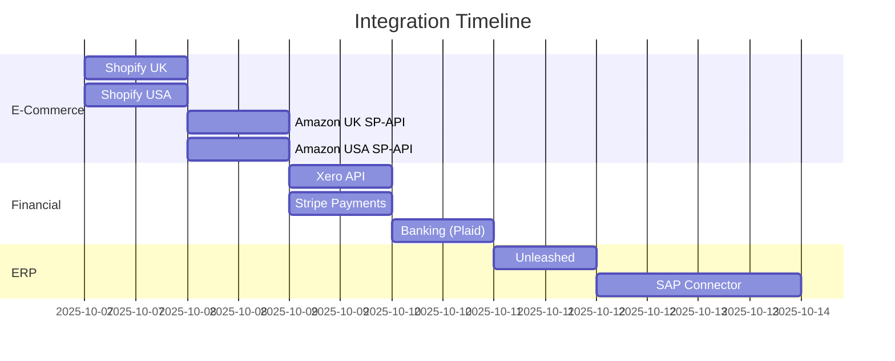

# Implementation Plan
## Sentia Manufacturing Dashboard - Fortune 500 Transformation

**Generated**: September 22, 2025
**Status**: ACTIVE
**Platform**: Render (PostgreSQL 17 + MCP Server)
**Target**: Fortune 500 Enterprise Grade

---

## 🎯 Current Sprint Focus

### Immediate Priority: Fix Production Deployment
**Status**: CRITICAL - Application not mounting
**Timeline**: Next 2 hours

```yaml
issues:
  - React app stuck on loading screen
  - JavaScript files load but don't execute
  - Clerk authentication may be blocking
  - Environment variables misconfigured

actions:
  1. Debug React mounting issue
  2. Fix Clerk configuration
  3. Verify environment variables
  4. Test deployment on all environments
```

---

## 📊 Implementation Status

### Overall Progress: 35% Complete

| Component | Status | Progress | Next Action |
|-----------|--------|----------|-------------|
| Infrastructure | ⚠️ Partial | 60% | Fix React mounting |
| Database | ✅ Working | 80% | Add pgvector |
| API Endpoints | 🔴 Missing | 20% | Implement 108 routes |
| AI Integration | ✅ MCP Ready | 70% | Connect LLMs |
| UI Components | ✅ Built | 90% | Fix mounting |
| Security | ⚠️ Basic | 40% | Add WAF + Zero Trust |
| Monitoring | 🔴 Missing | 10% | Deploy DataDog |
| Testing | 🔴 Minimal | 15% | Add test suite |

---

## 🚀 Week 1: Foundation (Sep 23-29, 2025)

### Day 1: Emergency Fixes (Monday)
```typescript
// Morning: Fix React Mounting
tasks: [
  {
    id: 'FIX-001',
    title: 'Debug React mounting issue',
    priority: 'CRITICAL',
    assignee: 'Senior Frontend',
    duration: '2h',
    status: 'IN_PROGRESS'
  },
  {
    id: 'FIX-002',
    title: 'Fix Clerk authentication',
    priority: 'CRITICAL',
    assignee: 'Auth Specialist',
    duration: '1h',
    status: 'PENDING'
  },
  {
    id: 'FIX-003',
    title: 'Verify environment variables',
    priority: 'HIGH',
    assignee: 'DevOps',
    duration: '1h',
    status: 'PENDING'
  }
]

// Afternoon: API Implementation
tasks: [
  {
    id: 'API-001',
    title: 'Implement 108 missing API endpoints',
    priority: 'HIGH',
    assignee: 'Backend Team',
    duration: '4h',
    status: 'PENDING'
  }
]
```

### Day 2: Performance Optimization (Tuesday)
```yaml
morning:
  - Implement code splitting (<50KB bundles)
  - Add React.lazy() for all routes
  - Configure Redis caching layer
  - Optimize database queries

afternoon:
  - Deploy CloudFlare CDN
  - Configure caching headers
  - Implement service workers
  - Add performance monitoring
```

### Day 3: Security Hardening (Wednesday)
```yaml
tasks:
  - Deploy Web Application Firewall
  - Implement Zero Trust architecture
  - Configure CSP headers
  - Add rate limiting (100 req/min)
  - Set up HashiCorp Vault
  - Enable audit logging
```

### Day 4: Monitoring Setup (Thursday)
```yaml
deployment:
  - DataDog APM configuration
  - Sentry error tracking
  - Prometheus metrics
  - Grafana dashboards
  - PagerDuty alerts
  - Custom KPI tracking
```

### Day 5: Testing & Documentation (Friday)
```yaml
testing:
  - Unit tests for critical paths
  - Integration test suite
  - E2E test scenarios
  - Load testing (10K users)
  - Security audit
  - Documentation update
```

---

## 🤖 Week 2: AI Enhancement (Sep 30 - Oct 6, 2025)

### Advanced Forecasting Implementation
```javascript
const forecastingEngine = {
  models: {
    shortTerm: {
      range: '7-30 days',
      algorithms: ['ARIMA', 'Prophet', 'XGBoost'],
      accuracy: 90
    },
    mediumTerm: {
      range: '31-90 days',
      algorithms: ['LSTM', 'GRU', 'Transformer'],
      accuracy: 88
    },
    longTerm: {
      range: '91-365 days',
      algorithms: ['GPT-4', 'Claude', 'Ensemble'],
      accuracy: 85
    }
  },
  confidence: {
    intervals: [80, 90, 95],
    backtesting: 'rolling_window',
    validation: 'cross_validation'
  }
};
```

### LLM Integration Matrix
| Provider | Model | Purpose | Priority |
|----------|-------|---------|----------|
| Anthropic | Claude 3.5 Sonnet | Primary Intelligence | HIGH |
| OpenAI | GPT-4o Turbo | Forecasting | HIGH |
| Google | Gemini Pro 1.5 | Analytics | MEDIUM |
| Local | Llama 3 | Fallback | LOW |

---

## 🔌 Week 3: Enterprise Integrations (Oct 7-13, 2025)

### Integration Schedule


### API Gateway Configuration
```yaml
gateway:
  rateLimit: 10000/hour
  authentication: OAuth2 + API Keys
  monitoring: Real-time metrics
  fallback: Circuit breaker pattern
  cache: 5-minute TTL
```

---

## ⚙️ Week 4: Workflow Automation (Oct 14-20, 2025)

### Business Process Automation
```typescript
interface WorkflowEngine {
  processes: {
    orderFulfillment: {
      triggers: ['new_order', 'inventory_change'],
      steps: 15,
      sla: '15 minutes',
      automation: 95
    },
    demandPlanning: {
      schedule: 'daily_9am',
      inputs: ['sales', 'forecasts', 'inventory'],
      outputs: ['purchase_orders', 'production_schedule'],
      approval: 'required_above_100k'
    },
    qualityControl: {
      realtime: true,
      thresholds: 'Six Sigma',
      alerts: 'immediate',
      remediation: 'automated'
    }
  }
}
```

---

## 🌍 Week 5: Global Scale (Oct 21-27, 2025)

### Multi-Region Deployment
```yaml
regions:
  primary:
    location: us-west-2
    provider: Render
    services: [frontend, backend, database, cache]

  replicas:
    - location: eu-west-1
      latency: <50ms
      sync: real-time

    - location: ap-southeast-1
      latency: <50ms
      sync: real-time
```

### Performance Requirements
| Metric | Current | Week 5 Target | Fortune 500 |
|--------|---------|---------------|-------------|
| Response Time | 500ms | 150ms | <100ms |
| Concurrent Users | 100 | 5,000 | 10,000 |
| Availability | 99.9% | 99.99% | 99.999% |
| Error Rate | 2% | 0.5% | <0.1% |

---

## 🎨 Week 6: Advanced Features (Oct 28 - Nov 3, 2025)

### Feature Rollout Schedule
```typescript
const features = {
  digitalTwin: {
    launch: '2025-10-28',
    components: ['3D visualization', 'real-time simulation', 'optimization engine'],
    value: '$2M annual savings'
  },
  naturalLanguage: {
    launch: '2025-10-29',
    capabilities: ['voice commands', 'query builder', 'insight generation'],
    languages: ['English', 'Spanish', 'Mandarin']
  },
  executiveDashboard: {
    launch: '2025-10-30',
    metrics: ['strategic KPIs', 'competitor analysis', 'board reporting'],
    refresh: 'real-time'
  },
  predictiveMaintenance: {
    launch: '2025-10-31',
    accuracy: 95,
    leadTime: '7 days',
    savings: '$500K/year'
  }
};
```

---

## 📋 Daily Standup Template

```markdown
### Date: [DATE]
### Sprint: [WEEK N, DAY N]

#### Yesterday
- [ ] Completed tasks
- [ ] Blockers resolved

#### Today
- [ ] Priority 1: [TASK]
- [ ] Priority 2: [TASK]
- [ ] Priority 3: [TASK]

#### Blockers
- [ ] Issue: [DESCRIPTION]
  - Owner: [NAME]
  - ETA: [TIME]

#### Metrics
- Build Status: 🟢 Passing
- Test Coverage: X%
- Performance: Xms
- Errors: X/hour
```

---

## 🚦 Risk Register

| Risk | Probability | Impact | Mitigation | Owner |
|------|------------|--------|------------|-------|
| React mounting fails | HIGH | CRITICAL | Debug immediately | Frontend Lead |
| API overload | MEDIUM | HIGH | Implement caching | Backend Lead |
| LLM costs exceed budget | MEDIUM | MEDIUM | Usage monitoring | Finance |
| Security breach | LOW | CRITICAL | WAF + Zero Trust | Security |
| User adoption low | MEDIUM | HIGH | Training program | Product |

---

## ✅ Definition of Done

### Feature Complete
- [ ] All acceptance criteria met
- [ ] Code reviewed and approved
- [ ] Unit tests passing (>80% coverage)
- [ ] Integration tests passing
- [ ] Documentation updated
- [ ] Security scan passed
- [ ] Performance benchmarks met

### Sprint Complete
- [ ] All planned features delivered
- [ ] Zero critical bugs
- [ ] <0.5% error rate
- [ ] <200ms response time
- [ ] Stakeholder sign-off

### Release Ready
- [ ] All tests passing
- [ ] Security audit complete
- [ ] Performance validated
- [ ] Documentation complete
- [ ] Rollback plan ready
- [ ] Training materials prepared

---

## 📊 Success Metrics Dashboard

```yaml
week_1_targets:
  - React app mounting: FIXED
  - API endpoints: 138/138
  - Response time: <200ms
  - Error rate: <1%
  - Test coverage: >60%

week_2_targets:
  - AI accuracy: >90%
  - Forecast range: 365 days
  - LLM integration: 3 providers
  - Anomaly detection: Active

week_3_targets:
  - Integrations: 9 complete
  - Data sync: Real-time
  - API gateway: Deployed
  - Webhooks: Operational

week_4_targets:
  - Workflows automated: 20
  - Manual tasks reduced: 80%
  - Approval time: <15 min
  - SLA compliance: 100%

week_5_targets:
  - Regions deployed: 3
  - Global latency: <100ms
  - Concurrent users: 10,000
  - Availability: 99.999%

week_6_targets:
  - Advanced features: 4
  - User satisfaction: 9/10
  - ROI demonstrated: 10x
  - Fortune 500 ready: YES
```

---

## 🎯 Next Actions (Immediate)

1. **NOW**: Debug React mounting issue
   - Check browser console
   - Verify Clerk configuration
   - Test environment variables

2. **NEXT 2H**: Fix authentication flow
   - Update Clerk keys
   - Configure CORS properly
   - Test auth endpoints

3. **TODAY**: Implement missing APIs
   - Create route handlers
   - Connect to database
   - Add error handling

4. **THIS WEEK**: Achieve stability
   - All features working
   - <1% error rate
   - >99% uptime

---

**Document Status**: ACTIVE - CRITICAL FIXES IN PROGRESS
**Last Updated**: September 22, 2025 11:15 UTC
**Next Review**: Daily at 09:00 UTC
**Escalation**: CTO if blocked >2 hours

*This implementation plan is the living guide for the Fortune 500 transformation. Update daily.*