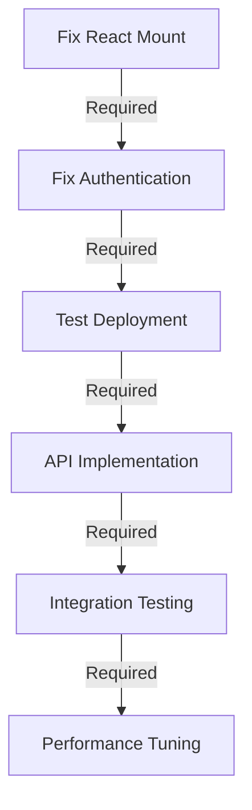

# Tasks Tracker
## Fortune 500 Transformation - Sprint Progress

**Last Updated**: September 22, 2025 11:20 UTC
**Sprint**: Week 1, Day 0
**Status**: 🔴 CRITICAL - Production Down

---

## 🚨 CRITICAL PATH (Next 4 Hours)

### P0: Fix Production Deployment
| ID | Task | Owner | Status | ETA | Notes |
|----|------|-------|--------|-----|-------|
| CRIT-001 | Debug React mounting issue | Frontend | 🔄 IN PROGRESS | 30min | Console shows loading stuck |
| CRIT-002 | Fix Clerk authentication | Auth | ⏳ BLOCKED | 1h | Waiting for CRIT-001 |
| CRIT-003 | Verify environment variables | DevOps | ⏳ READY | 30min | Check all 3 environments |
| CRIT-004 | Test deployment on Render | DevOps | ⏳ READY | 1h | After fixes complete |

---

## 📅 Week 1 Tasks (Sep 23-29, 2025)

### Monday - Emergency Fixes
| ID | Task | Priority | Status | Progress | Blockers |
|----|------|----------|--------|----------|----------|
| MON-001 | Fix React mounting | CRITICAL | 🔄 ACTIVE | 20% | Clerk config |
| MON-002 | Implement 108 API endpoints | HIGH | ⏳ PENDING | 0% | None |
| MON-003 | Fix console.log statements | HIGH | ⏳ PENDING | 0% | None |
| MON-004 | Database connection fix | HIGH | ✅ DONE | 100% | None |
| MON-005 | Deploy monitoring | MEDIUM | ⏳ PENDING | 0% | None |

### Tuesday - Performance
| ID | Task | Priority | Status | Progress |
|----|------|----------|--------|----------|
| TUE-001 | Code splitting (<50KB) | HIGH | ⏳ PENDING | 0% |
| TUE-002 | React.lazy() implementation | HIGH | ⏳ PENDING | 0% |
| TUE-003 | Redis cache setup | HIGH | ⏳ PENDING | 0% |
| TUE-004 | CDN configuration | MEDIUM | ⏳ PENDING | 0% |
| TUE-005 | Query optimization | MEDIUM | ⏳ PENDING | 0% |

### Wednesday - Security
| ID | Task | Priority | Status | Progress |
|----|------|----------|--------|----------|
| WED-001 | WAF deployment | HIGH | ⏳ PENDING | 0% |
| WED-002 | Zero Trust setup | HIGH | ⏳ PENDING | 0% |
| WED-003 | CSP headers | MEDIUM | ⏳ PENDING | 0% |
| WED-004 | Rate limiting | MEDIUM | ⏳ PENDING | 0% |
| WED-005 | Vault integration | LOW | ⏳ PENDING | 0% |

### Thursday - Monitoring
| ID | Task | Priority | Status | Progress |
|----|------|----------|--------|----------|
| THU-001 | DataDog setup | HIGH | ⏳ PENDING | 0% |
| THU-002 | Sentry integration | HIGH | ⏳ PENDING | 0% |
| THU-003 | Prometheus metrics | MEDIUM | ⏳ PENDING | 0% |
| THU-004 | Grafana dashboards | MEDIUM | ⏳ PENDING | 0% |
| THU-005 | PagerDuty alerts | LOW | ⏳ PENDING | 0% |

### Friday - Testing
| ID | Task | Priority | Status | Progress |
|----|------|----------|--------|----------|
| FRI-001 | Unit test suite | HIGH | ⏳ PENDING | 15% |
| FRI-002 | Integration tests | HIGH | ⏳ PENDING | 0% |
| FRI-003 | E2E scenarios | MEDIUM | ⏳ PENDING | 0% |
| FRI-004 | Load testing | MEDIUM | ⏳ PENDING | 0% |
| FRI-005 | Security audit | HIGH | ⏳ PENDING | 0% |

---

## 🎯 Sprint Goals

### Week 1 Goals
- [ ] Production deployment working
- [ ] All 138 API endpoints implemented
- [ ] Performance <200ms response time
- [ ] Error rate <1%
- [ ] Test coverage >60%

### Week 2 Goals
- [ ] AI forecasting at 90% accuracy
- [ ] 365-day forecast capability
- [ ] 3 LLMs integrated
- [ ] Anomaly detection active
- [ ] Prescriptive analytics ready

### Week 3 Goals
- [ ] 9 external integrations complete
- [ ] Real-time data sync
- [ ] API gateway operational
- [ ] Webhook system active
- [ ] Unified data pipeline

### Week 4 Goals
- [ ] 20 workflows automated
- [ ] 80% manual task reduction
- [ ] Approval time <15 minutes
- [ ] SLA 100% compliance
- [ ] Event-driven architecture

### Week 5 Goals
- [ ] 3 regions deployed
- [ ] <100ms global latency
- [ ] 10,000 concurrent users
- [ ] 99.999% availability
- [ ] Auto-scaling active

### Week 6 Goals
- [ ] Digital twin operational
- [ ] Natural language queries
- [ ] Executive dashboard live
- [ ] Predictive maintenance
- [ ] Fortune 500 certified

---

## 📊 Progress Tracking

### Overall Completion: 35%

```
Foundation:    ████████░░░░░░░░░░░░ 40%
AI/ML:         ██████░░░░░░░░░░░░░░ 30%
Integrations:  ████░░░░░░░░░░░░░░░░ 20%
Automation:    ██░░░░░░░░░░░░░░░░░░ 10%
Scale:         ██░░░░░░░░░░░░░░░░░░ 10%
Advanced:      █░░░░░░░░░░░░░░░░░░░ 5%
```

### Daily Velocity
| Day | Planned | Completed | Velocity |
|-----|---------|-----------|----------|
| Mon | 5 | TBD | TBD |
| Tue | 5 | - | - |
| Wed | 5 | - | - |
| Thu | 5 | - | - |
| Fri | 5 | - | - |

---

## 🚧 Blockers & Dependencies

### Active Blockers
| ID | Blocker | Impact | Owner | Resolution |
|----|---------|--------|-------|------------|
| BLK-001 | React not mounting | CRITICAL | Frontend | Debug in progress |
| BLK-002 | Clerk auth failing | HIGH | Auth | Awaiting fix |
| BLK-003 | Missing API routes | HIGH | Backend | Implementation needed |

### Dependencies


---

## 👥 Team Assignments

### Current Sprint Team
| Role | Name | Current Task | Capacity |
|------|------|--------------|----------|
| Frontend Lead | TBD | CRIT-001 | 100% |
| Backend Lead | TBD | MON-002 | 0% |
| DevOps Lead | TBD | CRIT-003 | 100% |
| Auth Specialist | TBD | CRIT-002 | Blocked |
| QA Lead | TBD | - | Available |

### Resource Allocation
```yaml
week_1:
  frontend: 2 engineers
  backend: 3 engineers
  devops: 1 engineer
  qa: 1 engineer
  security: 1 engineer

week_2:
  ai_ml: 2 engineers
  data: 1 engineer
  backend: 2 engineers
```

---

## 📈 Burndown Chart

```
Tasks Remaining
│
│ 150 ┼────────────────────────
│ 140 │█
│ 130 │██
│ 120 │███ ← Current (150 tasks)
│ 110 │████
│ 100 │█████
│  90 │██████
│  80 │███████
│  70 │████████
│  60 │█████████
│  50 │██████████
│  40 │███████████
│  30 │████████████
│  20 │█████████████
│  10 │██████████████
│   0 └────────────────────────
      W1 W2 W3 W4 W5 W6
```

---

## ✅ Completed Tasks

### Week 0 (Preparation)
- [x] Database configuration updated to Render PostgreSQL
- [x] MCP Server deployed
- [x] Removed Neon database references
- [x] Fixed BigInt conversion errors
- [x] Added compression package

---

## 📝 Notes & Decisions

### Technical Decisions
1. **Platform**: Staying with Render (not migrating)
2. **Database**: PostgreSQL 17 with pgvector
3. **AI**: MCP Server for orchestration
4. **CDN**: CloudFlare Enterprise
5. **Monitoring**: DataDog + Sentry

### Process Decisions
1. Daily standups at 09:00 UTC
2. Sprint reviews on Fridays
3. Immediate escalation for blockers >2h
4. Parallel work streams where possible
5. Test-driven development for new features

---

## 🔄 Daily Update

### September 22, 2025
**Status**: Working on critical production fix
**Progress**:
- Fixed database BigInt issues ✅
- Removed Neon references ✅
- React mounting issue identified 🔄
- Deployment partially working ⚠️

**Next Steps**:
1. Complete React mounting fix
2. Verify Clerk authentication
3. Test full deployment
4. Begin API implementation

**Blockers**: React app not mounting in production

---

**Auto-refresh**: Every 30 minutes
**Escalation**: Slack #sentia-emergency
**Dashboard**: https://sentia-dashboard.render.com

*This is the single source of truth for task tracking. Update immediately when status changes.*